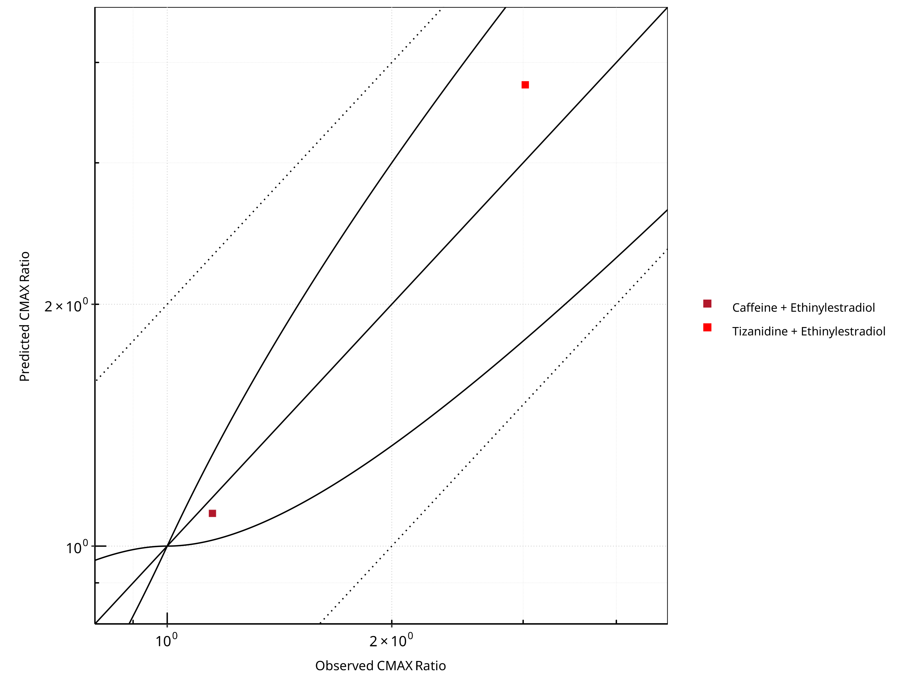
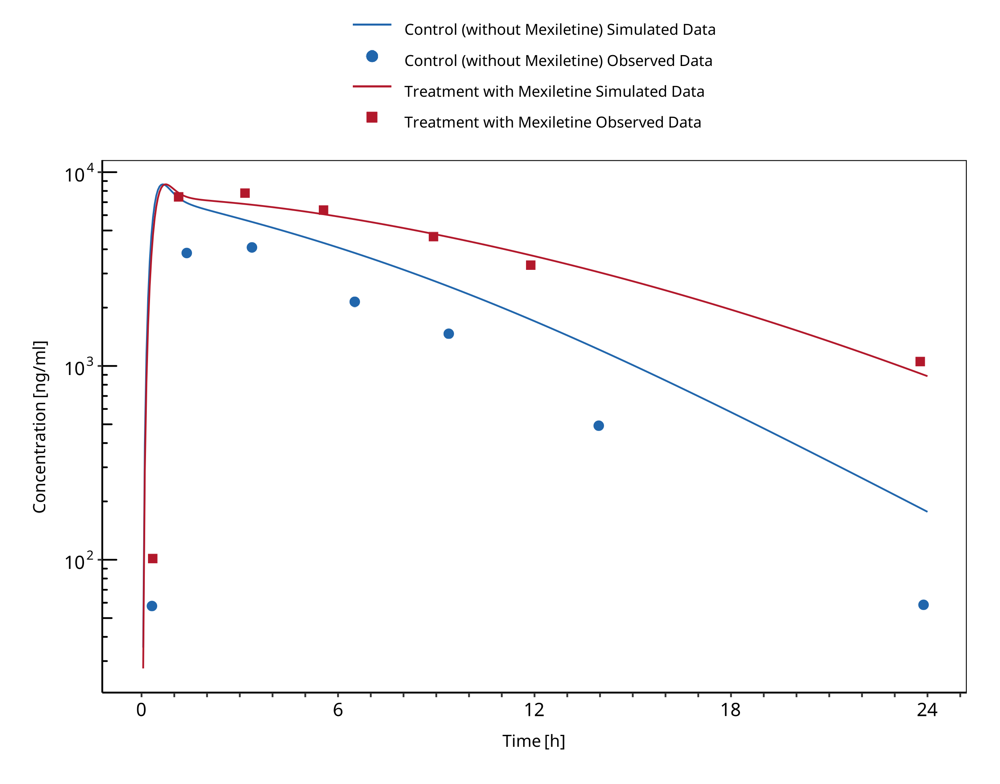

# CYP1A2 DDI Qualification

| Version                         | 1.0-OSP12.0                                                   |
| ------------------------------- | ------------------------------------------------------------ |
| Qualification Plan Release      | https://github.com/Open-Systems-Pharmacology/Qualification-DDI-CYP1A2/releases/tag/v1.0 |
| OSP Version                     | 12.0                                                          |
| Qualification Framework Version | 3.3                                                          |

This qualification report is filed at:

https://github.com/Open-Systems-Pharmacology/OSP-Qualification-Reports

# Table of Contents

 * [1 Introduction](#introduction)
   * [1.1 Objective](#objective)
   * [1.2 CYP1A2 DDI Network](#cyp1a2-ddi-network)
     * [1.2.1 Caffeine - Ethinylestradiol DDI](#caffeine-ethinylestradiol-ddi)
     * [1.2.2 Tizanidine - Ethinylestradiol DDI](#tizanidine-ethinylestradiol-ddi)
     * [1.2.3 Caffeine - Fluvoxamine DDI](#caffeine-fluvoxamine-ddi)
     * [1.2.4 Tizanidine - Fluvoxamine DDI](#tizanidine-fluvoxamine-ddi)
     * [1.2.5 Tizanidine - Mexiletine DDI](#tizanidine-mexiletine-ddi)
     * [1.2.6 Caffeine - Mexiletine DDI](#caffeine-mexiletine-ddi)
     * [1.2.7 Mexiletine - Fluvoxamine DDI](#mexiletine-fluvoxamine-ddi)
 * [2 Qualification of Use Case CYP1A2-mediated DDI](#qualification-cyp1a2-ddi)
   * [2.1 Perpetrator](#qualification-cyp1a2-ddi-ddi-subunit-9)
     * [2.1.1 Ethinylestradiol](#qualification-cyp1a2-ddi-ddi-subunit-10)
     * [2.1.2 Fluvoxamine](#qualification-cyp1a2-ddi-ddi-subunit-18)
     * [2.1.3 Mexiletine](#qualification-cyp1a2-ddi-ddi-subunit-26)
   * [2.2 Victim](#qualification-cyp1a2-ddi-ddi-subunit-34)
     * [2.2.1 Caffeine](#qualification-cyp1a2-ddi-ddi-subunit-35)
     * [2.2.2 Mexiletine](#qualification-cyp1a2-ddi-ddi-subunit-43)
     * [2.2.3 Tizanidine](#qualification-cyp1a2-ddi-ddi-subunit-51)
 * [3 Concentration-Time Profiles](#ct-profiles)
   * [3.1 Tizanidine - Ethinylestradiol DDI](#ct-profiles-tizanidine-ethinylestradiol-ddi)
   * [3.2 Caffeine - Fluvoxamine DDI](#ct-profiles-caffeine-fluvoxamine-ddi)
   * [3.3 Tizanidine - Fluvoxamine DDI](#ct-profiles-tizanidine-fluvoxamine-ddi)
   * [3.4 Tizanidine - Mexiletine DDI](#ct-profiles-tizanidine-mexiletine-ddi)
   * [3.5 Caffeine - Mexiletine DDI](#ct-profiles-caffeine-mexiletine-ddi)
   * [3.6 Mexiletine - Fluvoxamine DDI](#ct-profiles-mexiletine-fluvoxamine-ddi)
 * [4 Conclusion](#conclusion)
 * [5 References](#main-references)
 * [6 Appendix](#appendix)
   * [6.1 Open Systems Pharmacology Suite (OSPS) Introduction](#osp-introduction)
   * [6.2 Mathematical Implementation of Drug-Drug Interactions](#ddi-implementation)
   * [6.3 Automatic (re)-qualification workflow](#requalification-workflow)
 * [7 Glossary](#glossary)

# 1 Introduction

## 1.1 Objective

This qualification report evaluates the developed PBPK drug-drug interactions (DDI) models network for the ability to perform simulations with the intended purpose to predict cytochrome P450 1A2 (**CYPA12**)-mediated DDI.

To demonstrate the level of confidence, the predictive performance of the platform for this intended purpose is assessed via a network of PBPK models of selected index CYP1A2 DDI perpetrators, and respective sensitive CYP1A2 victim drugs and a comprehensive dataset from published clinical DDI studies. All PBPK models represent whole-body PBPK models, which allow dynamic DDI simulations in organs expressing CYP1A2.

The respective *qualification plan* to produce this *qualification report* is transparently documented and provided open-source (https://github.com/Open-Systems-Pharmacology/OSP-Qualification-Reports). The same applies for all presented PBPK models including *evaluation reports* on model building and evaluation of each model (https://github.com/Open-Systems-Pharmacology/OSP-PBPK-Model-Library).

*Evaluation reports* including descriptions on model building and detailed evaluations of the included models are documented separately (see [Section 1.2](#12-cyp1a2-ddi-network)).

Please refer to the [Appendix](#6-appendix) to learn more details:

- An overview over the Open Systems Pharmacology Suite is given in chapter [Section 6.1](#61-open-systems-pharmacology-suite-osps-introduction)

- [Section 6.2](#62-mathematical-implementation-of-drug-drug-interactions) shows the implementation of the underlying mathematical equations for drug-drug interactions in the OSP suite.

- A detailed general description of the performed qualification workflow (*qualification plan*, *qualification report*, etc.) can be found in chapter [Section 6.3](#63-automatic-re-qualification-workflow).

  

## 1.2 CYP1A2 DDI Network

CYP1A2 is involved in the elimination of about 15% of all therapeutic drugs (e.g., clozapine, tacrine, tizanidine, and theophylline), a number of procarcinogens (e.g. benzo[*a*]pyrene and aflatoxin B1), and several important endogenous compounds (e.g. steroids and arachidonic acids) ([Zhou 2009](#5-references), [Goldstein 2001](#5-references)). This enzyme is exclusively expressed in the liver and can be markedly induced by smoking. Well-known substrates of CYP1A2 include caffeine and tizanidine.

Like other CYPs, CYP1A2 is subject to induction and/or inhibition by a number of compounds, which can result in significant drug interactions in clinical practice. 

The U.S. Food and Drug Administration (FDA) lists several perpetrator and victim drugs of interactions in the CYP1A2 network ([FDA](#5-references)). For instance, caffeine and tizanidine are classified as sensitive index substrates for CYP1A2, and fluvoxamine is listed as a strong clinical index inhibitor of CYP1A2.

To qualify the developed models for the prediction of the CYP1A2 DDI potential of new drugs, a set of verified PBPK models of index perpetrators and respective CYP1A2 DDI victim drugs is specified to set up a CYP1A2-mediated DDI modeling network.

The following perpetrator compounds were selected: 

- **Fluvoxamine** (strong CYP1A2 inhibitor)
  Model snapshot and evaluation plan (*release* **alt_v1.0**): https://github.com/Open-Systems-Pharmacology/Fluvoxamine-Model/releases/tag/alt_v1.0
- **Ethinylestradiol** (moderate CYP1A2 inhibitor)
  Model snapshot and evaluation plan (*release* **v2.0**): https://github.com/Open-Systems-Pharmacology/Ethinylestradiol-Model/releases/tag/v2.0
- **Mexiletine** (moderate CYP1A2 inhibitor)
  Model snapshot and evaluation plan (*release* **v2.0**): https://github.com/Open-Systems-Pharmacology/Mexiletine-Model/releases/tag/v2.0

The following sensitive CYP1A2 substrates as victim drugs were selected:

- **Caffeine**
  PK-Sim compound template
- **Tizanidine**
  Model snapshot and evaluation plan (*release* **v2.0**): https://github.com/Open-Systems-Pharmacology/Tizanidine-Model/releases/tag/v2.0
- **Mexiletine**
  Model snapshot and evaluation plan (*release* **v2.0**): https://github.com/Open-Systems-Pharmacology/Mexiletine-Model/releases/tag/v2.0

The following interaction studies were predicted and used to qualify/optimize the final network:

- Strong CYP1A2 inhibition

  - Fluvoxamine - caffeine
  - Fluvoxamine - tizanidine
  - Fluvoxamine - mexiletine
- Moderate CYP1A2 inhibition
  - Mexiletine - caffeine
  - Mexiletine - tizanidine
  - Ethinylestradiol - caffeine
  - Ethinylestradiol - tizanidine

**Figure 1** shows the specified and developed DDI modeling network of interacting perpetrator and victim drugs.

**Figure** **1: CYP1A2 DDI modeling network**

The Ki values used to predict the interactions are listed in [Table 1](#table-1).

| **Inhibitor category** | **Inhibitor**         | **Substrate** | **Ki**    | **Reference**             |
| ---------------------- | --------------------- | ------------- | --------- | ------------------------- |
| Strong CYP1A2          | Fluvoxamine           | caffeine      | 2.97 nM   | [Iga 2016](#5-references) |
|                        |                       | tizanidine    | 0.8697 nM | Fit1           |
|                        |                       | mexiletine    | 2.97 nM   | [Iga 2016](#5-references) |
| Moderate CYP1A2        | Mexiletine            | caffeine      | 0.28 µM   | [Wei 1999](#5-references) |
|                        |                       | tizanidine    | 0.28 µM   | [Wei 1999](#5-references) |
|                        | Ethinylestradiol (EE) | caffeine      | 0.48 µM   | Fit2           |
|                        |                       | tizanidine    | 0.48 µM   | Fit2           |

**Table 1:** Ki values used in CYP1A2 DDI network. 1Lowest literature value = 0.9 nM; 2Literature value = 10.6 µM

The published DDI studies between the respective perpetrators and victim drugs were simulated and compared to observed data. The following sections give an overview of the clinical studies being part of this qualification report.

### 1.2.1 Caffeine - Ethinylestradiol DDI

A dynamical DDI simulation with ethinylestradiol as CYP1A2 inhibitor and caffeine as victim was conducted and compared to literature data. No profiles of caffeine under this interaction were available, but [Balogh 1995](#5-references) reported a 55% decrease in caffeine CL due to ethinylestradiol co-administration and report AUCR and CmaxR.

### 1.2.2 Tizanidine - Ethinylestradiol DDI

The tizanidine-ethinylestradiol interaction was evaluated using clinical DDI studies listed in [Table 2](#table-2).

| **Source**                     | **Route** | **Dose [mg] /** **Schedule \*** | **Pop.** | **Sex** | **N** | **Form.** |
| ------------------------------ | --------- | ------------------------------- | -------- | ------- | ----- | --------- |
| [Granfors 2005](#5-references) | p.o.      | EE: 0.02 Tizanidine: 4     | HV       | f       | 15    | tablet    |

**Table 2:** Literature sources of clinical concentration data of tizanidine used for DDI prediction qualification with ethinylestradiol. *EE: ethinylestradiol*

A dynamical DDI simulation with ethinylestradiol as moderate CYP1A2 inhibitor and tizanidine as victim drug was conducted and compared to literature data. Clinical observations were derived from [Granfors 2005](#5-references) in which 15 healthy women using Oral contraceptives (OCs) (ethinylestradiol + gestodene) and 15 healthy women without OCs (control subjects) ingested a single dose of 4 mg tizanidine.

### 1.2.3 Caffeine - Fluvoxamine DDI

The caffeine-fluvoxamine interaction was evaluated using clinical DDI studies listed in [Table 3](#table-3).

| **Source**                        | **Route** | **Dose [mg] /** **Schedule \***                            | **Pop.** | Age [yrs] (mean) | Weight [kg] (mean) | **Sex** | **N** | **Form.** |
| --------------------------------- | --------- | ---------------------------------------------------------- | -------- | ---------------- | ------------------ | ------- | ----- | --------- |
| [Jeppesen 1996](#5-references)    | p.o.      | 200 caffeine, 50 mg 4 days, 100 mg 8 days fluvoxamine | HV       | 27               | -                  | -       | 8     | Tablet    |
| [Culm-Merdek 2005](#5-references) | p.o.      | 250 caffeine, 100 b.i.d. fluvoxamine                  | HV       | 50               | 82                 | m/f     | 7     | Capsule   |

**Table 3:** Literature sources of clinical concentration data of caffeine used for DDI prediction qualification with fluvoxamine.

A dynamical DDI simulation with fluvoxamine as CYP1A2 inhibitor and caffeine as victim was conducted and compared to literature data. For caffeine the template model included in PK-Sim was used. Two published clinical studies were found where fluvoxamine and caffeine were given together. Fluvoxamine is a strong inhibitor of CYP1A2 and increases the AUC of caffeine by 7 to 14-fold.

In [Jeppesen 1996](#5-references), subjects in one group received 50 mg fluvoxamine-maleate on the first 4 days followed by 100 mg q.d. for 8 days. On day 8 they received a single dose of 200 mg caffeine. The other group received caffeine without fluvoxamine co-treatment.

In [Culm-Merdek 2005](#5-references), seven healthy subjects received single 250 mg dose of caffeine (or matching placebo) together with fluvoxamine (four doses of 100 mg over 2 days) or with matching placebo in a cross-over fashion. 

The simulated caffeine levels with co-administered fluvoxamine were underpredicted. However, the pre-dose concentrations of caffeine were not 0 in the test group. It may be speculated that subjects may not have refrained completely from caffeine containing beverages before the test period. To investigate this hypothesis, a simulation was conducted where a dose of 100 mg caffeine (corresponding approximately to the caffeine content of one cup of coffee ([Caffeine quantities, FDA](#5-references))) was given 24 hours before the administration of caffeine-tablets as per the study protocol. The resulting simulation results support this hypothesis. Hence it was not deemed necessary to adjust the underlying caffeine or fluvoxamine models but rather conclude that the clinical study potentially was facing issues with subjects not compliant with the protocol rules and drank coffee the morning before the study day. The final DDI simulations were therefore conducted with administration of 100 mg caffeine 24 hours prior study protocol.

### 1.2.4 Tizanidine - Fluvoxamine DDI

The tizanidine-fluvoxamine interaction was evaluated using clinical DDI studies listed in [Table 4](#table-4).

| **Source**                     | **Route** | **Dose [mg] /** **Schedule \***          | **Pop.** | Age [yrs] | Weight [kg] | **Sex** | **N** | **Form.** |
| ------------------------------ | --------- | ---------------------------------------- | -------- | --------- | ----------- | ------- | ----- | --------- |
| [Granfors 2004](#5-references) | p.o.      | 4 mg tizanidine, 100 mg fluvoxamine | HV       | 21-31     | 65-83       | m       | 10    | Tablet    |

**Table 4:** Literature sources of clinical concentration data of tizanidine used for DDI prediction qualification with fluvoxamine. *\*:single dose*

In the clinical study reported by [Granfors 2004](#5-references), a single oral dose of 4 mg tizanidine was given after treatment with fluvoxamine (100mg fluvoxamine-maleate ~73.3 mg free base, q.d. for 4 days).

Initially, the Ki value for the inhibition of CYP1A2 by fluvoxamine reported by [Iga 2016](#5-references) was used. While the predicted Cmax ratio matched closely the observed value, the AUC ratio was underpredicted by a factor of 2.1. Since the predictions of the tizanidine profiles without co-administration of fluvoxamine matched the observations very well, it was concluded that the most plausible reason for the under prediction was the value of Ki, as the fraction metabolized via CYP1A2 was already 99%. Hence Ki was optimized using the data from [Granfors 2004](#5-references). A Ki value of 0.8697 +/- 0.1935 nmol/L was estimated, which is still in line with the Ki values derived for other CYP1A2 substrates.

### 1.2.5 Tizanidine - Mexiletine DDI

The tizanidine-mexiletine interaction was evaluated using clinical DDI studies listed in [Table 5](#table-5).

| **Source**                 | **Route** | **Dose [mg] /** **Schedule \***              | **Pop.** | **Sex** | **N** | **Form.** |
| -------------------------- | --------- | -------------------------------------------- | -------- | ------- | ----- | --------- |
| [Momo 2010](#5-references) | p.o.      | 2 mg tizanidine, 50 mg b.i.d mexiletine | HV       | m       | 12    | Tablet    |

**Table 5:** Literature sources of clinical concentration data of tizanidine used for DDI prediction qualification with mexiletine.

A dynamical DDI simulation with mexiletine as CYP1A2 inhibitor and tizanidine as victim was conducted and compared to literature data from [Momo 2010](#5-references). The same Ki as for the caffeine interaction simulation was used (0.28 µM). The predefined “Standard European Male for DDI” individual (age = 30 y, weight = 73 kg, height = 176 cm, BMI = 23.57 kg/m2) was used.

The pharmacokinetics of tizanidine was examined in an open-label study in 12 healthy participants after a single dose of tizanidine (2 mg) with and without mexiletine co-administration (50 mg, 3 times as a pretreatment for a day and 2 times on the study day).

### 1.2.6 Caffeine - Mexiletine DDI

The caffeine-mexiletine interaction was evaluated using clinical DDI studies listed in [Table 6](#table-6).

| **Source**                   | **Route** | **Dose [mg] /** **Schedule \***   | **Pop.** | **N** |
| ---------------------------- | --------- | --------------------------------- | -------- | ----- |
| [Joeres 1987](#5-references) | p.o.      | 366 caffeine, 200 mexiletine | HV       | 6     |

**Table 6:** Literature sources of clinical concentration data of caffeine used for DDI prediction qualification with mexiletine.

A dynamical DDI simulation with mexiletine as CYP1A2 inhibitor and caffeine as victim was conducted and compared to literature data.

Clinical observations of caffeine-mexiletine interaction were derived from [Joeres 1987](#5-references) where 6 healthy volunteers received 366 mg caffeine (400 mg caffeine monohydrate) after an overnight fast, together with 200 mg mexiletine orally. One week later caffeine was administered alone. 

The in-built caffeine template model included in PK-Sim was used for caffeine predictions.

Competitive inhibition was assumed on CYP1A2 enzyme between caffeine (substrate) and mexiletine (inhibitor) with an inhibitory constant of 0.28 µM. No reported values were found for mexiletine Ki on CYP1A2 and caffeine as substrate, so the inhibitory constant for methoxyresofurin ([Ko 1997](#5-references)) was used [calculated in vivo, unbound Ki for methoxyresofurin].

### 1.2.7 Mexiletine - Fluvoxamine DDI

The mexiletine-fluvoxamine interaction was evaluated using clinical DDI studies listed in [Table 7](#table-7).

| **Source**                     | **Route** | **Dose [mg] /** **Schedule \***              | **Pop.**    | **Sex** | **N** | **Form.** |
| ------------------------------ | --------- | -------------------------------------------- | ----------- | ------- | ----- | --------- |
| [Kusumoto 2001](#5-references) | p.o.      | 166.62 mexiletine 50 b.i.d. fluvoxamine | HV japanese | m       | 6     | -         |

**Table 7:** Literature sources of clinical concentration data of mexiletine used for DDI prediction qualification with fluvoxamine. *\*:single dose*

A dynamical DDI simulation with fluvoxamine as CYP1A2 inhibitor and mexiletine as victim was conducted and compared to literature data ([Kusumoto 2001](#5-references)). A typical Japanese subject (age = 30 y, weight = 61.87 kg, height = 168.99 cm, BMI = 21.67 kg/m2) was created in PK-Sim from predefined database "Japanese (2015)" by adding CYP2D6 and CYP1A2 expressions from PK-Sim RT PCR database.

A randomized crossover design with two phases was used. Each subject received an oral dose of mexiletine (200 mg) or fluvoxamine (50 mg twice a day) for 7 days, and on the eighth day they received mexiletine and fluvoxamine concomitantly.

# 2 Qualification of Use Case CYP1A2-mediated DDI

The following section shows the correlations between observed and model-predicted AUC and Cmax ratios, respectively.

Specifically, the PBPK model performance for the PK parameters **AUC ratio (AUCR)** and **Cmax ratio (CMAXR)** is assessed via:

- predicted (*Pred*) vs. observed (*Obs*) plots

- *Pred*/*Obs* vs. *Obs* plots

- geometric mean fold error (GMFE):
  
  
  
- number of AUCR and CMAXR falling within 2-fold error range and within the limits as suggested by [Guest et al. 2011](#5-references)
  
- detailed table of results for each study

In the plots,

- the dotted lines denote 0.50–2.00 (2-fold) criterion,

- the solid lines denote the limits as suggested by [Guest et al. 2011](#5-references),

- the bold solid line denotes the unity line,

- each color represents one combination of drugs

***

**Figure 2-1: CYP1A2 DDI.  Predicted vs. Observed AUC Ratio. (&delta; = 1 in Guest *et al.* formula)**

 
 

**Figure 2-2: CYP1A2 DDI.  Predicted/Observed vs. Observed AUC Ratio. (&delta; = 1 in Guest *et al.* formula)**

 
 

**Figure 2-3: CYP1A2 DDI.  Predicted vs. Observed CMAX Ratio. (&delta; = 1 in Guest *et al.* formula)**

 
 

**Figure 2-4: CYP1A2 DDI.  Predicted/Observed vs. Observed CMAX Ratio. (&delta; = 1 in Guest *et al.* formula)**

 
 

**Table 2-1: GMFE for CYP1A2 DDI Ratio**

|PK parameter |GMFE |
|:------------|:----|
|AUC          |1.39 |
|CMAX         |1.22 |

 
 

**Table 2-2: Summary table for CYP1A2 DDI - AUC Ratio. (&delta; = 1 in Guest *et al.* formula)**

|AUC                          |Number |Ratio [%] |
|:----------------------------|:------|:---------|
|Points total                 |8      |-        |
|Points within Guest *et al.* |6      |75.00     |
|Points within 2 fold         |7      |87.50     |

 
 

**Table 2-3: Summary table for CYP1A2 DDI - CMAX Ratio. (&delta; = 1 in Guest *et al.* formula)**

|CMAX                         |Number |Ratio [%] |
|:----------------------------|:------|:---------|
|Points total                 |8      |-        |
|Points within Guest *et al.* |7      |87.50     |
|Points within 2 fold         |8      |100.00    |

 
 

**Table 2-4: Summary table for CYP1A2 DDI**

|DataID |Perpetrator                    |Victim         |Predicted AUC Ratio |Observed AUC Ratio |Pred/Obs AUC Ratio |Predicted CMAX Ratio |Observed CMAX Ratio |Pred/Obs CMAX Ratio |Reference        |
|:------|:------------------------------|:--------------|:-------------------|:------------------|:------------------|:--------------------|:-------------------|:-------------------|:----------------|
|6110   |Ethinylestradiol, 0.03 mg, PO, |Caffeine, PO   |5.84                |2.13               |2.74               |1.10                 |1.15                |0.96                |Balogh 1995      |
|13017  |Fluvoxamine, 100 mg, PO,       |Tizanidine, PO |39.12               |33.00              |1.19               |16.00                |12.10               |1.32                |Granfors 2004    |
|13018  |Mexiletine, 50 mg, PO,         |Tizanidine, PO |2.48                |3.42               |0.73               |2.42                 |3.22                |0.75                |Momo 2010        |
|14002  |Ethinylestradiol, 20 mg, PO,   |Tizanidine, PO |4.41                |3.92               |1.13               |3.75                 |3.02                |1.24                |Granfors 2005    |
|14004  |Fluvoxamine, 100 mg, PO,       |Caffeine, PO   |9.97                |7.16               |1.39               |1.08                 |1.09                |0.99                |Jeppesen 1996    |
|14006  |Fluvoxamine, 100 mg, PO,       |Caffeine, PO   |13.64               |13.71              |0.99               |1.34                 |1.40                |0.96                |Culm-Merdek 2005 |
|14008  |Mexiletine, 200 mg, PO,        |Caffeine, PO   |1.66                |2.83               |0.59               |1.00                 |1.89                |0.53                |Joeres 1987      |
|14010  |Fluvoxamine, 50 mg, PO,        |Mexiletine, PO |1.31                |1.55               |0.84               |1.08                 |1.16                |0.93                |Kusumoto 2001    |

 
 

## 2.1 Perpetrator

### 2.1.1 Ethinylestradiol

**Figure 2-5: CYP1A2 DDI. Perpetrator: Ethinylestradiol. Predicted vs. Observed AUC Ratio. (&delta; = 1 in Guest *et al.* formula)**

 
 

**Figure 2-6: CYP1A2 DDI. Perpetrator: Ethinylestradiol. Predicted/Observed vs. Observed AUC Ratio. (&delta; = 1 in Guest *et al.* formula)**

 
 

**Figure 2-7: CYP1A2 DDI. Perpetrator: Ethinylestradiol. Predicted vs. Observed CMAX Ratio. (&delta; = 1 in Guest *et al.* formula)**

 
 

**Figure 2-8: CYP1A2 DDI. Perpetrator: Ethinylestradiol. Predicted/Observed vs. Observed CMAX Ratio. (&delta; = 1 in Guest *et al.* formula)**

 
 

**Table 2-5: GMFE for CYP1A2 DDI Ratio**

|PK parameter |GMFE |
|:------------|:----|
|AUC          |1.76 |
|CMAX         |1.14 |

 
 

**Table 2-6: Summary table for CYP1A2 DDI - AUC Ratio. (&delta; = 1 in Guest *et al.* formula)**

|AUC                          |Number |Ratio [%] |
|:----------------------------|:------|:---------|
|Points total                 |2      |-        |
|Points within Guest *et al.* |1      |50        |
|Points within 2 fold         |1      |50        |

 
 

**Table 2-7: Summary table for CYP1A2 DDI - CMAX Ratio. (&delta; = 1 in Guest *et al.* formula)**

|CMAX                         |Number |Ratio [%] |
|:----------------------------|:------|:---------|
|Points total                 |2      |-        |
|Points within Guest *et al.* |2      |100       |
|Points within 2 fold         |2      |100       |

 
 

### 2.1.2 Fluvoxamine

**Figure 2-9: CYP1A2 DDI. Perpetrator: Fluvoxamine. Predicted vs. Observed AUC Ratio. (&delta; = 1 in Guest *et al.* formula)**

 
 

**Figure 2-10: CYP1A2 DDI. Perpetrator: Fluvoxamine. Predicted/Observed vs. Observed AUC Ratio. (&delta; = 1 in Guest *et al.* formula)**

 
 

**Figure 2-11: CYP1A2 DDI. Perpetrator: Fluvoxamine. Predicted vs. Observed CMAX Ratio. (&delta; = 1 in Guest *et al.* formula)**

 
 

**Figure 2-12: CYP1A2 DDI. Perpetrator: Fluvoxamine. Predicted/Observed vs. Observed CMAX Ratio. (&delta; = 1 in Guest *et al.* formula)**

 
 

**Table 2-8: GMFE for CYP1A2 DDI Ratio**

|PK parameter |GMFE |
|:------------|:----|
|AUC          |1.18 |
|CMAX         |1.11 |

 
 

**Table 2-9: Summary table for CYP1A2 DDI - AUC Ratio. (&delta; = 1 in Guest *et al.* formula)**

|AUC                          |Number |Ratio [%] |
|:----------------------------|:------|:---------|
|Points total                 |4      |-        |
|Points within Guest *et al.* |4      |100       |
|Points within 2 fold         |4      |100       |

 
 

**Table 2-10: Summary table for CYP1A2 DDI - CMAX Ratio. (&delta; = 1 in Guest *et al.* formula)**

|CMAX                         |Number |Ratio [%] |
|:----------------------------|:------|:---------|
|Points total                 |4      |-        |
|Points within Guest *et al.* |4      |100       |
|Points within 2 fold         |4      |100       |

 
 

### 2.1.3 Mexiletine

**Figure 2-13: CYP1A2 DDI. Perpetrator: Mexiletine. Predicted vs. Observed AUC Ratio. (&delta; = 1 in Guest *et al.* formula)**

 
 

**Figure 2-14: CYP1A2 DDI. Perpetrator: Mexiletine. Predicted/Observed vs. Observed AUC Ratio. (&delta; = 1 in Guest *et al.* formula)**

 
 

**Figure 2-15: CYP1A2 DDI. Perpetrator: Mexiletine. Predicted vs. Observed CMAX Ratio. (&delta; = 1 in Guest *et al.* formula)**

 
 

**Figure 2-16: CYP1A2 DDI. Perpetrator: Mexiletine. Predicted/Observed vs. Observed CMAX Ratio. (&delta; = 1 in Guest *et al.* formula)**

 
 

**Table 2-11: GMFE for CYP1A2 DDI Ratio**

|PK parameter |GMFE |
|:------------|:----|
|AUC          |1.53 |
|CMAX         |1.59 |

 
 

**Table 2-12: Summary table for CYP1A2 DDI - AUC Ratio. (&delta; = 1 in Guest *et al.* formula)**

|AUC                          |Number |Ratio [%] |
|:----------------------------|:------|:---------|
|Points total                 |2      |-        |
|Points within Guest *et al.* |1      |50        |
|Points within 2 fold         |2      |100       |

 
 

**Table 2-13: Summary table for CYP1A2 DDI - CMAX Ratio. (&delta; = 1 in Guest *et al.* formula)**

|CMAX                         |Number |Ratio [%] |
|:----------------------------|:------|:---------|
|Points total                 |2      |-        |
|Points within Guest *et al.* |1      |50        |
|Points within 2 fold         |2      |100       |

 
 

## 2.2 Victim

### 2.2.1 Caffeine

**Figure 2-17: CYP1A2 DDI. Victim: Caffeine. Predicted vs. Observed AUC Ratio. (&delta; = 1 in Guest *et al.* formula)**

 
 

**Figure 2-18: CYP1A2 DDI. Victim: Caffeine. Predicted/Observed vs. Observed AUC Ratio. (&delta; = 1 in Guest *et al.* formula)**

 
 

**Figure 2-19: CYP1A2 DDI. Victim: Caffeine. Predicted vs. Observed CMAX Ratio. (&delta; = 1 in Guest *et al.* formula)**

 
 

**Figure 2-20: CYP1A2 DDI. Victim: Caffeine. Predicted/Observed vs. Observed CMAX Ratio. (&delta; = 1 in Guest *et al.* formula)**

 
 

**Table 2-14: GMFE for CYP1A2 DDI Ratio**

|PK parameter |GMFE |
|:------------|:----|
|AUC          |1.60 |
|CMAX         |1.20 |

 
 

**Table 2-15: Summary table for CYP1A2 DDI - AUC Ratio. (&delta; = 1 in Guest *et al.* formula)**

|AUC                          |Number |Ratio [%] |
|:----------------------------|:------|:---------|
|Points total                 |4      |-        |
|Points within Guest *et al.* |2      |50        |
|Points within 2 fold         |3      |75        |

 
 

**Table 2-16: Summary table for CYP1A2 DDI - CMAX Ratio. (&delta; = 1 in Guest *et al.* formula)**

|CMAX                         |Number |Ratio [%] |
|:----------------------------|:------|:---------|
|Points total                 |4      |-        |
|Points within Guest *et al.* |3      |75        |
|Points within 2 fold         |4      |100       |

 
 

### 2.2.2 Mexiletine

**Figure 2-21: CYP1A2 DDI. Victim: Mexiletine. Predicted vs. Observed AUC Ratio. (&delta; = 1 in Guest *et al.* formula)**

 
 

**Figure 2-22: CYP1A2 DDI. Victim: Mexiletine. Predicted/Observed vs. Observed AUC Ratio. (&delta; = 1 in Guest *et al.* formula)**

 
 

**Figure 2-23: CYP1A2 DDI. Victim: Mexiletine. Predicted vs. Observed CMAX Ratio. (&delta; = 1 in Guest *et al.* formula)**

 
 

**Figure 2-24: CYP1A2 DDI. Victim: Mexiletine. Predicted/Observed vs. Observed CMAX Ratio. (&delta; = 1 in Guest *et al.* formula)**

 
 

**Table 2-17: GMFE for CYP1A2 DDI Ratio**

|PK parameter |GMFE |
|:------------|:----|
|AUC          |1.19 |
|CMAX         |1.07 |

 
 

**Table 2-18: Summary table for CYP1A2 DDI - AUC Ratio. (&delta; = 1 in Guest *et al.* formula)**

|AUC                          |Number |Ratio [%] |
|:----------------------------|:------|:---------|
|Points total                 |1      |-        |
|Points within Guest *et al.* |1      |100       |
|Points within 2 fold         |1      |100       |

 
 

**Table 2-19: Summary table for CYP1A2 DDI - CMAX Ratio. (&delta; = 1 in Guest *et al.* formula)**

|CMAX                         |Number |Ratio [%] |
|:----------------------------|:------|:---------|
|Points total                 |1      |-        |
|Points within Guest *et al.* |1      |100       |
|Points within 2 fold         |1      |100       |

 
 

### 2.2.3 Tizanidine

**Figure 2-25: CYP1A2 DDI. Victim: Tizanidine. Predicted vs. Observed AUC Ratio. (&delta; = 1 in Guest *et al.* formula)**

 
 

**Figure 2-26: CYP1A2 DDI. Victim: Tizanidine. Predicted/Observed vs. Observed AUC Ratio. (&delta; = 1 in Guest *et al.* formula)**

 
 

**Figure 2-27: CYP1A2 DDI. Victim: Tizanidine. Predicted vs. Observed CMAX Ratio. (&delta; = 1 in Guest *et al.* formula)**

 
 

**Figure 2-28: CYP1A2 DDI. Victim: Tizanidine. Predicted/Observed vs. Observed CMAX Ratio. (&delta; = 1 in Guest *et al.* formula)**

 
 

**Table 2-20: GMFE for CYP1A2 DDI Ratio**

|PK parameter |GMFE |
|:------------|:----|
|AUC          |1.23 |
|CMAX         |1.30 |

 
 

**Table 2-21: Summary table for CYP1A2 DDI - AUC Ratio. (&delta; = 1 in Guest *et al.* formula)**

|AUC                          |Number |Ratio [%] |
|:----------------------------|:------|:---------|
|Points total                 |3      |-        |
|Points within Guest *et al.* |3      |100       |
|Points within 2 fold         |3      |100       |

 
 

**Table 2-22: Summary table for CYP1A2 DDI - CMAX Ratio. (&delta; = 1 in Guest *et al.* formula)**

|CMAX                         |Number |Ratio [%] |
|:----------------------------|:------|:---------|
|Points total                 |3      |-        |
|Points within Guest *et al.* |3      |100       |
|Points within 2 fold         |3      |100       |

 
 

# 3 Concentration-Time Profiles

The following section shows concentration time profiles of the victim drugs of the simulated DDI studies in comparison to observed data.

## 3.1 Tizanidine - Ethinylestradiol DDI

**Figure 3-1: Granfors 2005 (Tizanidine 4 mg po)**

 
 

## 3.2 Caffeine - Fluvoxamine DDI

**Figure 3-2: Jeppesen 1996 (Caffeine 200 mg po)**

 
 

**Figure 3-3: Culm-Merdeck 2005 (Caffeine 250 mg po)**

 
 

## 3.3 Tizanidine - Fluvoxamine DDI

**Figure 3-4: Granfors 2004 (Tizanidine 4 mg po)**

 
 

## 3.4 Tizanidine - Mexiletine DDI

**Figure 3-5: Momo 2010 (Tizanidine 2 mg po)**

 
 

## 3.5 Caffeine - Mexiletine DDI

**Figure 3-6: Joeres 1987 (Caffeine 336 mg po)**

 
 

## 3.6 Mexiletine - Fluvoxamine DDI

**Figure 3-7: Kusumoto 2001 (Mexiletine 166.62 mg po)**

 
 

# 4 Conclusion

The predicted perpetrator/victim drug concentration-time profiles, DDI AUC and Cmax ratios confirmed that the developed PBPK models are well suited to characterize the CYP1A2 DDI network over the full range of reported DDI studies. The same Ki values could be used by the moderate CYP1A2 inhibitors EE (0.48 μM) and mexiletine (0.28 μM) with regards to all tested substrates (caffeine and tizanidine). For the strong inhibition of CYP1A2 by fluvoxamine, the same Ki value (2.97 nM) could be used for both caffeine and mexiletine as substrate. In contrast, for tizanidine the Ki (0.9 nM) needed to be refitted to capture the data.

**Fluvoxamine** 

- CYP1A2 inhibition:
  - DDI simulations with caffeine, tizanidine, and mexiletine demonstrate an excellent prediction (ratio pred/obs = around 1 and within 2-fold) of the inhibitory potential of fluvoxamine on CYP1A2.

**Tizanidine**

- Substrate:

  - DDI simulations with fluvoxamine as inhibitor of tizanidine demonstrated a good prediction of tizanidine levels (pred/obs AUCR and pred/obs CmaxR within 2-fold) when using an optimized value of fluvoxamine Ki.
  - DDI simulations with mexiletine as inhibitor of tizanidine demonstrated an underprediction of tizanidine levels but were within 2-fold of observed ratios. Tizanidine is underpredicted both with and without mexiletine, probably due to an un-modelled food effect
  - DDI predictions with ethinylestradiol (EE) using a TDI mechanism was necessary to describe the      observed interaction with tizanidine. DDI simulations with ethinylestradiol demonstrated a good prediction of tizanidine levels when using TDI.

**Mexiletine**

+ Perpetrator:
  + DDI simulations with mexiletine as inhibitor of caffeine demonstrated an underprediction of caffeine levels but were within 2-fold of observed ratios.
  + DDI simulations with mexiletine as inhibitor of tizanidine demonstrated an underprediction of      tizanidine levels but were within 2-fold of observed ratios.
  + Overall, DDI predictions with mexiletine as an inhibitor tend to lead to underprediction of both AUCR and CmaxR but were within 2-fold of observed ratios.
+ Substrate:
  + DDI simulations with fluvoxamine as inhibitor of mexiletine demonstrated an excellent prediction of mexiletine levels.

**Ethinylestradiol**

- A TDI mechanism on CYP1A2 was introduced to describe tizanidine DDI study data.

- Perpetrator: 

  - DDI simulations with EE as inhibitor of caffeine demonstrated a good prediction of caffeine levels (pred/obs AUCR and pred/obs CmaxR within 2-fold).
  - DDI simulations with EE as inhibitor of tizanidine demonstrated a good prediction of tizanidine levels (pred/obs AUCR and pred/obs CmaxR within 2-fold).

# 5 References

**Balogh 1995** Balogh A, Boerner A, Kuhnz W, Klinger G, Vollanth R, Henschel L. Influence of ethinylestradiol-containing combination oral contraceptives with gestodene or levonorgestrel on caffeine elimination. *Eur J Clin Pharmacol*. 1995;48(2):161-166.

**Caffeine quantities, FDA**  Website: https://www.fda.gov/consumers/consumer-updates/spilling-beans-how-much-caffeine-too-much

**Culm-Merdek 2005** Culm-Merdek KE, Von Moltke LL, Harmatz JS, Greenblatt DJ. Fluvoxamine impairs single-dose caffeine clearance without altering caffeine pharmacodynamics. Br J Clin Pharmacol. 2005;60(5):486-493.

**FDA** U.S. Food and Drug Administration. Drug development and drug interactions: table of substrates, inhibitors and inducers. Website: https://www.fda.gov/drugs/drug-interactions-labeling/drug-development-and-drug-interactions-table-substrates-inhibitors-and-inducers (2020). Accessed 06 May 2022.

**Goldstein 2001** Goldstein JA., J. A. (2001). Clinical relevance of genetic polymorphisms in the human CYP2C subfamily. *Br J Clin Pharmacol*. 2001;British journal of clinical pharmacology, 52(4):), 349-355.

**Granfors 2004** Granfors M, Backman JT, Neuvonen M. Fluvoxamine drastically increases concentrations and effects of tizanidine: a potentially hazardous interaction. *Clinical Pharmacology & Therapeutics*. 2004 Apr;75(4):331–41.

**Granfors 2005** Granfors MT, Backman JT, Laitila J, Neuvonen PJ. Oral contraceptives containing ethinyl estradiol and gestodene markedly increase plasma concentrations and effects of tizanidine by inhibiting cytochrome P450 1A2. *Clin Pharmacol Ther*. 2005;78(4):400-411.

**Guest 2011** Guest EJ, Aarons L, Houston JB, Rostami-Hodjegan A, Galetin A. Critique of the two-fold measure of prediction success for ratios: application for the assessment of drug-drug interactions. Drug Metab Dispos. 2011 Feb;39(2):170-3.

**Iga 2016** Iga K. Dynamic and Static Simulations of Fluvoxamine-Perpetrated Drug-Drug Interactions Using Multiple Cytochrome P450 Inhibition Modeling, and Determination of Perpetrator-Specific CYP Isoform Inhibition Constants and Fractional CYP Isoform Contributions to Vic. *J Pharm Sci*.Victim Clearance. Journal of Pharmaceutical Sciences. 2016 Mar;105(3):1307-1317–17.

**Jeppesen 1996** Jeppesen U, Loft S, Poulsen H, Brosen K. A fluvoxamine-caffeine interaction study. Pharmacogenetics. 1996;(6):213-222.

**Joeres 1987** Joeres, R., Klinker, H., Heusler, H., Epping, J., Richter, E. (1987). Influence of mexiletine on caffeine elimination*. Pharmacology & therapeutics*, 33(1), 163-169.

**Ko 1997** Ko JW, Sukhova N, Thacker D, Chen P, Flockhart DA. Evaluation of omeprazole and lansoprazole as inhibitors of cytochrome P450 isoforms. *Drug Metab Dispos*. 1997;25(7):853-862.

**Kusumoto 2001** Kusumoto M, Ueno K, Oda A, et al. Effect of fluvoxamine on the pharmacokinetics of mexiletine in healthy Japanese men. *Clin Pharmacol Ther*. 2001;69(3):104-107. 

**Momo 2010** Momo K, Homma M, Osaka Y, Inomata SI, Tanaka M, Kohda Y. Effects of mexiletine, a CYP1A2 inhibitor, on tizanidine pharmacokinetics and pharmacodynamics. *J Clin Pharmacol*. 2010;50(3):331-337.

**Wei 1999** Wei X, Dai R, Zhai S, Thummel KE, Friedman FK, Vestal RE. Inhibition of human liver cytochrome P-450 1A2 by the class IB antiarrhythmics mexiletine, lidocaine, and tocainide. *J Pharmacol Exp Ther*. 1999;289(2):853-858.

**Zhou 2009** Zhou SF, Yang LP, Zhou ZW, Liu YH, Chan E. Insights into the substrate specificity, inhibitors, regulation, and polymorphisms and the clinical impact of human cytochrome P450 1A2. AAPS J. 2009 Sep;11(3):481-94. doi: 10.1208/s12248-009-9127-y. Epub 2009 Jul 10. PMID: 19590965; PMCID: PMC2758120.

# 6 Appendix

## 6.1 Open Systems Pharmacology Suite (OSPS) Introduction

Open Systems Pharmacology Suite (OSP suite) is a tool for PBPK modeling and simulation of drugs in laboratory animals and humans. PK-Sim® and MoBi® are part of the OSP suite [[1](#references-osps-introduction)].  PK-Sim® is based on a generic PBPK-model with 18 organs and tissues. One of the main assumptions is that all compartments are well-stirred. Represented organs/tissues include arterial and venous blood, adipose tissue (separable adipose, excluding yellow marrow), brain, lung, bone (including yellow marrow), gonads, heart, kidneys, large intestine, liver, muscle, portal vein, pancreas, skin, small intestine, spleen and stomach, as shown in [**Figure Appendix-1**](#figure-appendix-1).

Each organ consists of four sub-compartments namely the plasma, blood cells (which together build the vascular space), interstitial space, and cellular space. Distribution between the plasma and blood cells as well as between the interstitial and cellular compartments can be permeability-limited. In the brain, the permeation barrier is located between the vascular and the interstitial space. PK-Sim® estimates model parameters (intestinal permeability [[2](#references-osps-introduction)] organ partition coefficients (tissue-to-plasma partition coefficients) [[3,4](#references-osps-introduction)], and permeabilities) from physico-chemical properties of compounds (molecular weight, pKa, acid/base properties) and the composition of each tissue compartment (lipids, water and proteins). Partition coefficients can be calculated using a variety of methods available in PK-Sim®, for example the internal PK-Sim® method [[3,4](#references-osps-introduction)] or that of Rodgers and Rowland [[5-7](#references-osps-introduction)]. 

Physiological databases included in the software incorporate the dependencies of organ composition, organ weights, organ blood flows and gastrointestinal parameters (gastrointestinal length, radius of each section, intestinal surface area, gastrointestinal transit times, and pH in different intestinal segments [[2](#references-osps-introduction)]), with the user-defined body weight and height and ethnicity of the individual [[8](#references-osps-introduction)]. Thereby, PK Sim® allows generating realistic virtual populations. For a detailed description of the PBPK model structure implemented in PK Sim®, see Willmann et al. [[2,4,8,9](#references-osps-introduction)] or the OSP Suite homepage ([https://docs.open-systems-pharmacology.org/mechanistic-modeling-of-pharmacokinetics-and-dynamics/modeling-concepts](https://docs.open-systems-pharmacology.org/mechanistic-modeling-of-pharmacokinetics-and-dynamics/modeling-concepts)).

**Figure** **Appendix-1: Structure of the Whole Body PBPK Model integrated in PK-Sim®**

## References for OSPS introduction

[1] [www.open-systems-pharmacology.org](http://www.open-systems-pharmacology.org/)

[2] [Willmann S, Schmitt W, Keldenich J, Lippert J, Dressman JB. A physiological model for the estimation of the fraction dose absorbed in humans.J Med Chem. 2004 Jul 29;47(16):4022-31.](https://www.ncbi.nlm.nih.gov/pubmed/15267240)

[3] [Haerter MW, K.J., Schmitt W, *Estimation of physicochemical and ADME parameters.* , in *Handbook of Combinatorial Chemistry: Drugs, Catalysts, Materials*, H.W. Nicolaou KC HR, Editor. 2002, Wiley VCH Verlag GmbH: Weinheim, Germany. p. 743-60.](https://onlinelibrary.wiley.com/doi/pdf/10.1002/3527603034.ch26)

[4] [Willmann S, Lippert J, Schmitt W. From physicochemistry to absorption and distribution: predictive mechanistic modelling and computational tools. Expert Opin Drug Metab Toxicol. 2005 Jun;1(1):159-68.](https://www.ncbi.nlm.nih.gov/pubmed/16922658)

[5] [Rodgers, T, D. Leahy, and M. Rowland. Physiologically based pharmacokinetic modeling 1: predicting the tissue distribution of moderate-to-strong bases. J Pharm Sci. 2005 Jun;94(6):1259-76.](https://www.ncbi.nlm.nih.gov/pubmed/15858854)

[6] [Rodgers T, Rowland M. Physiologically based pharmacokinetic modelling 2: predicting the tissue distribution of acids, very weak bases, neutrals and zwitterions. J Pharm Sci. 2006 Jun;95(6):1238-57.](https://www.ncbi.nlm.nih.gov/pubmed/16639716)

[7] [Rodgers T, Rowland M. Mechanistic approaches to volume of distribution predictions: understanding the processes. Pharm Res. 2007 May;24(5):918-33.](https://www.ncbi.nlm.nih.gov/pubmed/17372687)

[8] [Willmann S, Höhn K, Edginton A, Sevestre M, Solodenko J, Weiss W, Lippert J, Schmitt W. Development of a physiology-based whole-body population model for assessing the influence of individual variability on the pharmacokinetics of drugs. J Pharmacokinet Pharmacodyn. 2007 Jun;34(3):401-31.](https://www.ncbi.nlm.nih.gov/pubmed/17431751)

[9] [Willmann S, Lippert J, Sevestre M, Solodenko J, Fois F, Schmitt W. PK-Sim®: a physiologically based pharmacokinetic ‘whole-body’ model. Biosilico 2003.1(4):121-24.](https://www.sciencedirect.com/science/article/pii/S1478538203023424?via%3Dihub)

## 6.2 Mathematical Implementation of Drug-Drug Interactions

**DDI modeling: Competitive inhibition** 

A detailed representation of the mathematical implementation of competitive enzyme inhibition can be found in the OSP manual ([https://docs.open-systems-pharmacology.org/working-with-pk-sim/pk-sim-documentation/pk-sim-compounds-defining-inhibition-induction-processes#competitive-inhibition-simple-setting-with-one-inhibitor](https://docs.open-systems-pharmacology.org/working-with-pk-sim/pk-sim-documentation/pk-sim-compounds-defining-inhibition-induction-processes#competitive-inhibition-simple-setting-with-one-inhibitor)).

**DDI modeling: Mechanism-based inhibition**

A detailed representation of the mathematical implementation of mechanism-based enzyme inhibition can be found in the OSP manual ([https://docs.open-systems-pharmacology.org/working-with-pk-sim/pk-sim-documentation/pk-sim-compounds-defining-inhibition-induction-processes#irreversible-inhibition](https://docs.open-systems-pharmacology.org/working-with-pk-sim/pk-sim-documentation/pk-sim-compounds-defining-inhibition-induction-processes#irreversible-inhibition)).

**DDI modeling: Induction**

A detailed representation of the mathematical implementation of enzyme induction can be found in the OSP manual ([https://docs.open-systems-pharmacology.org/working-with-pk-sim/pk-sim-documentation/pk-sim-compounds-defining-inhibition-induction-processes#enzyme-induction](https://docs.open-systems-pharmacology.org/working-with-pk-sim/pk-sim-documentation/pk-sim-compounds-defining-inhibition-induction-processes#enzyme-induction)).

## 6.3 Automatic (re)-qualification workflow

Open Systems Pharmacology ([https://www.open-systems-pharmacology.org/](http://www.open-systems-pharmacology.org)) provides a dynamic landscape of model repositories and a database of observed clinical data. Additionally, a technical framework to assess confidence of a specific intended use has been developed (qualification runner and reporting engine). This framework allows for an automatic (re)-qualification workflow of the OSP suite, comprising the following steps [**Figure Appendix-2**](#figure-appendix-2):

- PBPK model development and verification with observed data,

- Qualification plan generation,

- Qualification plan execution,

- Qualification report generation.

**Figure Appendix-2: OSP suite automatic (re)-qualification workflow**

In a first step, the respective qualification scenario is saved in a special qualification repository on OSP GitHub ([https://github.com/Open-Systems-Pharmacology/](https://github.com/Open-Systems-Pharmacology/)). This qualification scenario repository contains a detailed qualification plan that links and combines respective models and data to address the use case that shall be qualified. Therefore, the qualification plan consists of: 

- PK-Sim project files,
- Additional model building steps (if applicable),
- Description of potential cross-dependencies between PK-Sim project files (if applicable),
- Observed data (needed for model development and verification),
- Qualification scenario description text modules
- Detailed report settings to describe the generation of charts and qualification measures. 

PK-Sim projects, observed data sets, and qualification scenario text modules are deposited in distinct repositories and are referenced by the qualification plan ([**Figure Appendix-3**](#figure-appendix-3)).

**Figure Appendix-3: Qualification scenario repository landscape on GitHub**

In a second step the qualification runner ([https://github.com/Open-Systems-Pharmacology/QualificationRunner](https://github.com/Open-Systems-Pharmacology/QualificationRunner)) processes the qualification plan, i.e. all project parts are exported and prepared for the reporting engine ([https://github.com/Open-Systems-Pharmacology/Reporting-Engine](https://github.com/Open-Systems-Pharmacology/Reporting-Engine)). The reporting engine provides a validated environment (implemented in R) for model execution and finally generates the qualification report. This report contains the evaluation of the individual PBPK models with observed data (i.e. standard goodness of fit plots, visual predictive checks) and a comprehensive qualification of the specific use case assessing the predictive performance of the OSP suite by means of a predefined set of qualification measures and charts. 

The automated execution of the described workflow can be triggered to assess re-qualification in case new data, changes in model structure or parameterization, or new OSP suite releases arise.

# 7 Glossary

| ADME    | Absorption, Distribution, Metabolism,  Excretion             |
| ------- | ------------------------------------------------------------ |
| AUC     | Area under the plasma concentration  versus time curve       |
| AUCinf  | AUC until infinity                                           |
| AUClast | AUC until last measurable sample                             |
| AUCR    | Area under the plasma concentration  versus time curve Ratio |
| b.i.d.  | Twice daily (bis in diem)                                    |
| CL      | Clearance                                                    |
| Clint   | Intrinsic liver clearance                                    |
| Cmax    | Maximum concentration                                        |
| CmaxR   | Maximum concentration Ratio                                  |
| CYP     | Cytochrome P450 oxidase                                      |
| CYP1A2  | Cytochrome P450 1A2 oxidase                                  |
| CYP2C19 | Cytochrome P450 2C19 oxidase                                 |
| CYP3A4  | Cytochrome P450 3A4 oxidase                                  |
| DDI     | Drug-drug interaction                                        |
| e.c.    | Enteric coated                                               |
| EE      | Ethinylestradiol                                             |
| EM      | Extensive metabolizers                                       |
| fm      | Fraction metabolized                                         |
| FMO     | Flavin-containing monooxygenase                              |
| fu      | Fraction unbound                                             |
| FDA     | Food and Drug administration                                 |
| GFR     | Glomerular filtration rate                                   |
| HLM     | Human liver microsomes                                       |
| hm      | homozygous                                                   |
| ht      | heterozygous                                                 |
| IM      | Intermediate metabolizers                                    |
| i.v.    | Intravenous                                                  |
| IVIVE   | In Vitro to In  Vivo Extrapolation                           |
| Ka      | Absorption rate constant                                     |
| kcat    | Catalyst rate constant                                       |
| Ki      | Inhibitor constant                                           |
| Kinact  | Rate of enzyme inactivation                                  |
| Km      | Michaelis Menten constant                                    |
| m.d.    | Multiple dose                                                |
| OSP     | Open Systems Pharmacology                                    |
| PBPK    | Physiologically-based pharmacokinetics                       |
| PK      | Pharmacokinetics                                             |
| PI      | Parameter identification                                     |
| PM      | Poor metabolizers                                            |
| RT-PCR  | Reverse transcription polymerase chain  reaction             |
| p.o.    | Per os                                                       |
| q.d.    | Once daily (quaque diem)                                     |
| SD      | Single Dose                                                  |
| SE      | Standard error                                               |
| s.d.SPC | Single dose Summary of Product Characteristics                |
| SD      | Standard deviation                                           |
| TDI     | Time dependent inhibition                                    |
| t.i.d   | Three times a day (ter in die)                               |
| UGT     | Uridine  5'-diphospho-glucuronosyltransferase                |
| UM      | Ultra-rapid metabolizers                                     |

