# P-gp DDI Qualification

| Version                         | 1.0-OSP11.3                                                   |
| ------------------------------- | ------------------------------------------------------------ |
| Qualification Plan Release      | https://github.com/Open-Systems-Pharmacology/Qualification-DDI-P-gp/releases/tag/v1.0 |
| OSP Version                     | 11.3                                                          |
| Qualification Framework Version | 3.2                                                          |

This qualification report is filed at:

https://github.com/Open-Systems-Pharmacology/OSP-Qualification-Reports

# Table of Contents

 * [1 Introduction](#introduction)
   * [1.1 Objective](#objective)
   * [1.2 Pgp DDI Network](#pgp-ddi-network)
     * [1.2.1 Clarithromycin - Digoxin DDI](#clarithromycin-digoxin-ddi)
     * [1.2.2 Erythromycin - Digoxin DDI](#erythromycin-digoxin-ddi)
     * [1.2.3 Itraconazole - Digoxin DDI](#itraconazole-digoxin-ddi)
     * [1.2.4 Verapamil - Digoxin DDI](#verapamil-digoxin-ddi)
     * [1.2.5 Rifampicin - Digoxin DDI](#rifampicin-digoxin-ddi)
 * [2 Qualification of Use Case Pgp-mediated DDI](#qualification-of-use-case-pgp-mediated-ddi)
   * [2.1 Mechanism](#qualification-of-use-case-pgp-mediated-ddi-ddi-subunit-9)
     * [2.1.1 Induction](#qualification-of-use-case-pgp-mediated-ddi-ddi-subunit-10)
     * [2.1.2 Mechanism-based Inactivation](#qualification-of-use-case-pgp-mediated-ddi-ddi-subunit-18)
     * [2.1.3 Reversible Inhibition](#qualification-of-use-case-pgp-mediated-ddi-ddi-subunit-26)
   * [2.2 Perpetrator](#qualification-of-use-case-pgp-mediated-ddi-ddi-subunit-34)
     * [2.2.1 Clarithromycin](#qualification-of-use-case-pgp-mediated-ddi-ddi-subunit-35)
     * [2.2.2 Erythromycin](#qualification-of-use-case-pgp-mediated-ddi-ddi-subunit-43)
     * [2.2.3 Itraconazole](#qualification-of-use-case-pgp-mediated-ddi-ddi-subunit-51)
     * [2.2.4 Rifampicin](#qualification-of-use-case-pgp-mediated-ddi-ddi-subunit-59)
     * [2.2.5 Verapamil](#qualification-of-use-case-pgp-mediated-ddi-ddi-subunit-67)
   * [2.3 Victim](#qualification-of-use-case-pgp-mediated-ddi-ddi-subunit-75)
     * [2.3.1 Digoxin](#qualification-of-use-case-pgp-mediated-ddi-ddi-subunit-76)
 * [3 Concentration-Time Profiles](#concentration-time-profiles)
   * [3.1 Clarithromycin - Digoxin DDI](#clarithromycin-digoxin-ddi-timeprofile)
   * [3.2 Erythromycin - Digoxin DDI](#erythromycin-digoxin-ddi-timeprofile)
   * [3.3 Itraconazole - Digoxin DDI](#itraconazole-digoxin-ddi-timeprofile)
   * [3.4 Verapamil - Digoxin DDI](#verapamil-digoxin-ddi-timeprofile)
   * [3.5 Rifampicin - Digoxin DDI](#rifampicin-digoxin-ddi-timeprofile)
 * [4 References](#references)
 * [5 Appendix](#appendix)
   * [5.1 Open Systems Pharmacology Suite (OSPS) Introduction](#osp-introduction)
   * [5.2 Mathematical Implementation of Drug-Drug Interactions](#mathematical-implementation-of-ddi)
   * [5.3 Automatic (re)-qualification workflow](#automatic-requalification-workflow)

# 1 Introduction

## 1.1 Objective

This **qualification report** evaluates for the PBPK platform **PK-Sim** (as part of the open systems pharmacology (OSP) suite) the ability to perform simulations with the intended purpose to predict Permeability-glycoprotein (**P-gp**)-mediated drug-drug interactions (**DDI**).

To demonstrate the level of confidence, the predictive performance of the platform for this indented purpose is assessed via a network of PBPK models of selected P-gp DDI perpetrators, and a respective sensitive P-gp victim drug (digoxin) and a comprehensive dataset from published clinical DDI studies. All PBPK models represent whole-body PBPK models, which allow dynamic DDI simulations in organs expressing P-gp. 

The respective *qualification plan* to produce this *qualification report* is transparently provided open-source (https://github.com/Open-Systems-Pharmacology/Qualification-DDI-P-gp). The same applies for all presented PBPK models including *evaluation reports* on model building and evaluation of each model (https://github.com/Open-Systems-Pharmacology/OSP-PBPK-Model-Library).

*Evaluation reports* including descriptions on model building and detailed evaluations of the included models are documented separately (see [Section 1.2](#12-P-gp-ddi-network)).

Please refer to the [Appendix](#5-appendix) to learn more details:

- An overview over the Open Systems Pharmacology Suite is given in chapter [Section 5.1](#51-open-systems-pharmacology-suite-osps-introduction)

- [Section 5.2](#52-mathematical-implementation-of-drug-drug-interactions) shows the implementation of the underlying mathematical equations for drug-drug interactions in the OSP suite.

- A detailed general description of the performed qualification workflow (*qualification plan*, *qualification report*, etc.) can be found in chapter [Section 5.3](#53-automatic-re-qualification-workflow).

  

## 1.2 Pgp DDI Network

To qualify the OSP suite for the prediction of the P-gp DDI potential of new drugs, a set of verified PBPK models of perpetrators, and respective P-gp DDI victim drugs is specified to set up a P-gp-mediated DDI modeling network. 

The following perpetrator compounds were selected: 

- **Rifampicin**
  Model snapshot and evaluation plan (*release* **v1.2**): https://github.com/Open-Systems-Pharmacology/Rifampicin-Model/releases/tag/v1.2
- **Verapamil**
  Model snapshot and evaluation plan (*release* **v2.0**): https://github.com/Open-Systems-Pharmacology/Verapamil-Model/releases/tag/v2.0
- **Erythromycin** 
  Model snapshot and evaluation plan (*release* **v1.3**): https://github.com/Open-Systems-Pharmacology/Erythromycin-Model/releases/tag/v1.3
- **Clarithromycin** 
  Model snapshot and evaluation plan (*release* **v1.2**): https://github.com/Open-Systems-Pharmacology/Clarithromycin-Model/releases/tag/v1.2
- **Itraconazole** including metabolites 
  Model snapshot and evaluation plan (*release* **v1.3**): https://github.com/Open-Systems-Pharmacology/Itraconazole-Model/releases/tag/v1.3

The following sensitive P-gp substrates as victim drugs were selected:

- **Digoxin**
  Model snapshot and evaluation plan (*release* **v2.0**): https://github.com/Open-Systems-Pharmacology/Digoxin-Model/releases/tag/v2.0

**Figure 1** shows the prespecified and developed DDI modeling network of interacting perpetrator and victim drugs for the OSP suite qualification of predicting P-gp-mediated DDI.

**Figure** **1: P-gp DDI modeling network**

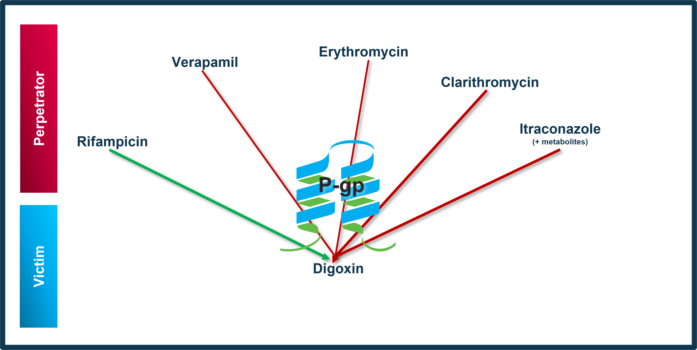

The arrows indicate where at least one clinical DDI study between the two connected substances was available and included in the model network. Red indicates inhibition and green indicates induction as the primary type of interaction. Thin arrows indicate weak, mid-thick arrows moderate and thick arrows strong P-gp modulation by the perpetrator.

The published DDI studies between the respective perpetrators and victim drugs were simulated and compared to observed data. The following sections give an overview of the clinical studies being part of this qualification report. The respective data identifier (DataID) refers to the **ID** of the dataset in the OSP PK database, version 1.6 (https://github.com/Open-Systems-Pharmacology/Database-for-observed-data/releases/tag/v1.6).

### 1.2.1 Clarithromycin - Digoxin DDI

The release of the snapshot containing the respective simulations can be found here: <https://github.com/Open-Systems-Pharmacology/Clarithromycin-Digoxin-DDI/releases/tag/v1.0>

The Clarithromycin / digoxin interaction was evaluated using 6 clinical DDI studies including 21 different clinical settings ([Gurley 2006](#references), [Gurley 2007](#references), [Gurley 2008b](#references), [Kurata 2002](#references), [Rengelshausen 2003](#references), [Tsutsumi 2002](#references)).

| DataID | Enzyme | Perpetrator / victim     | Study design                                                                                                                                               | Comment | Clinical study                      |
|---:|:---|:--------|:----------------------------------------------|:---|:------|
|  16324 | P-gp   | Clarithromycin / digoxin | Clarithromycin: **500** mg po twice daily (14 doses)   Digoxin: **0.4** mg po single dose, simultaneous with **12th** clarithromycin dose  |         | [Gurley 2006](#references)        |
|  16328 | P-gp   | Clarithromycin / digoxin | Clarithromycin: **500** mg po twice daily (14 doses)   Digoxin: **0.5** mg po single dose, simultaneous with **12th** clarithromycin dose  |         | [Gurley 2007](#references)        |
|    229 | P-gp   | Clarithromycin / digoxin | Clarithromycin: **500** mg po twice daily (14 doses)   Digoxin: **0.25** mg po single dose, 2 hours after **12th** clarithromycin dose     |         | [Gurley 2008b](#references)       |
|  16305 | P-gp   | Clarithromycin / digoxin | Clarithromycin: **400** mg po twice daily (16 doses)   Digoxin: **0.25** mg po single dose, simultaneous with **10th** clarithromycin dose |         | [Kurata 2002](#references)        |
|  16307 | P-gp   | Clarithromycin / digoxin | Clarithromycin: **400** mg po twice daily (16 doses)   Digoxin: **0.25** mg iv single dose, simultaneous with **10th** clarithromycin dose |         | [Kurata 2002](#references)        |
|  16309 | P-gp   | Clarithromycin / digoxin | Clarithromycin: **400** mg po twice daily (16 doses)   Digoxin: **0.25** mg po single dose, simultaneous with **10th** clarithromycin dose |         | [Kurata 2002](#references)        |
|  16311 | P-gp   | Clarithromycin / digoxin | Clarithromycin: **400** mg po twice daily (16 doses)   Digoxin: **0.25** mg iv single dose, simultaneous with **10th** clarithromycin dose |         | [Kurata 2002](#references)        |
|  16313 | P-gp   | Clarithromycin / digoxin | Clarithromycin: **400** mg po twice daily (16 doses)   Digoxin: **0.25** mg po single dose, simultaneous with **10th** clarithromycin dose |         | [Kurata 2002](#references)        |
|  16315 | P-gp   | Clarithromycin / digoxin | Clarithromycin: **400** mg po twice daily (16 doses)   Digoxin: **0.25** mg iv single dose, simultaneous with **10th** clarithromycin dose |         | [Kurata 2002](#references)        |
|  16333 | P-gp   | Clarithromycin / digoxin | Clarithromycin: **400** mg po twice daily (16 doses)   Digoxin: **0.25** mg po single dose, simultaneous with **10th** clarithromycin dose |         | [Kurata 2002](#references)        |
|  16334 | P-gp   | Clarithromycin / digoxin | Clarithromycin: **400** mg po twice daily (16 doses)   Digoxin: **0.25** mg iv single dose, simultaneous with **10th** clarithromycin dose |         | [Kurata 2002](#references)        |
|  16335 | P-gp   | Clarithromycin / digoxin | Clarithromycin: **400** mg po twice daily (16 doses)   Digoxin: **0.25** mg po single dose, simultaneous with **10th** clarithromycin dose |         | [Kurata 2002](#references)        |
|  16336 | P-gp   | Clarithromycin / digoxin | Clarithromycin: **400** mg po twice daily (16 doses)   Digoxin: **0.25** mg iv single dose, simultaneous with **10th** clarithromycin dose |         | [Kurata 2002](#references)        |
|  16337 | P-gp   | Clarithromycin / digoxin | Clarithromycin: **400** mg po twice daily (16 doses)   Digoxin: **0.25** mg po single dose, simultaneous with **10th** clarithromycin dose |         | [Kurata 2002](#references)        |
|  16338 | P-gp   | Clarithromycin / digoxin | Clarithromycin: **400** mg po twice daily (16 doses)   Digoxin: **0.25** mg iv single dose, simultaneous with **10th** clarithromycin dose |         | [Kurata 2002](#references)        |
|   3025 | P-gp   | Clarithromycin / digoxin | Clarithromycin: **250** mg po twice daily (6 doses)   Digoxin: **0.75** mg po single dose, 0.5 hours after **3rd** clarithromycin dose     |         | [Rengelshausen 2003](#references) |
|  16409 | P-gp   | Clarithromycin / digoxin | Clarithromycin: **250** mg po twice daily (6 doses)   Digoxin: **0.01** mg/kg iv single dose, 2 hours after **3rd** clarithromycin dose    |         | [Rengelshausen 2003](#references) |
|  16411 | P-gp   | Clarithromycin / digoxin | Clarithromycin: **250** mg po twice daily (6 doses)   Digoxin: **0.75** mg po single dose, 0.5 hours after **3rd** clarithromycin dose     |         | [Rengelshausen 2003](#references) |
|  16413 | P-gp   | Clarithromycin / digoxin | Clarithromycin: **250** mg po twice daily (6 doses)   Digoxin: **0.75** mg po single dose, 0.5 hours after **3rd** clarithromycin dose     |         | [Rengelshausen 2003](#references) |
|   3029 | P-gp   | Clarithromycin / digoxin | Clarithromycin: **200** mg po twice daily (10 doses)   Digoxin: **0.5** mg iv single dose, simultaneous with **3rd** clarithromycin dose   |         | [Tsutsumi 2002](#references)      |
|   3032 | P-gp   | Clarithromycin / digoxin | Clarithromycin: **200** mg po twice daily (10 doses)   Digoxin: **0.5** mg iv single dose, simultaneous with **3rd** clarithromycin dose   |         | [Tsutsumi 2002](#references)      |

### 1.2.2 Erythromycin - Digoxin DDI

The release of the snapshot containing the respective simulations can be found here: <https://github.com/Open-Systems-Pharmacology/Erythromycin-Digoxin-DDI/releases/tag/v1.1>

The erythromycin-digoxin interaction was evaluated using one clinical DDI study ([Tsutsumi 2002](#references)).

| DataID | Transporter | Perpetrator / victim   | Study design                                                                                                                                                                                                                        | Clinical study           |
| ------ | ----------- | ---------------------- | -------------------------------------------------------------------------------------------------------------------------- | ------------------------------ |
| 3028   | P-gp        | Erythromycin / digoxin | Erythromycin: 200 mg po QID for 5 days Digoxin: 0.5 mg iv, concomitantly with erythromycin on the 2nd day | [Tsutsumi 2002](#references) |

### 1.2.3 Itraconazole - Digoxin DDI

The release of the snapshot containing the respective simulations can be found here: <https://github.com/Open-Systems-Pharmacology/Itraconazole-Digoxin-DDI/releases/tag/v1.0>

The itraconazole-digoxin interaction was evaluated using 2 clinical DDI studies including 3 different clinical settings ([Jalava 1997](#references), [Partanen 1995](#references)).

| DataID | Transporter | Perpetrator / victim     | Study design                                                                                                                                               | Comment | Clinical study                      |
|---:|:---|:--------|:----------------------------------------------|:---|:------|
| 271 | P-gp   | Itraconazole / digoxin | Itraconazole: **200** mg po once daily (5 doses)   Digoxin: **0.5** mg po single dose, 1 h after the **3rd** itraconazole dose |         | [Jalava 1997](#references) |
| 16329 | P-gp   | Itraconazole / digoxin | Itraconazole: **200** mg po once daily (10 doses)   Digoxin: **0.25** mg po once daily (20 doses), 2 hours after **12th** itraconazole dose |         | [Partanen 1995](#references) |
| 16330 | P-gp   | Itraconazole / digoxin | Itraconazole: **200** mg po once daily (10 doses) starting with the  **11th** digoxin dose  Digoxin: **0.25** mg po once daily (20 doses), simultaneous with **10th** itraconazole dose |         | [Partanen 1995](#references) |

### 1.2.4 Verapamil - Digoxin DDI

The release of the snapshot containing the respective simulations can be found here: <https://github.com/Open-Systems-Pharmacology/Verapamil-Digoxin-DDI/releases/tag/v1.0>

The verapamil-digoxin interaction was evaluated using a 11 clinical DDI studies including 12 different clinical settings ([Belz 1981](#references), [Belz 1983](#references), [Doering 1983](#references), [Johnson 1987](#references), [Klein 1982](#references), [Pedersen 1981](#references), [Pedersen 1982](#references), [Pedersen 1983](#references), [Rodin 1988](#references), [Schwartz 1982](#references), [Wiebe 2020](#references)).

| DataID | Transporter | Perpetrator / victim       | Study design                                                 | Comment                                                      | Clinical study                        |
| ------ | ------ | -------------------------- | ------------------------------------------------------------ | ------------------------------------------------------------ | ------------------------------------- |
| 16635    | P-gp | Verapamil / digoxin | Verapamil: 80 mg po TID for 14 days Digoxin: 0.125 mg po TID for 14 days|              | [Belz 1981](#references)          |
| 16165    | P-gp | Verapamil / digoxin | Verapamil: 80 mg po TID for 14 days Digoxin: 0.125 mg po TID for 14 days|              | [Belz 1983](#references)          |
| 16167    | P-gp | Verapamil / digoxin | Verapamil: 120 mg po TID for 14 days Digoxin: 0.125 mg po TID for 14 days|              | [Belz 1983](#references)          |
| 16169   | P-gp | Verapamil / digoxin | Verapamil: 80 mg po TID for 14 days Digoxin: 0.125 mg po TID for 14 days|              | [Doering 1983](#references)          |
| 16159    | P-gp | Verapamil / digoxin | Verapamil: 80 mg po BID for 4 days followed by TID for 10 days Digoxin: 1.0 mg iv (15 min) on day 13|              | [Johnson 1987](#references)          |
| 16174    | P-gp | Verapamil / digoxin | Verapamil: 80 mg po TID for 14 days Digoxin: 0.25 mg PO OD for 28 days|              | [Klein 1982](#references)          |
| 16638    | P-gp | Verapamil / digoxin | Verapamil: 80 mg po TID for 10 days Digoxin: 0.75 mg IV SD at day 10|              | [Pedersen 1981](#references) 
| 16163    | P-gp | Verapamil / digoxin | Verapamil: 80 mg po TID followed by 120mg TID Digoxin: initial dose of 1mg PO followed by 0.0625 mg po BID followed by 0.125mg BID |              | [Pedersen 1982](#references)          |
| 16162    | P-gp | Verapamil / digoxin | Verapamil: 120 mg po TID for 12 days Digoxin: 1.0 mg iv (bolus) on day 8|              | [Pedersen 1983](#references)          |
| 3063  | P-gp | Verapamil / digoxin | Verapamil: 80mg BID for 4 days followed by 80mg TID for 10 days Digoxin: 0.25 mg PO BID for 14 days|              | [Rodin 1988](#references)          |
| 16175   | P-gp | Verapamil / digoxin | Verapamil: 80 mg po QID for 70 days Digoxin: 0.46 mg PO OD for 85 days| Daily dose of digoxin varied between patients between 0.25 and 1 mg/day. 0.46 is the arith. mean of all dose levels.  | [Schwartz 1982](#references)          |
| 16172   | P-gp | Verapamil / digoxin | Verapamil: 120 mg po SD Digoxin: 0.25 mg PO SD 1h after verapamil dosing|              | [Wiebe 2020](#references)          |

### 1.2.5 Rifampicin - Digoxin DDI

The release of the snapshot containing the respective simulations can be found here: <https://github.com/Open-Systems-Pharmacology/Rifampicin-Digoxin-DDI/releases/tag/v1.0>

The rifampicin-digoxin interaction was evaluated using 9 clinical DDI studies including 11 different clinical settings ([Drescher 2003](#references), [Gurley 2006](#references), [Gurley 2007](#references), [Gurley 2008b](#references), [Greiner 1999](#references), [Kirby 2012](#references), [Larsen 2007](#references), [Reitmann 2011](#references), [Wiebe 2020](#references)).

| DataID | Transporter | Perpetrator / victim     | Study design                                                                                                                                               | Comment | Clinical study                      |
|---:|:---|:--------|:----------------------------------------------|:---|:------|
| 191 | P-gp   | Rifampicin / digoxin | Rifampicin: **600** mg po once daily (16 doses)   Digoxin: **1** mg po single dose, simultaneous with **11th** rifampicin dose |         | [Greiner 1999](#references) |
| 193 | P-gp   | Rifampicin / digoxin | Rifampicin: **600** mg po once daily (16 doses)   Digoxin: **1** mg iv single dose, simultaneous with **11th** rifampicin dose |         | [Greiner 1999](#references) |
|    227 | P-gp   | Rifampicin / digoxin | Rifampicin: **300** mg po twice daily (16 doses)   Digoxin: **0.25** mg po single dose, 2 hours after **13th** rifampicin dose |         | [Gurley 2008b](#references)       |
| 314 | P-gp   | Rifampicin / digoxin | Rifampicin: **600** mg po once daily (14 doses)   Digoxin: **0.5** mg po single dose, 12 hours after **14th** rifampicin dose |         | [Kirby 2012](#references) |
| 316 | P-gp   | Rifampicin / digoxin | Rifampicin: **600** mg po once daily (14 doses)   Digoxin: **0.5** mg iv single dose, 12 hours after **14th** rifampicin  dose |         | [Kirby 2012](#references) |
| 337 | P-gp   | Rifampicin / digoxin | Rifampicin: **600** mg po once daily (6 doses)   Digoxin: **0.5** mg po single dose, simultaneous with **7th** rifampicin dose |         | [Larsen 2007](#references) |
| 396 | P-gp   | Rifampicin / digoxin | Rifampicin: **600** mg po once daily (28 doses)   Digoxin: **0.5** mg po single dose, 1 h after the  **28th** (last) rifampicin dose |         | [Reitmann 2011](#references) |
| 397 | P-gp   | Rifampicin / digoxin | Rifampicin: **600** mg po once daily (28 doses)   Digoxin: **0.5** mg po single dose, 169 h (1 week +1 h) after the  **28th** (last) rifampicin dose |         | [Reitmann 2011](#references) |
| 398 | P-gp   | Rifampicin / digoxin | Rifampicin: **600** mg po once daily (28 doses)   Digoxin: **0.5** mg po single dose, 337 h (2 weeks +1 h) after the  **28th** (last) rifampicin dose |         | [Reitmann 2011](#references) |
| 16301 | P-gp   | Rifampicin / digoxin | Rifampicin: **600** mg po single dose   Digoxin: **0.25** mg po single dose, simultaneous with rifampicin dose |         | [Wiebe 2020](#references) |
| 16319 | P-gp   | Rifampicin / digoxin | Rifampicin: **600** mg po once daily (14 doses)   Digoxin: **1** mg iv single dose, 12 h after the **10th** rifampicin dose |         | [Drescher 2003](#references) |
| 16322 | P-gp   | Rifampicin / digoxin | Rifampicin: **600** mg po once daily (14 doses)   Digoxin: **0.4** mg po single dose, simultaneous with **7th** rifampicin dose |         | [Gurley 2006](#references) |
| 16326 | P-gp   | Rifampicin / digoxin | Rifampicin: **600** mg po once daily (14 doses)   Digoxin: **0.5** mg iv single dose, simultaneous with **7th** rifampicin dose |         | [Gurley 2007](#references) |

# 2 Qualification of Use Case Pgp-mediated DDI

The following section shows the correlations between observed and model-predicted AUC and Cmax ratios, respectively.

Specifically, the PBPK model performance for the PK parameters **AUC ratio (AUCR)** and **Cmax ratio (CMAXR)** is assessed via:

- predicted (*Pred*) vs. observed (*Obs*) plots

- *Pred*/*Obs* vs. *Obs* plots

- geometric mean fold error (GMFE):
  
  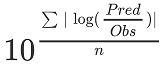
  
- number of AUCR and CMAXR falling within 2-fold error range and within the limits as suggested by [Guest et al. 2011](#4-references)
  
- detailed table of results for each study

  

In the plots,

- the dotted lines denote 0.50–2.00 (2-fold) criterion,

- the solid lines denote the limits as suggested by [Guest et al. 2011](#4-references),

- the bold solid line denotes the unity line,

- each color represents one combination of drugs,

- squares represent studies with intravenous administration of the victim drug and circles represent studies with oral administration of the victim drug.

***

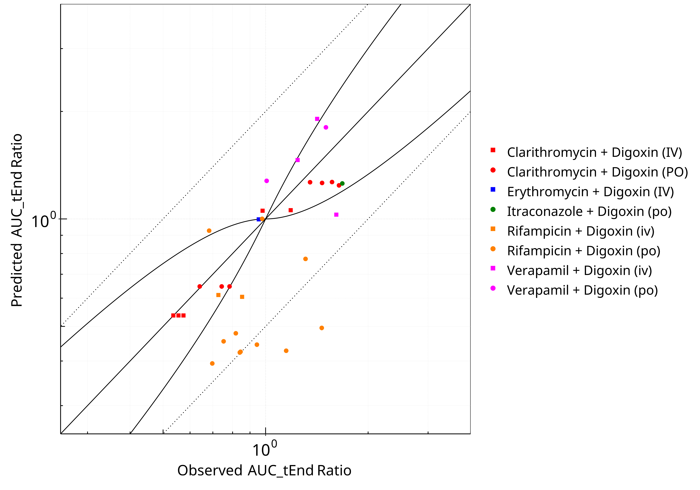

**Figure 2-1: Pgp DDI.  Predicted vs. Observed AUC_tEnd Ratio. (&delta; = 1 in Guest *et al.* formula)**

 
 

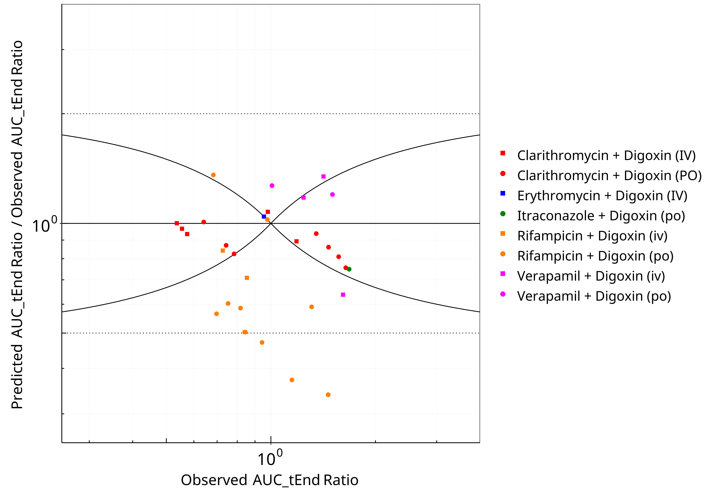

**Figure 2-2: Pgp DDI.  Predicted/Observed vs. Observed AUC_tEnd Ratio. (&delta; = 1 in Guest *et al.* formula)**

 
 

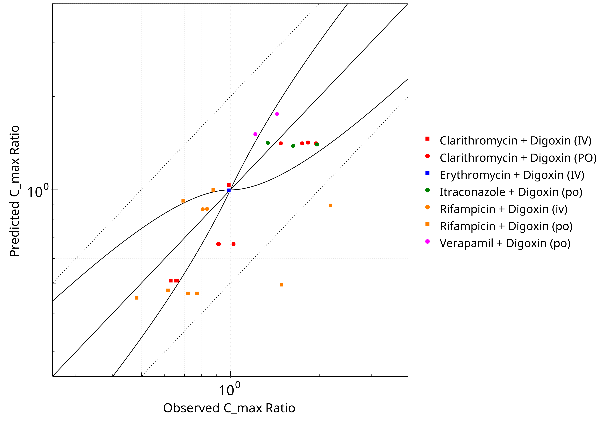

**Figure 2-3: Pgp DDI.  Predicted vs. Observed C_max Ratio. (&delta; = 1 in Guest *et al.* formula)**

 
 

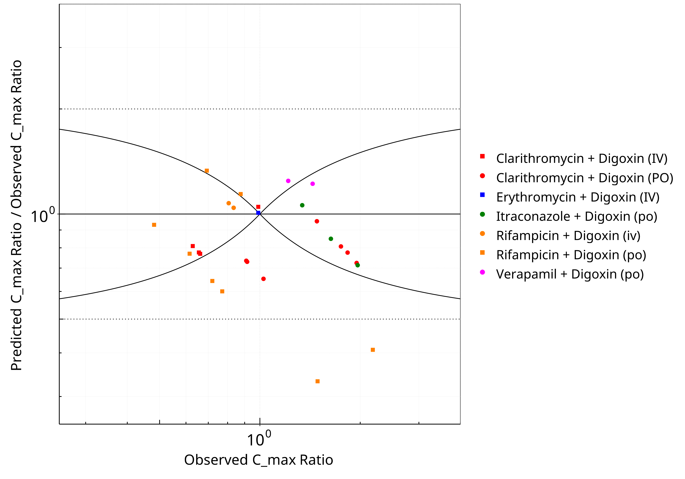

**Figure 2-4: Pgp DDI.  Predicted/Observed vs. Observed C_max Ratio. (&delta; = 1 in Guest *et al.* formula)**

 
 

**Table 2-1: GMFE for Pgp DDI Ratio**

|PK parameter |GMFE |
|:------------|:----|
|AUC_tEnd     |1.37 |
|C_max        |1.32 |

 
 

**Table 2-2: Summary table for Pgp DDI - AUC_tEnd Ratio. (&delta; = 1 in Guest *et al.* formula)**

|AUC_tEnd                     |Number |Ratio [%] |
|:----------------------------|:------|:---------|
|Points total                 |32     |-        |
|Points within Guest *et al.* |16     |50.00     |
|Points within 2 fold         |29     |90.62     |

 
 

**Table 2-3: Summary table for Pgp DDI - C_max Ratio. (&delta; = 1 in Guest *et al.* formula)**

|C_max                        |Number |Ratio [%] |
|:----------------------------|:------|:---------|
|Points total                 |27     |-        |
|Points within Guest *et al.* |16     |59.26     |
|Points within 2 fold         |25     |92.59     |

 
 

**Table 2-4: Summary table for Pgp DDI**

|DataID |Perpetrator                                                     |Victim      |Predicted AUC_tEnd Ratio |Observed AUC_tEnd Ratio |Pred/Obs AUC_tEnd Ratio |Predicted C_max Ratio |Observed C_max Ratio |Pred/Obs C_max Ratio |Reference            |
|:------|:---------------------------------------------------------------|:-----------|:------------------------|:-----------------------|:-----------------------|:---------------------|:--------------------|:--------------------|:--------------------|
|191    |Rifampicin, 600 mg, PO, MD OD (16 days)                         |Digoxin, PO |0.39                     |0.70                    |0.57                    |0.45                  |0.48                 |0.93                 |Greiner 1999         |
|193    |Rifampicin, 600 mg, PO, MD OD (16 days)                         |Digoxin, IV |0.60                     |0.85                    |0.71                    |0.87                  |0.83                 |1.04                 |Greiner 1999         |
|227    |Rifampicin, 300 mg, PO, MD BID (7 days)                         |Digoxin, PO |0.45                     |0.75                    |0.60                    |0.47                  |0.62                 |0.77                 |Gurley 2008b         |
|229    |Clarithromycin, 500 mg, PO, MD BID (7 days)                     |Digoxin, PO |1.26                     |1.47                    |0.86                    |1.42                  |1.75                 |0.81                 |Gurley 2008b         |
|271    |Itraconazole, 200 mg, PO, MD OD (5 days)                        |Digoxin, PO |1.26                     |1.68                    |0.75                    |1.42                  |1.34                 |1.06                 |Jalava 1997          |
|314    |Rifampicin, 600 mg, PO, MD OD (14 days)                         |Digoxin, PO |0.45                     |0.94                    |0.47                    |0.48                  |-                   |-                   |Kirby 2012           |
|316    |Rifampicin, 600 mg, PO, MD OD (14 days)                         |Digoxin, PO |0.43                     |1.15                    |0.37                    |0.45                  |-                   |-                   |Kirby 2012           |
|337    |Rifampicin, 600 mg, PO, MD OD (6 days)                          |Digoxin, PO |0.48                     |0.82                    |0.59                    |0.51                  |-                   |-                   |Larsen 2007          |
|396    |Rifampicin, 600 mg, PO, MD OD (28 days)                         |Digoxin, PO |0.50                     |1.46                    |0.34                    |0.49                  |1.49                 |0.33                 |Reitman 2011         |
|397    |Rifampicin, 600 mg, PO, MD OD (28 days)                         |Digoxin, PO |0.93                     |0.68                    |1.36                    |0.92                  |0.69                 |1.33                 |Reitman 2011         |
|398    |Rifampicin, 600 mg, PO, MD OD (28 days)                         |Digoxin, PO |1.00                     |0.98                    |1.03                    |1.00                  |0.88                 |1.14                 |Reitman 2011         |
|3028   |Erythromycin, 200 mg, PO, MD QID (5 days)                       |Digoxin, IV |1.00                     |0.95                    |1.04                    |1.00                  |0.99                 |1.01                 |Tsutsumi 2002        |
|3029   |Clarithromycin, 200 mg, PO, MD BID (5 days)                     |Digoxin, IV |1.05                     |0.98                    |1.08                    |1.04                  |0.99                 |1.05                 |Tsutsumi 2002        |
|3063   |Verapamil, 80 mg, PO, MD: 80mg BID (4 days), 80mg TID (10 days) |Digoxin, PO |1.81                     |1.50                    |1.20                    |1.76                  |1.44                 |1.22                 |Rodin 1988           |
|16159  |Verapamil, 80 mg, PO, MD BID 4days, TID 10days                  |Digoxin, IV |1.46                     |1.24                    |1.18                    |1.05                  |-                   |-                   |Johnson et al. 1987  |
|16162  |Verapamil, 120 mg, PO, TID, 7 days pre-treatment                |Digoxin, IV |1.91                     |1.42                    |1.34                    |1.01                  |-                   |-                   |Pedersen et al. 1983 |
|16172  |Verapamil, 120 mg, PO, SD                                       |Digoxin, PO |1.28                     |1.01                    |1.27                    |1.52                  |1.22                 |1.25                 |Wiebe 2020           |
|16301  |Rifampicin, 600 mg, PO, SD                                      |Digoxin, PO |0.77                     |1.31                    |0.59                    |0.89                  |2.18                 |0.41                 |Wiebe 2020           |
|16305  |Clarithromycin, 400 mg, PO, MD                                  |Digoxin, PO |0.65                     |0.74                    |0.87                    |0.67                  |1.02                 |0.65                 |Kurata 2002          |
|16307  |Clarithromycin, 400 mg, PO, MD                                  |Digoxin, IV |0.54                     |0.57                    |0.93                    |0.51                  |0.66                 |0.78                 |Kurata 2002          |
|16309  |Clarithromycin, 400 mg, PO, MD                                  |Digoxin, PO |0.65                     |0.64                    |1.01                    |0.67                  |0.91                 |0.74                 |Kurata 2002          |
|16311  |Clarithromycin, 400 mg, PO, MD                                  |Digoxin, IV |0.54                     |0.54                    |1.00                    |0.51                  |0.66                 |0.77                 |Kurata 2002          |
|16313  |Clarithromycin, 400 mg, PO, MD                                  |Digoxin, PO |0.65                     |0.78                    |0.83                    |0.67                  |0.92                 |0.73                 |Kurata 2002          |
|16315  |Clarithromycin, 400 mg, PO, MD                                  |Digoxin, IV |0.54                     |0.56                    |0.97                    |0.51                  |0.63                 |0.81                 |Kurata 2002          |
|16319  |Rifampicin, 600 mg, PO, MD                                      |Digoxin, IV |0.61                     |0.73                    |0.84                    |0.87                  |0.81                 |1.08                 |Drescher 2003        |
|16322  |Rifampicin, 300 mg, PO, MD                                      |Digoxin, PO |0.43                     |0.84                    |0.50                    |0.46                  |0.77                 |0.60                 |Gurley 2006          |
|16324  |Clarithromycin, 500 mg, PO, MD                                  |Digoxin, PO |1.27                     |1.35                    |0.94                    |1.42                  |1.48                 |0.95                 |Gurley 2006          |
|16326  |Rifampicin, 300 mg, PO, MD                                      |Digoxin, PO |0.42                     |0.84                    |0.50                    |0.46                  |0.72                 |0.64                 |Gurley 2007          |
|16328  |Clarithromycin, 500 mg, PO, MD                                  |Digoxin, PO |1.27                     |1.57                    |0.81                    |1.42                  |1.95                 |0.73                 |Gurley 2007          |
|16329  |Itraconazole, 200 mg, PO, MD                                    |Digoxin, PO |1.35                     |-                      |-                      |1.39                  |1.63                 |0.85                 |Partanen 1996        |
|16330  |Itraconazole, 200 mg, PO, MD                                    |Digoxin, PO |1.37                     |-                      |-                      |1.40                  |1.97                 |0.71                 |Partanen 1996        |
|16409  |Clarithromycin, 250 mg, PO, MD BID (3 days)                     |Digoxin, IV |1.06                     |1.19                    |0.89                    |1.00                  |-                   |-                   |Rengelshausen 2003   |
|16411  |Clarithromycin, 250 mg, PO, MD BID (3 days)                     |Digoxin, PO |1.24                     |1.64                    |0.76                    |1.42                  |1.83                 |0.78                 |Rengelshausen 2003   |
|16638  |Verapamil, 80 mg, PO, TID                                       |Digoxin, IV |1.03                     |1.61                    |0.64                    |0.83                  |-                   |-                   |Pedersen 1981        |

 
 

## 2.1 Mechanism

### 2.1.1 Induction

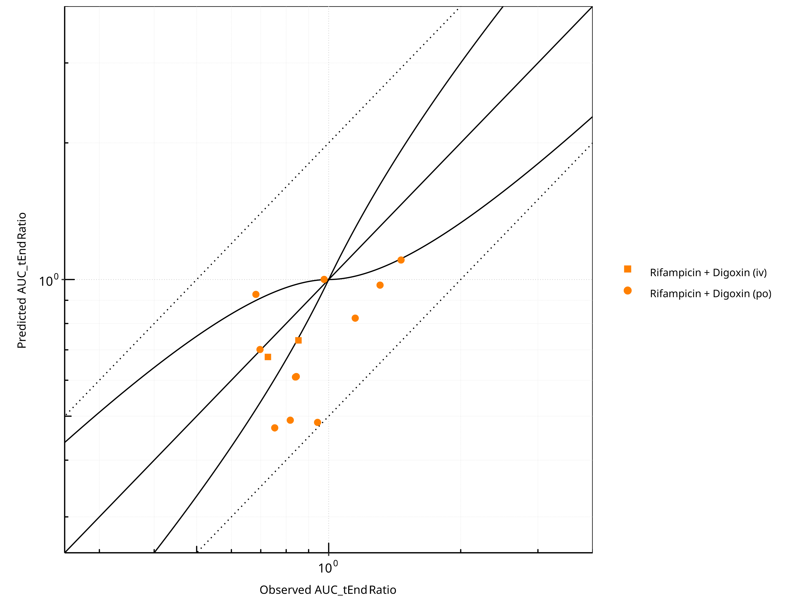

**Figure 2-5: Pgp DDI. Mechanism: Induction. Predicted vs. Observed AUC_tEnd Ratio. (&delta; = 1 in Guest *et al.* formula)**

 
 

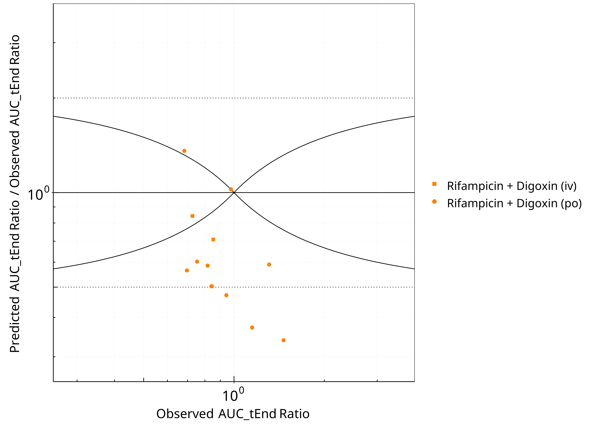

**Figure 2-6: Pgp DDI. Mechanism: Induction. Predicted/Observed vs. Observed AUC_tEnd Ratio. (&delta; = 1 in Guest *et al.* formula)**

 
 

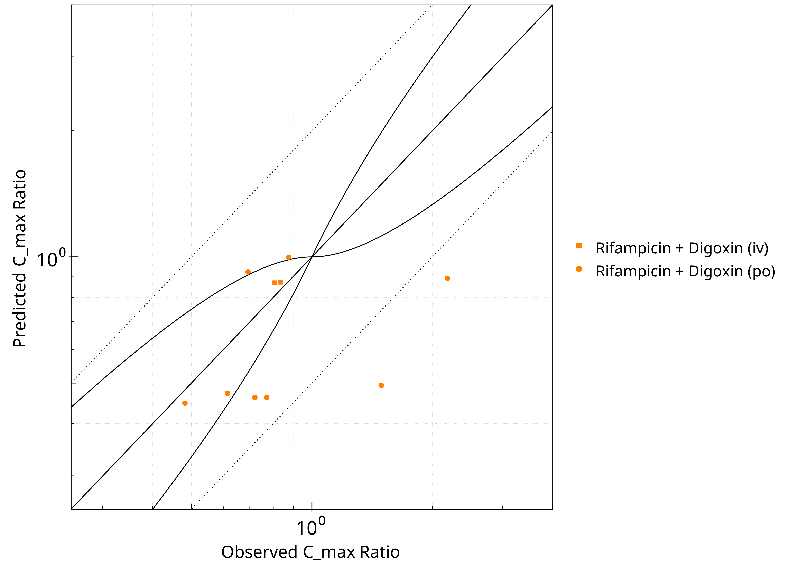

**Figure 2-7: Pgp DDI. Mechanism: Induction. Predicted vs. Observed C_max Ratio. (&delta; = 1 in Guest *et al.* formula)**

 
 

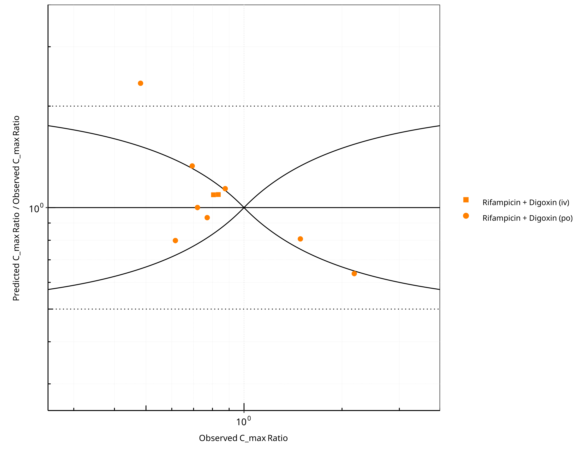

**Figure 2-8: Pgp DDI. Mechanism: Induction. Predicted/Observed vs. Observed C_max Ratio. (&delta; = 1 in Guest *et al.* formula)**

 
 

**Table 2-5: GMFE for Pgp DDI Ratio**

|PK parameter |GMFE |
|:------------|:----|
|AUC_tEnd     |1.74 |
|C_max        |1.47 |

 
 

**Table 2-6: Summary table for Pgp DDI - AUC_tEnd Ratio. (&delta; = 1 in Guest *et al.* formula)**

|AUC_tEnd                     |Number |Ratio [%] |
|:----------------------------|:------|:---------|
|Points total                 |13     |-        |
|Points within Guest *et al.* |1      |7.69      |
|Points within 2 fold         |10     |76.92     |

 
 

**Table 2-7: Summary table for Pgp DDI - C_max Ratio. (&delta; = 1 in Guest *et al.* formula)**

|C_max                        |Number |Ratio [%] |
|:----------------------------|:------|:---------|
|Points total                 |10     |-        |
|Points within Guest *et al.* |4      |40        |
|Points within 2 fold         |8      |80        |

 
 

### 2.1.2 Mechanism-based Inactivation

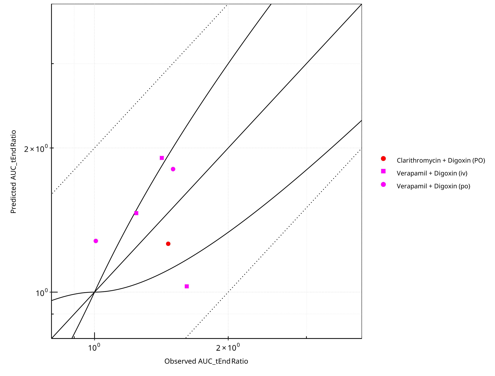

**Figure 2-9: Pgp DDI. Mechanism: Mechanism-based Inactivation. Predicted vs. Observed AUC_tEnd Ratio. (&delta; = 1 in Guest *et al.* formula)**

 
 

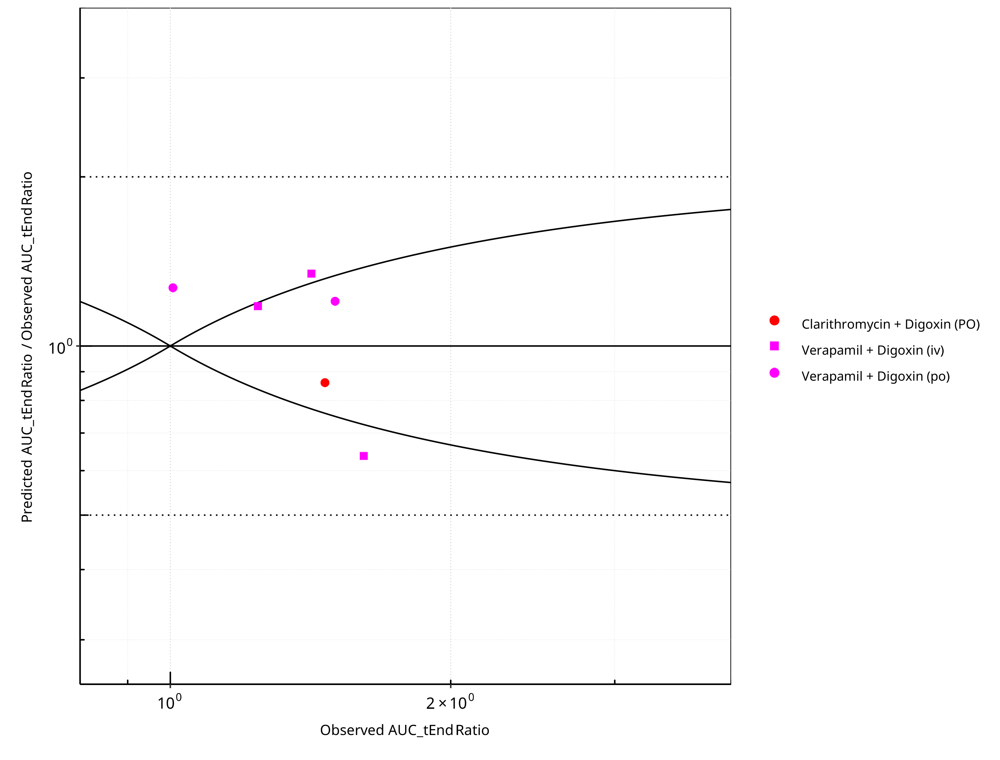

**Figure 2-10: Pgp DDI. Mechanism: Mechanism-based Inactivation. Predicted/Observed vs. Observed AUC_tEnd Ratio. (&delta; = 1 in Guest *et al.* formula)**

 
 

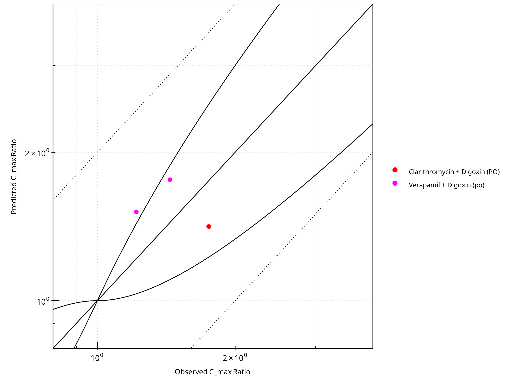

**Figure 2-11: Pgp DDI. Mechanism: Mechanism-based Inactivation. Predicted vs. Observed C_max Ratio. (&delta; = 1 in Guest *et al.* formula)**

 
 

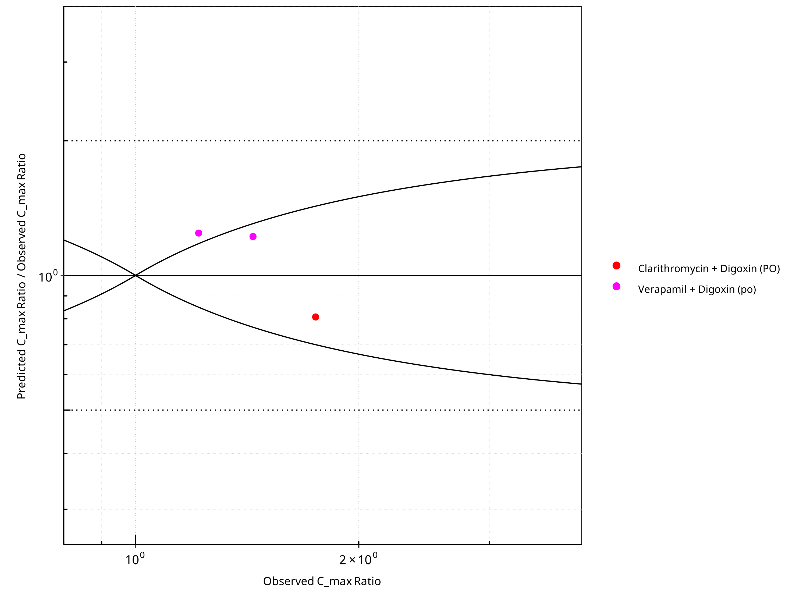

**Figure 2-12: Pgp DDI. Mechanism: Mechanism-based Inactivation. Predicted/Observed vs. Observed C_max Ratio. (&delta; = 1 in Guest *et al.* formula)**

 
 

**Table 2-8: GMFE for Pgp DDI Ratio**

|PK parameter |GMFE |
|:------------|:----|
|AUC_tEnd     |1.28 |
|C_max        |1.24 |

 
 

**Table 2-9: Summary table for Pgp DDI - AUC_tEnd Ratio. (&delta; = 1 in Guest *et al.* formula)**

|AUC_tEnd                     |Number |Ratio [%] |
|:----------------------------|:------|:---------|
|Points total                 |6      |-        |
|Points within Guest *et al.* |3      |50        |
|Points within 2 fold         |6      |100       |

 
 

**Table 2-10: Summary table for Pgp DDI - C_max Ratio. (&delta; = 1 in Guest *et al.* formula)**

|C_max                        |Number |Ratio [%] |
|:----------------------------|:------|:---------|
|Points total                 |3      |-        |
|Points within Guest *et al.* |2      |66.67     |
|Points within 2 fold         |3      |100.00    |

 
 

### 2.1.3 Reversible Inhibition

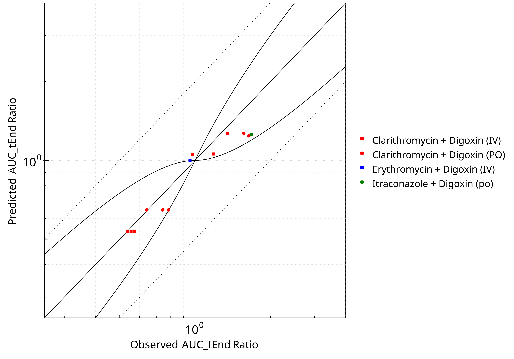

**Figure 2-13: Pgp DDI. Mechanism: Reversible Inhibition. Predicted vs. Observed AUC_tEnd Ratio. (&delta; = 1 in Guest *et al.* formula)**

 
 

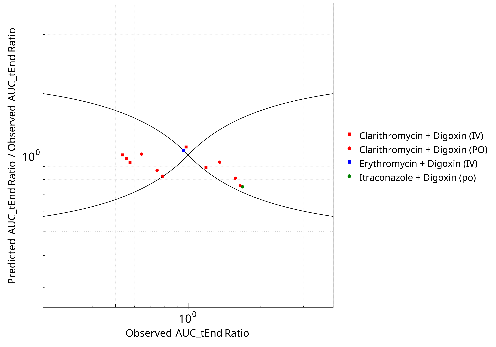

**Figure 2-14: Pgp DDI. Mechanism: Reversible Inhibition. Predicted/Observed vs. Observed AUC_tEnd Ratio. (&delta; = 1 in Guest *et al.* formula)**

 
 

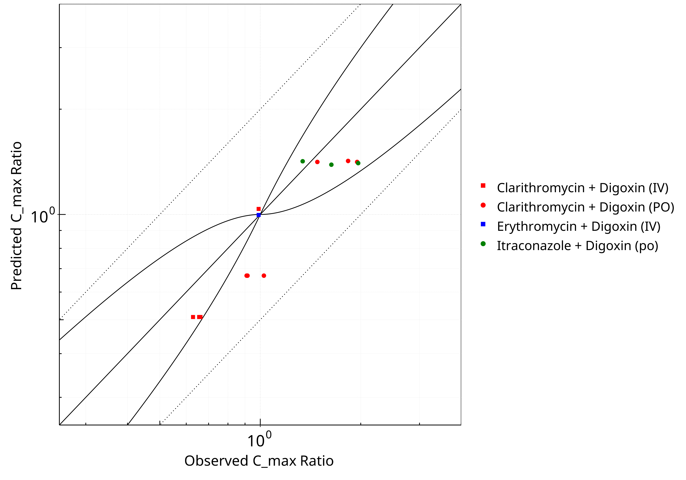

**Figure 2-15: Pgp DDI. Mechanism: Reversible Inhibition. Predicted vs. Observed C_max Ratio. (&delta; = 1 in Guest *et al.* formula)**

 
 

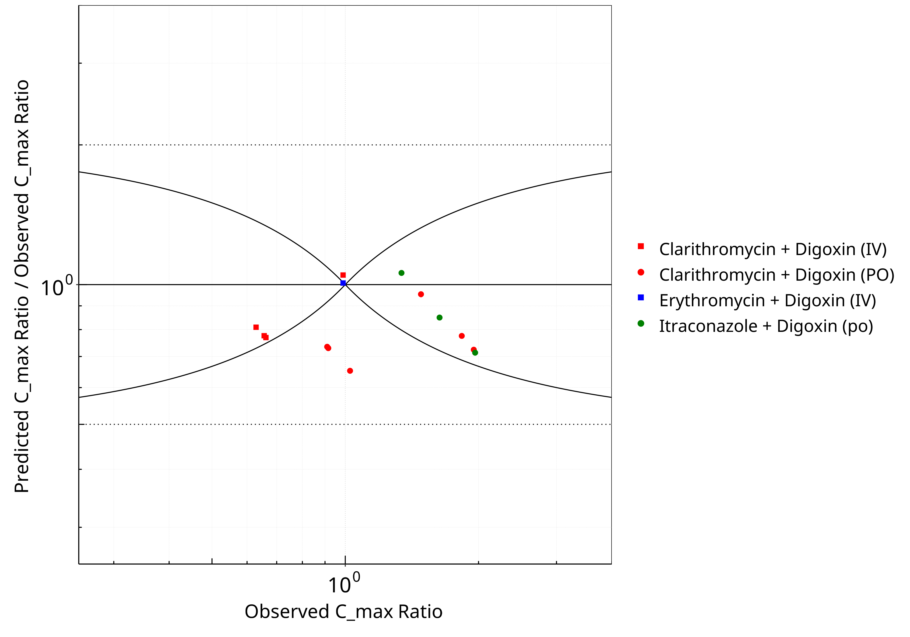

**Figure 2-16: Pgp DDI. Mechanism: Reversible Inhibition. Predicted/Observed vs. Observed C_max Ratio. (&delta; = 1 in Guest *et al.* formula)**

 
 

**Table 2-11: GMFE for Pgp DDI Ratio**

|PK parameter |GMFE |
|:------------|:----|
|AUC_tEnd     |1.12 |
|C_max        |1.24 |

 
 

**Table 2-12: Summary table for Pgp DDI - AUC_tEnd Ratio. (&delta; = 1 in Guest *et al.* formula)**

|AUC_tEnd                     |Number |Ratio [%] |
|:----------------------------|:------|:---------|
|Points total                 |13     |-        |
|Points within Guest *et al.* |12     |92.31     |
|Points within 2 fold         |13     |100.00    |

 
 

**Table 2-13: Summary table for Pgp DDI - C_max Ratio. (&delta; = 1 in Guest *et al.* formula)**

|C_max                        |Number |Ratio [%] |
|:----------------------------|:------|:---------|
|Points total                 |14     |-        |
|Points within Guest *et al.* |10     |71.43     |
|Points within 2 fold         |14     |100.00    |

 
 

## 2.2 Perpetrator

### 2.2.1 Clarithromycin

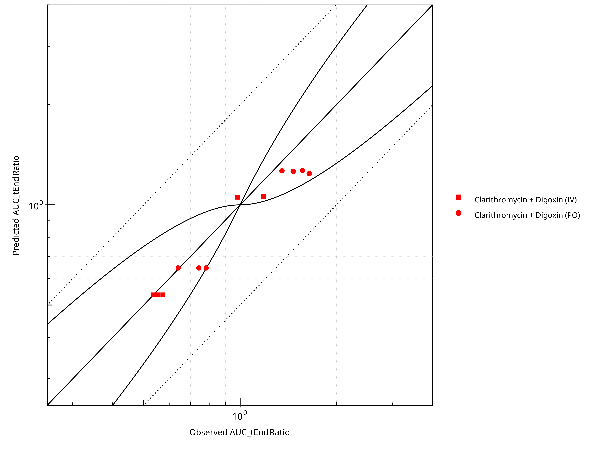

**Figure 2-17: Pgp DDI. Perpetrator: Clarithromycin. Predicted vs. Observed AUC_tEnd Ratio. (&delta; = 1 in Guest *et al.* formula)**

 
 

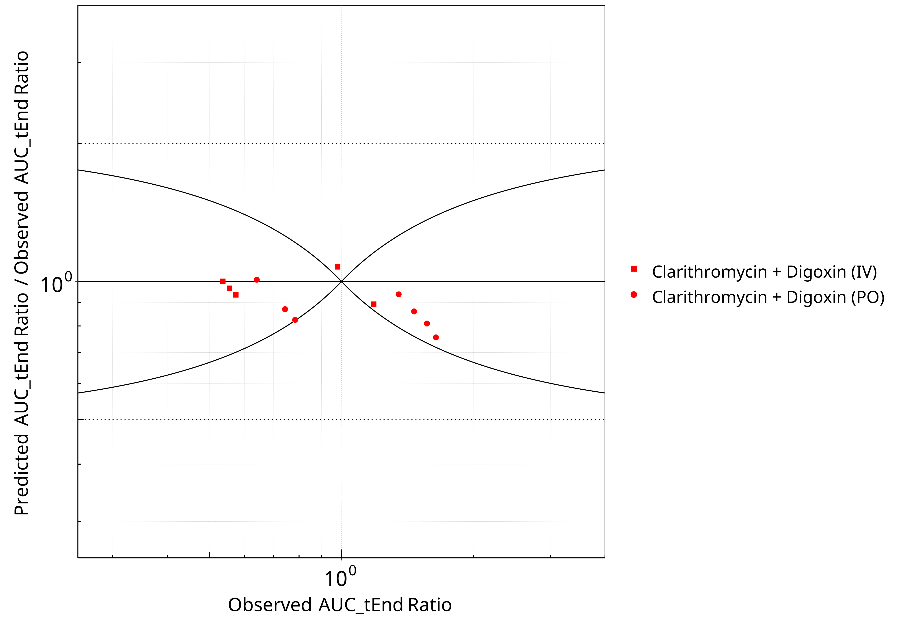

**Figure 2-18: Pgp DDI. Perpetrator: Clarithromycin. Predicted/Observed vs. Observed AUC_tEnd Ratio. (&delta; = 1 in Guest *et al.* formula)**

 
 

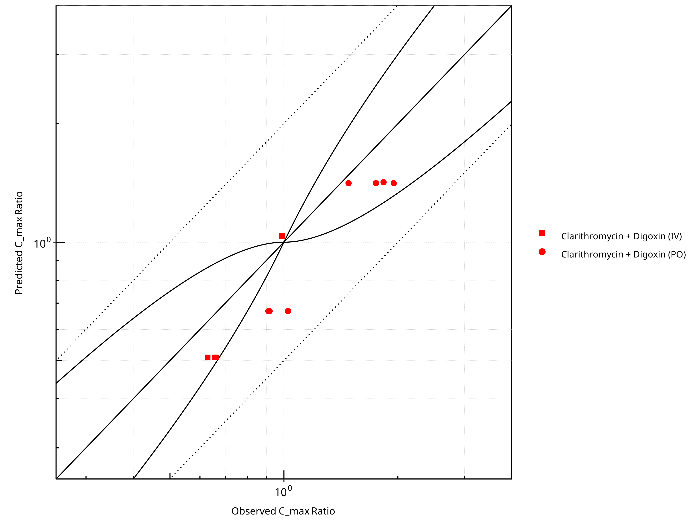

**Figure 2-19: Pgp DDI. Perpetrator: Clarithromycin. Predicted vs. Observed C_max Ratio. (&delta; = 1 in Guest *et al.* formula)**

 
 

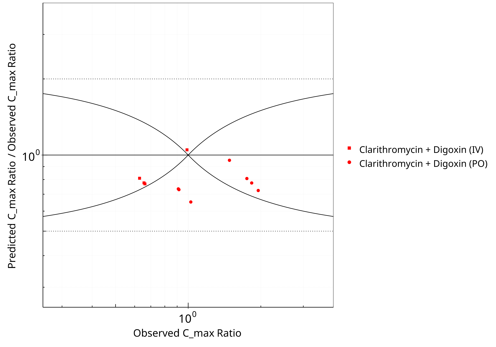

**Figure 2-20: Pgp DDI. Perpetrator: Clarithromycin. Predicted/Observed vs. Observed C_max Ratio. (&delta; = 1 in Guest *et al.* formula)**

 
 

**Table 2-14: GMFE for Pgp DDI Ratio**

|PK parameter |GMFE |
|:------------|:----|
|AUC_tEnd     |1.12 |
|C_max        |1.27 |

 
 

**Table 2-15: Summary table for Pgp DDI - AUC_tEnd Ratio. (&delta; = 1 in Guest *et al.* formula)**

|AUC_tEnd                     |Number |Ratio [%] |
|:----------------------------|:------|:---------|
|Points total                 |12     |-        |
|Points within Guest *et al.* |11     |91.67     |
|Points within 2 fold         |12     |100.00    |

 
 

**Table 2-16: Summary table for Pgp DDI - C_max Ratio. (&delta; = 1 in Guest *et al.* formula)**

|C_max                        |Number |Ratio [%] |
|:----------------------------|:------|:---------|
|Points total                 |11     |-        |
|Points within Guest *et al.* |7      |63.64     |
|Points within 2 fold         |11     |100.00    |

 
 

### 2.2.2 Erythromycin

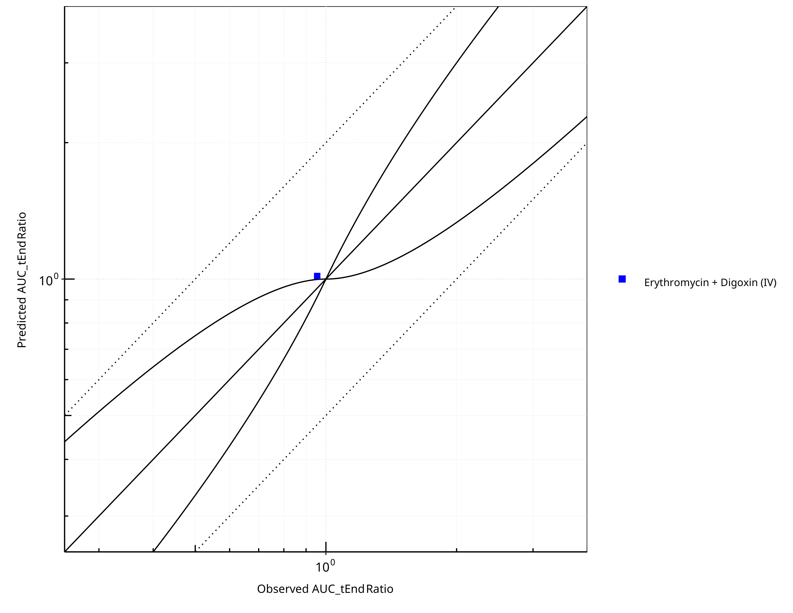

**Figure 2-21: Pgp DDI. Perpetrator: Erythromycin. Predicted vs. Observed AUC_tEnd Ratio. (&delta; = 1 in Guest *et al.* formula)**

 
 

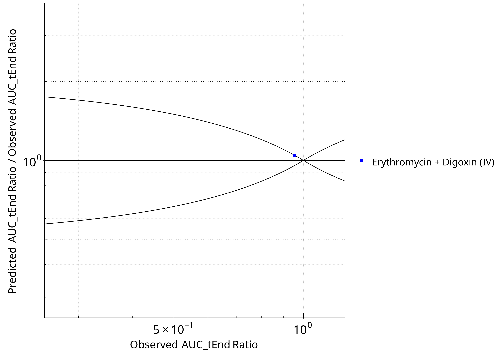

**Figure 2-22: Pgp DDI. Perpetrator: Erythromycin. Predicted/Observed vs. Observed AUC_tEnd Ratio. (&delta; = 1 in Guest *et al.* formula)**

 
 

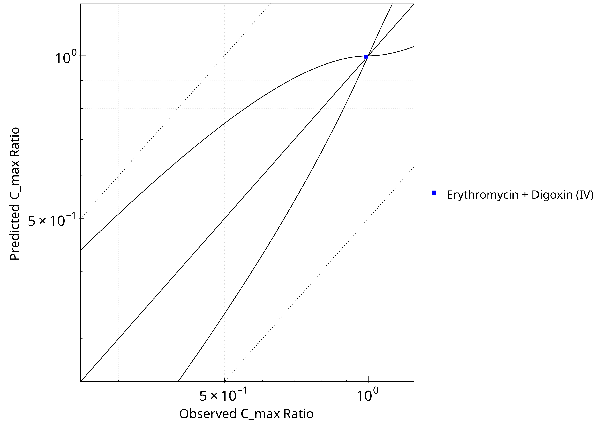

**Figure 2-23: Pgp DDI. Perpetrator: Erythromycin. Predicted vs. Observed C_max Ratio. (&delta; = 1 in Guest *et al.* formula)**

 
 

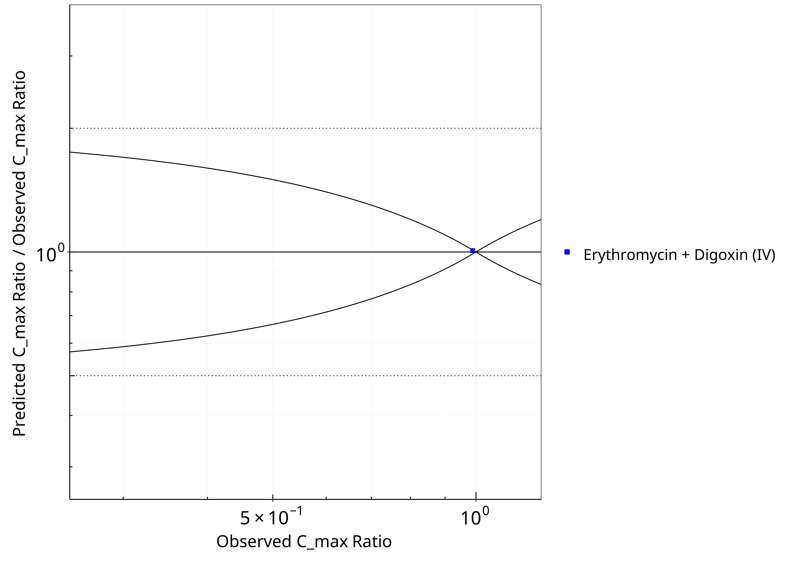

**Figure 2-24: Pgp DDI. Perpetrator: Erythromycin. Predicted/Observed vs. Observed C_max Ratio. (&delta; = 1 in Guest *et al.* formula)**

 
 

**Table 2-17: GMFE for Pgp DDI Ratio**

|PK parameter |GMFE |
|:------------|:----|
|AUC_tEnd     |1.04 |
|C_max        |1.01 |

 
 

**Table 2-18: Summary table for Pgp DDI - AUC_tEnd Ratio. (&delta; = 1 in Guest *et al.* formula)**

|AUC_tEnd                     |Number |Ratio [%] |
|:----------------------------|:------|:---------|
|Points total                 |1      |-        |
|Points within Guest *et al.* |1      |100       |
|Points within 2 fold         |1      |100       |

 
 

**Table 2-19: Summary table for Pgp DDI - C_max Ratio. (&delta; = 1 in Guest *et al.* formula)**

|C_max                        |Number |Ratio [%] |
|:----------------------------|:------|:---------|
|Points total                 |1      |-        |
|Points within Guest *et al.* |1      |100       |
|Points within 2 fold         |1      |100       |

 
 

### 2.2.3 Itraconazole

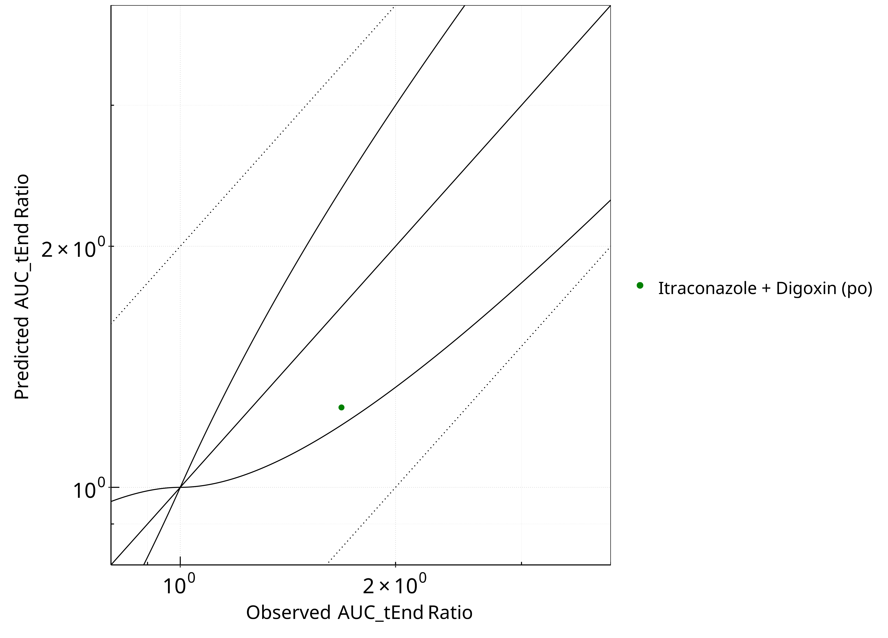

**Figure 2-25: Pgp DDI. Perpetrator: Itraconazole. Predicted vs. Observed AUC_tEnd Ratio. (&delta; = 1 in Guest *et al.* formula)**

 
 

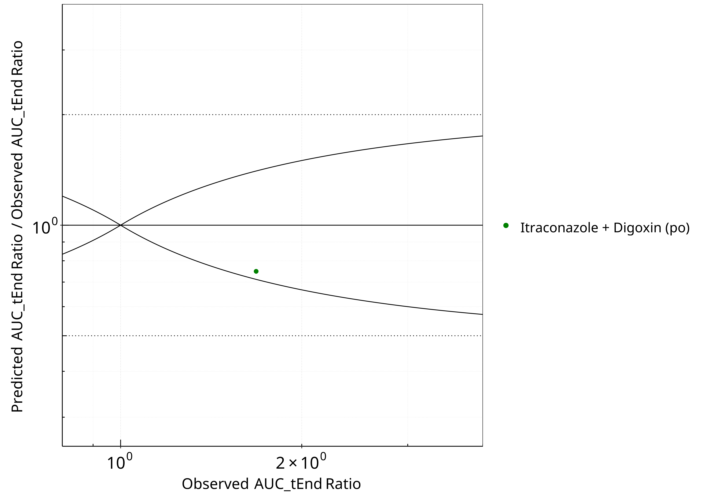

**Figure 2-26: Pgp DDI. Perpetrator: Itraconazole. Predicted/Observed vs. Observed AUC_tEnd Ratio. (&delta; = 1 in Guest *et al.* formula)**

 
 

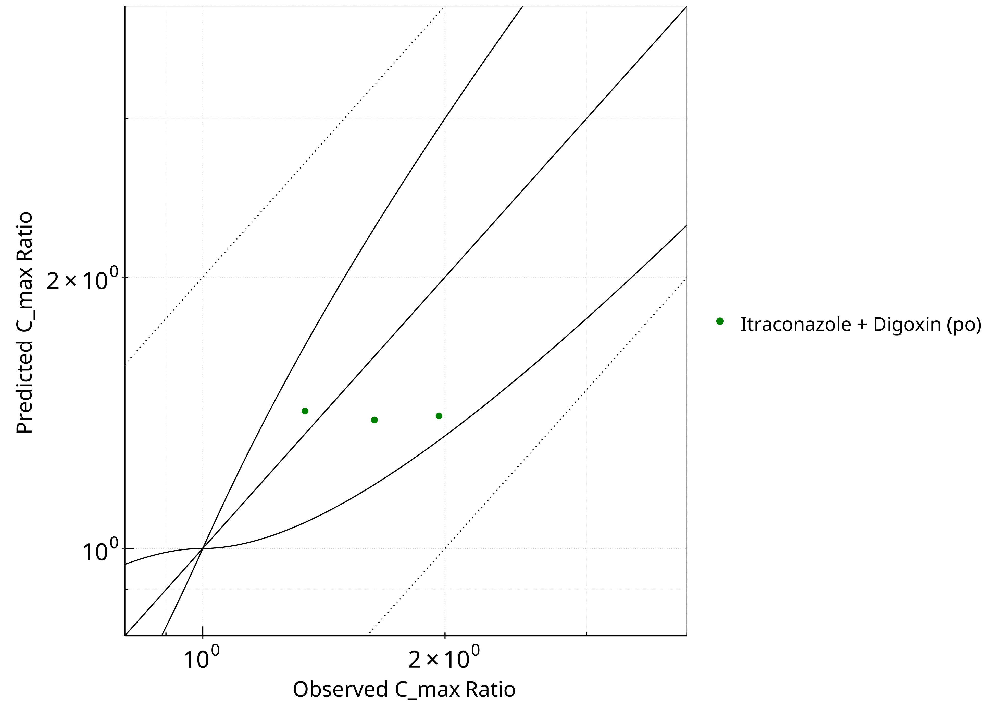

**Figure 2-27: Pgp DDI. Perpetrator: Itraconazole. Predicted vs. Observed C_max Ratio. (&delta; = 1 in Guest *et al.* formula)**

 
 

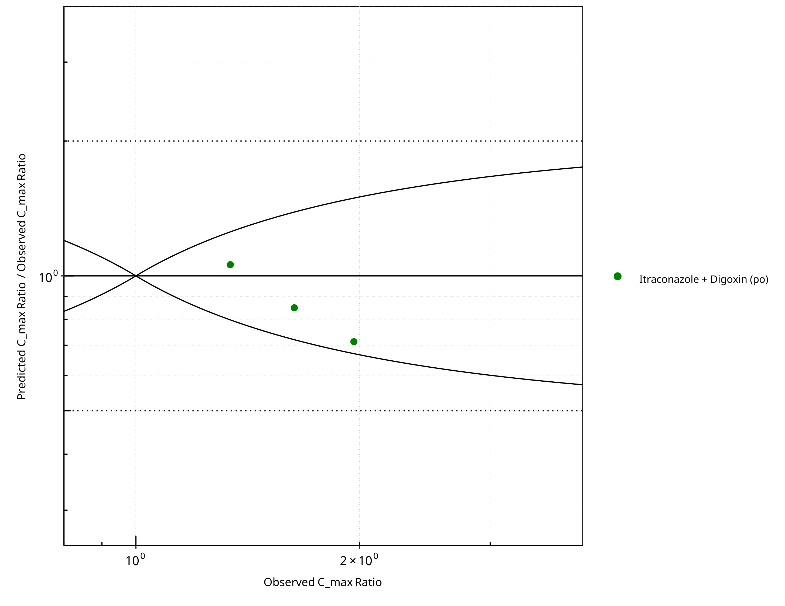

**Figure 2-28: Pgp DDI. Perpetrator: Itraconazole. Predicted/Observed vs. Observed C_max Ratio. (&delta; = 1 in Guest *et al.* formula)**

 
 

**Table 2-20: GMFE for Pgp DDI Ratio**

|PK parameter |GMFE |
|:------------|:----|
|AUC_tEnd     |1.33 |
|C_max        |1.20 |

 
 

**Table 2-21: Summary table for Pgp DDI - AUC_tEnd Ratio. (&delta; = 1 in Guest *et al.* formula)**

|AUC_tEnd                     |Number |Ratio [%] |
|:----------------------------|:------|:---------|
|Points total                 |1      |-        |
|Points within Guest *et al.* |1      |100       |
|Points within 2 fold         |1      |100       |

 
 

**Table 2-22: Summary table for Pgp DDI - C_max Ratio. (&delta; = 1 in Guest *et al.* formula)**

|C_max                        |Number |Ratio [%] |
|:----------------------------|:------|:---------|
|Points total                 |3      |-        |
|Points within Guest *et al.* |3      |100       |
|Points within 2 fold         |3      |100       |

 
 

### 2.2.4 Rifampicin

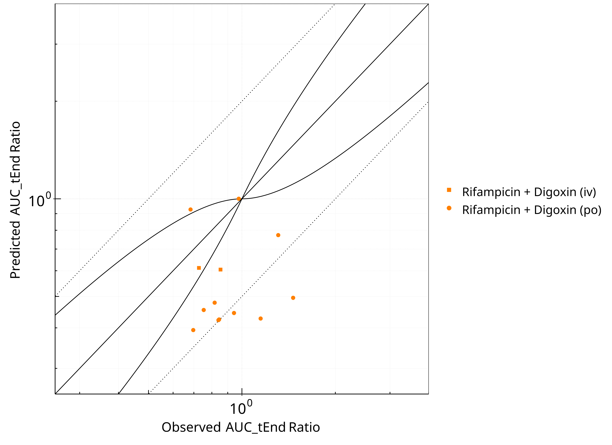

**Figure 2-29: Pgp DDI. Perpetrator: Rifampicin. Predicted vs. Observed AUC_tEnd Ratio. (&delta; = 1 in Guest *et al.* formula)**

 
 

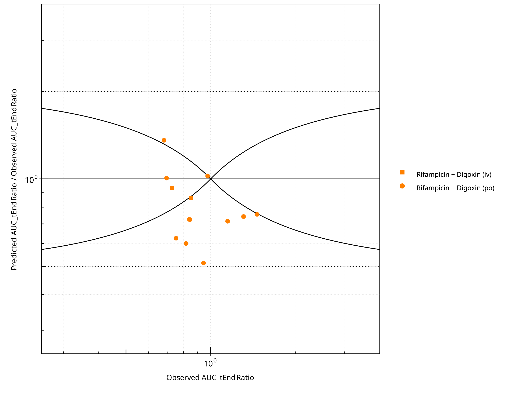

**Figure 2-30: Pgp DDI. Perpetrator: Rifampicin. Predicted/Observed vs. Observed AUC_tEnd Ratio. (&delta; = 1 in Guest *et al.* formula)**

 
 

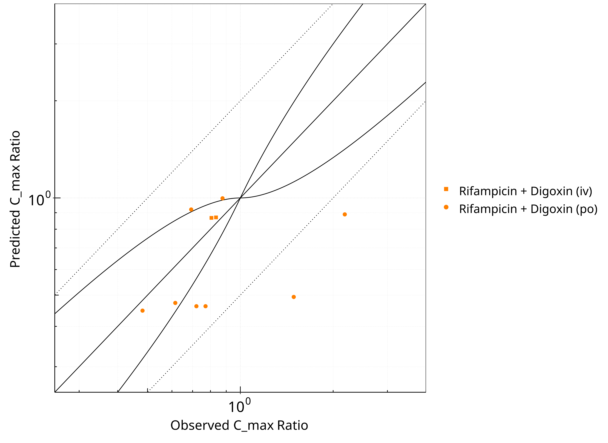

**Figure 2-31: Pgp DDI. Perpetrator: Rifampicin. Predicted vs. Observed C_max Ratio. (&delta; = 1 in Guest *et al.* formula)**

 
 

**Figure 2-32: Pgp DDI. Perpetrator: Rifampicin. Predicted/Observed vs. Observed C_max Ratio. (&delta; = 1 in Guest *et al.* formula)**

 
 

**Table 2-23: GMFE for Pgp DDI Ratio**

|PK parameter |GMFE |
|:------------|:----|
|AUC_tEnd     |1.74 |
|C_max        |1.47 |

 
 

**Table 2-24: Summary table for Pgp DDI - AUC_tEnd Ratio. (&delta; = 1 in Guest *et al.* formula)**

|AUC_tEnd                     |Number |Ratio [%] |
|:----------------------------|:------|:---------|
|Points total                 |13     |-        |
|Points within Guest *et al.* |1      |7.69      |
|Points within 2 fold         |10     |76.92     |

 
 

**Table 2-25: Summary table for Pgp DDI - C_max Ratio. (&delta; = 1 in Guest *et al.* formula)**

|C_max                        |Number |Ratio [%] |
|:----------------------------|:------|:---------|
|Points total                 |10     |-        |
|Points within Guest *et al.* |4      |40        |
|Points within 2 fold         |8      |80        |

 
 

### 2.2.5 Verapamil

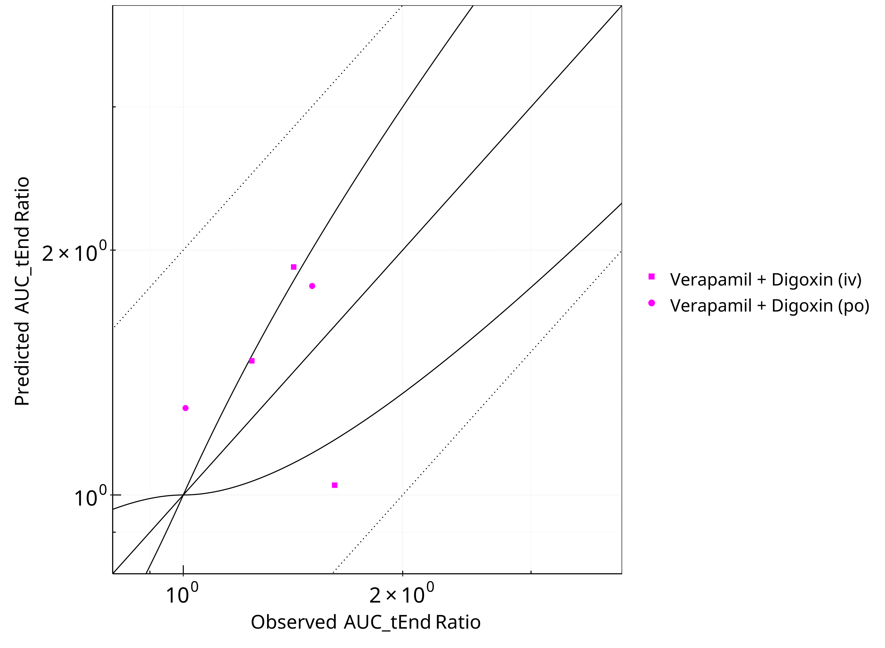

**Figure 2-33: Pgp DDI. Perpetrator: Verapamil. Predicted vs. Observed AUC_tEnd Ratio. (&delta; = 1 in Guest *et al.* formula)**

 
 

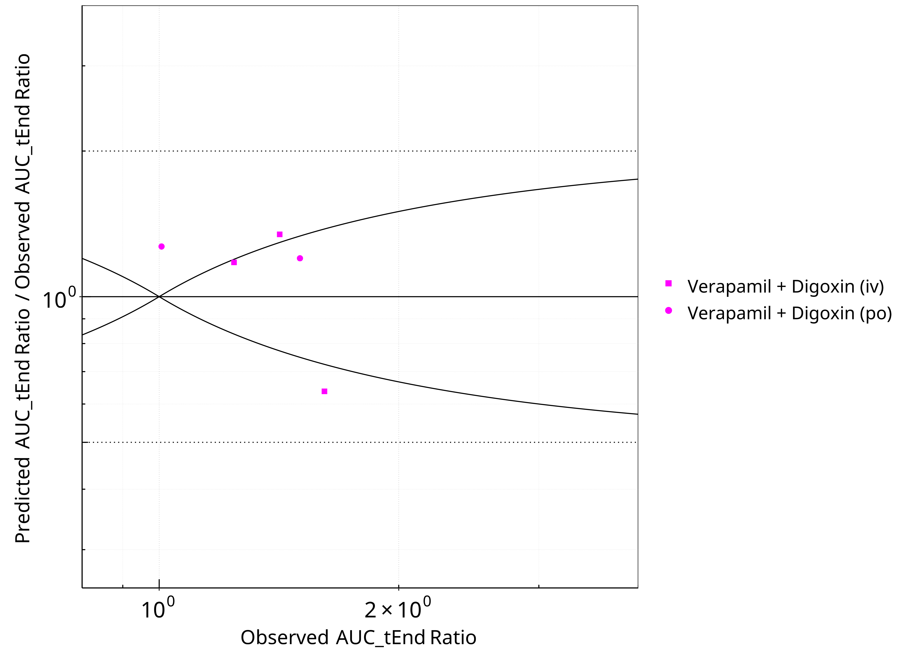

**Figure 2-34: Pgp DDI. Perpetrator: Verapamil. Predicted/Observed vs. Observed AUC_tEnd Ratio. (&delta; = 1 in Guest *et al.* formula)**

 
 

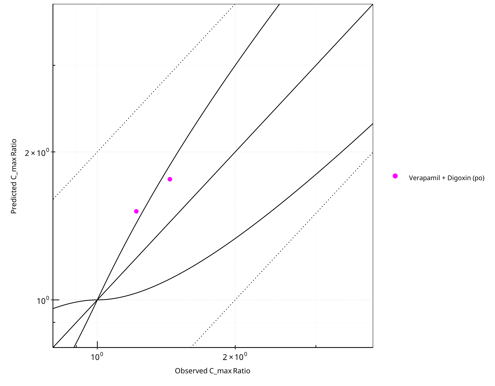

**Figure 2-35: Pgp DDI. Perpetrator: Verapamil. Predicted vs. Observed C_max Ratio. (&delta; = 1 in Guest *et al.* formula)**

 
 

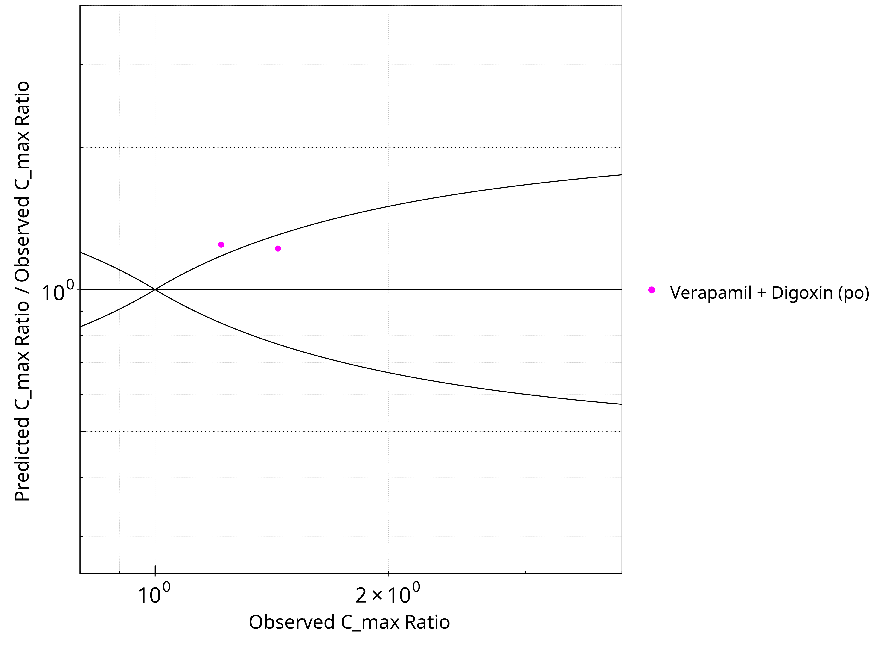

**Figure 2-36: Pgp DDI. Perpetrator: Verapamil. Predicted/Observed vs. Observed C_max Ratio. (&delta; = 1 in Guest *et al.* formula)**

 
 

**Table 2-26: GMFE for Pgp DDI Ratio**

|PK parameter |GMFE |
|:------------|:----|
|AUC_tEnd     |1.31 |
|C_max        |1.23 |

 
 

**Table 2-27: Summary table for Pgp DDI - AUC_tEnd Ratio. (&delta; = 1 in Guest *et al.* formula)**

|AUC_tEnd                     |Number |Ratio [%] |
|:----------------------------|:------|:---------|
|Points total                 |5      |-        |
|Points within Guest *et al.* |2      |40        |
|Points within 2 fold         |5      |100       |

 
 

**Table 2-28: Summary table for Pgp DDI - C_max Ratio. (&delta; = 1 in Guest *et al.* formula)**

|C_max                        |Number |Ratio [%] |
|:----------------------------|:------|:---------|
|Points total                 |2      |-        |
|Points within Guest *et al.* |1      |50        |
|Points within 2 fold         |2      |100       |

 
 

## 2.3 Victim

### 2.3.1 Digoxin

**Figure 2-37: Pgp DDI. Victim: Digoxin. Predicted vs. Observed AUC_tEnd Ratio. (&delta; = 1 in Guest *et al.* formula)**

 
 

**Figure 2-38: Pgp DDI. Victim: Digoxin. Predicted/Observed vs. Observed AUC_tEnd Ratio. (&delta; = 1 in Guest *et al.* formula)**

 
 

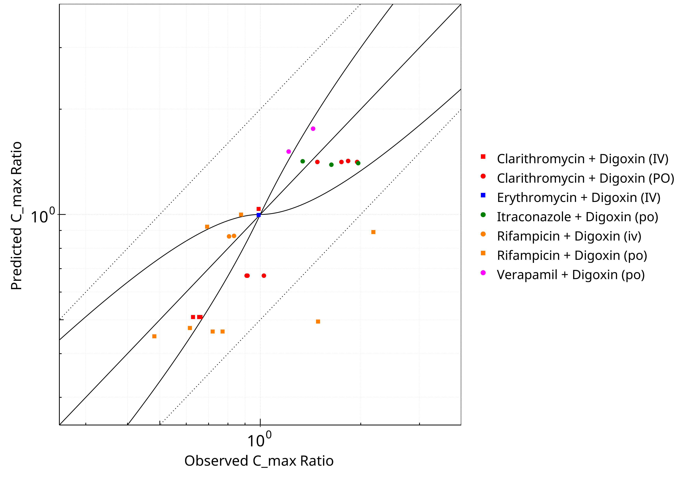

**Figure 2-39: Pgp DDI. Victim: Digoxin. Predicted vs. Observed C_max Ratio. (&delta; = 1 in Guest *et al.* formula)**

 
 

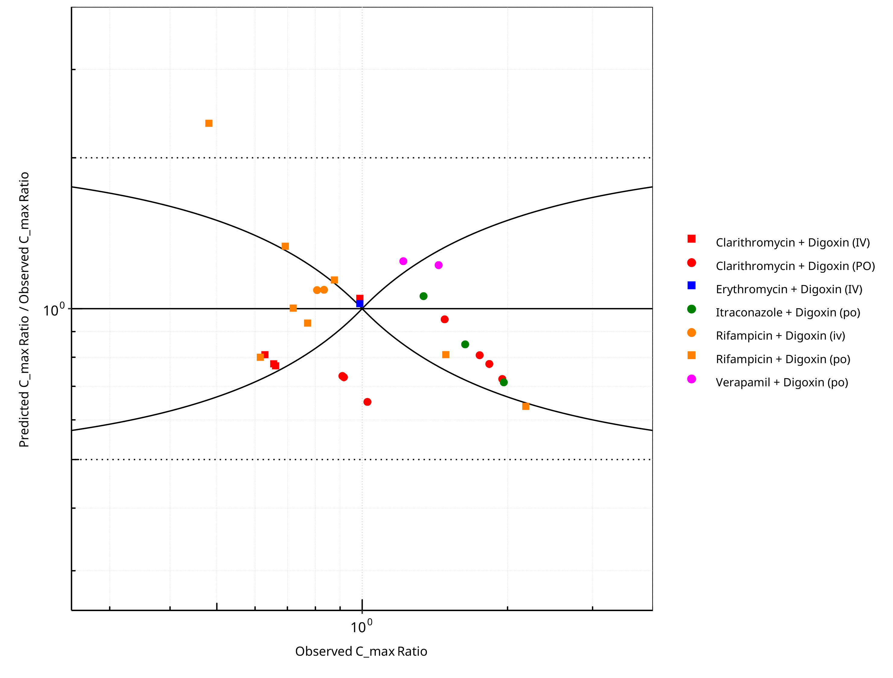

**Figure 2-40: Pgp DDI. Victim: Digoxin. Predicted/Observed vs. Observed C_max Ratio. (&delta; = 1 in Guest *et al.* formula)**

 
 

**Table 2-29: GMFE for Pgp DDI Ratio**

|PK parameter |GMFE |
|:------------|:----|
|AUC_tEnd     |1.37 |
|C_max        |1.32 |

 
 

**Table 2-30: Summary table for Pgp DDI - AUC_tEnd Ratio. (&delta; = 1 in Guest *et al.* formula)**

|AUC_tEnd                     |Number |Ratio [%] |
|:----------------------------|:------|:---------|
|Points total                 |32     |-        |
|Points within Guest *et al.* |16     |50.00     |
|Points within 2 fold         |29     |90.62     |

 
 

**Table 2-31: Summary table for Pgp DDI - C_max Ratio. (&delta; = 1 in Guest *et al.* formula)**

|C_max                        |Number |Ratio [%] |
|:----------------------------|:------|:---------|
|Points total                 |27     |-        |
|Points within Guest *et al.* |16     |59.26     |
|Points within 2 fold         |25     |92.59     |

 
 

# 3 Concentration-Time Profiles

The following section shows concentration time profiles of the victim drugs of the simulated DDI studies in comparison to observed data (if available).

## 3.1 Clarithromycin - Digoxin DDI

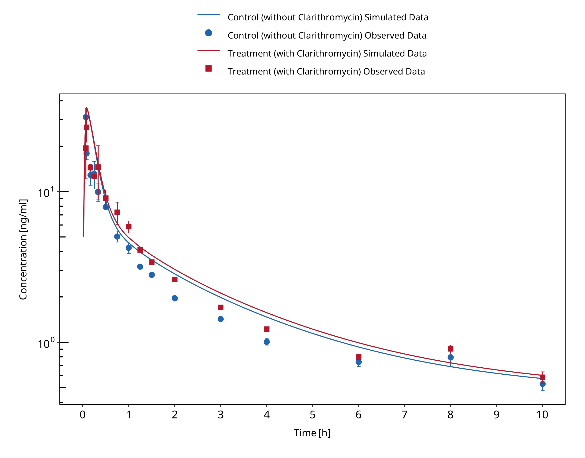

**Figure 3-1: Rengelshausen 2003 (0.01 mg/kg IV) - Plasma**

 
 

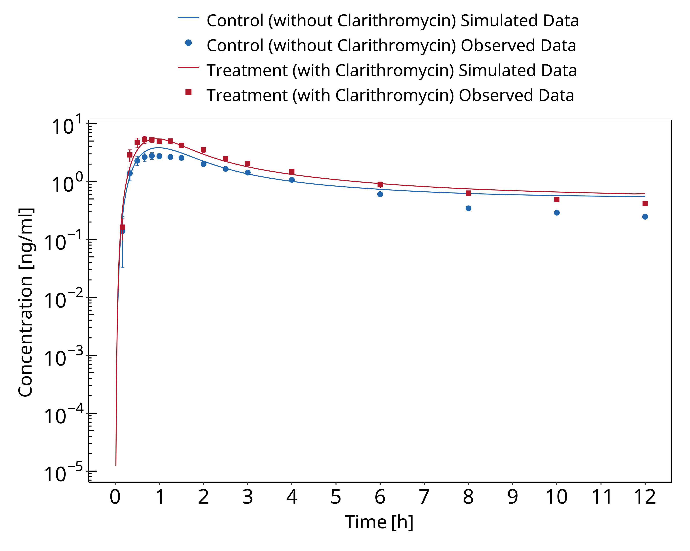

**Figure 3-2: Rengelshausen 2003 (0.75 mg PO) - Plasma**

 
 

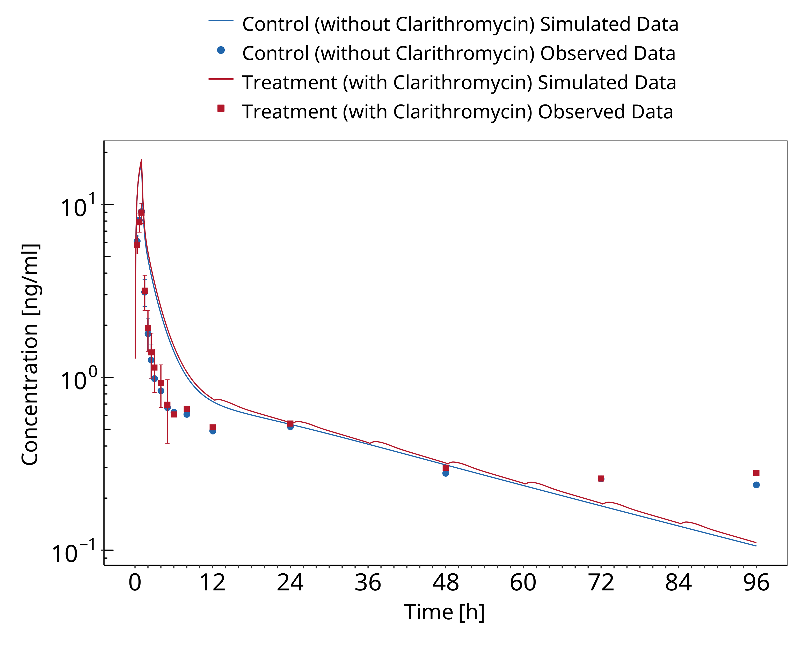

**Figure 3-3: Tsutsumi 2002 (0.5mg IV) - Plasma**

 
 

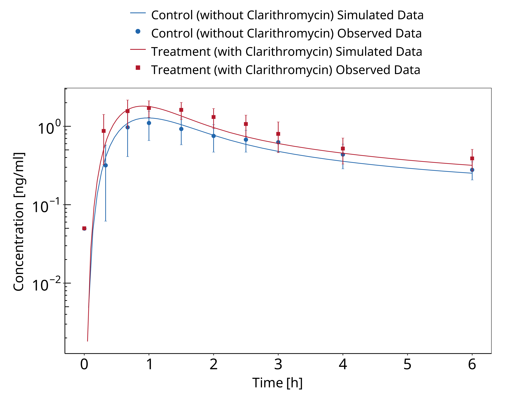

**Figure 3-4: Gurley 2008 (0.25 mg PO) - Plasma**

 
 

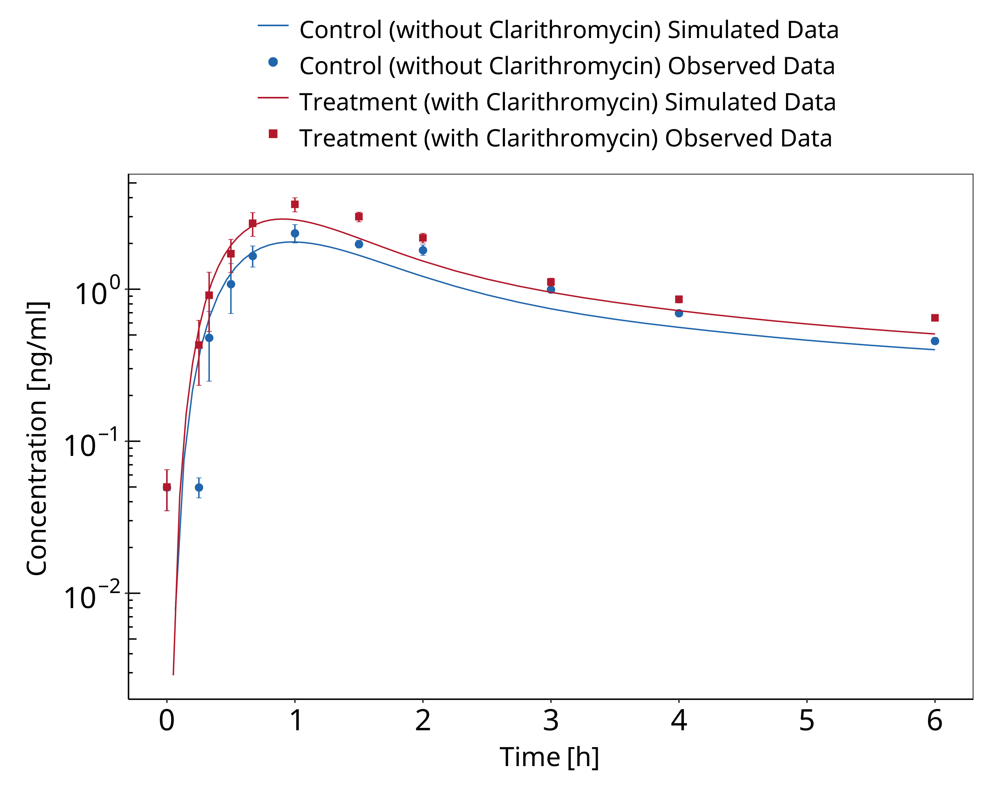

**Figure 3-5: Gurley 2006 (0.4 mg PO) - Plasma**

 
 

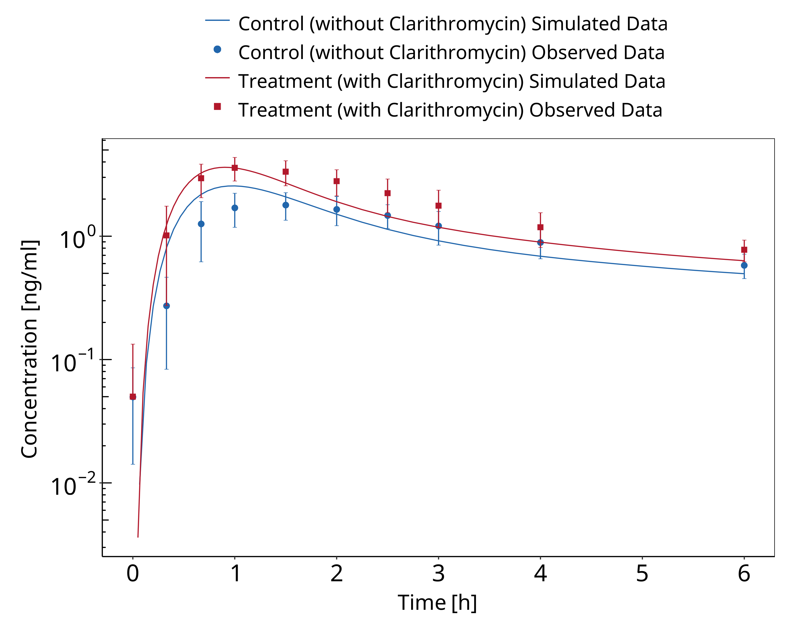

**Figure 3-6: Gurley 2007 (0.5 mg PO) - Plasma**

 
 

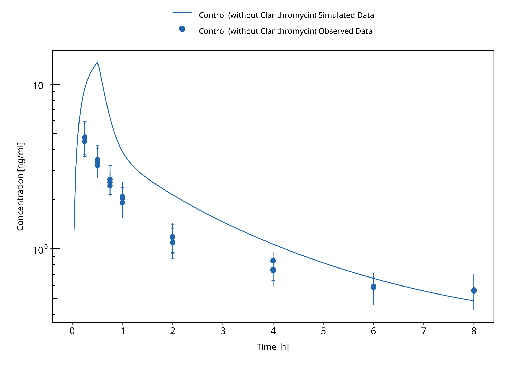

**Figure 3-7: Kurata 2002 (0.5 mg IV) - Plasma**

 
 

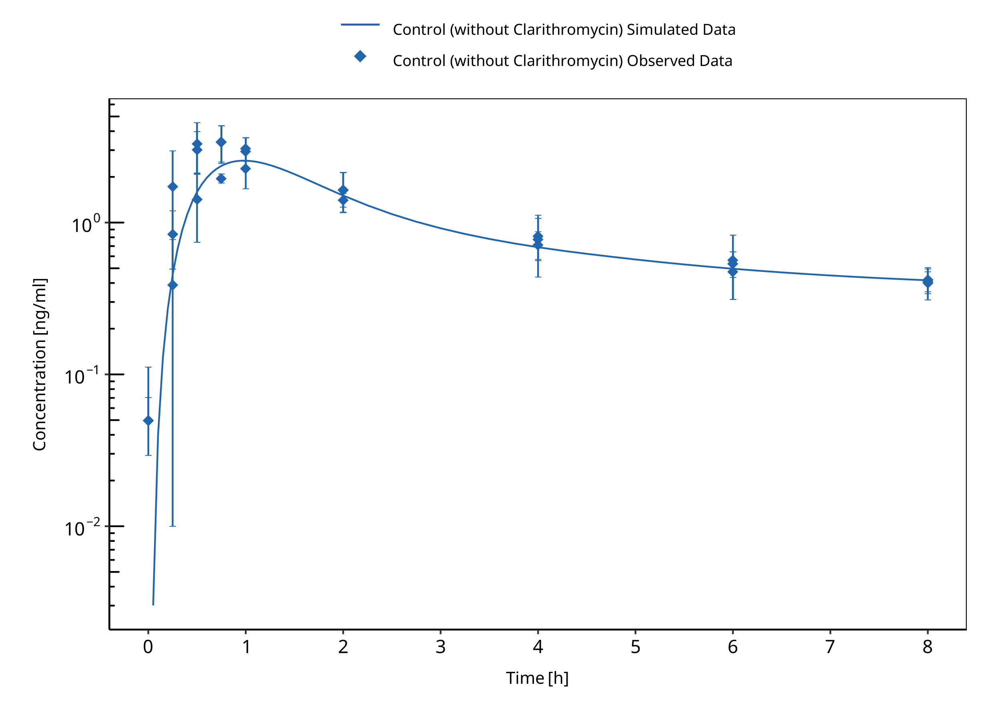

**Figure 3-8: Kurata 2002 (0.5 mg PO) - Plasma**

 
 

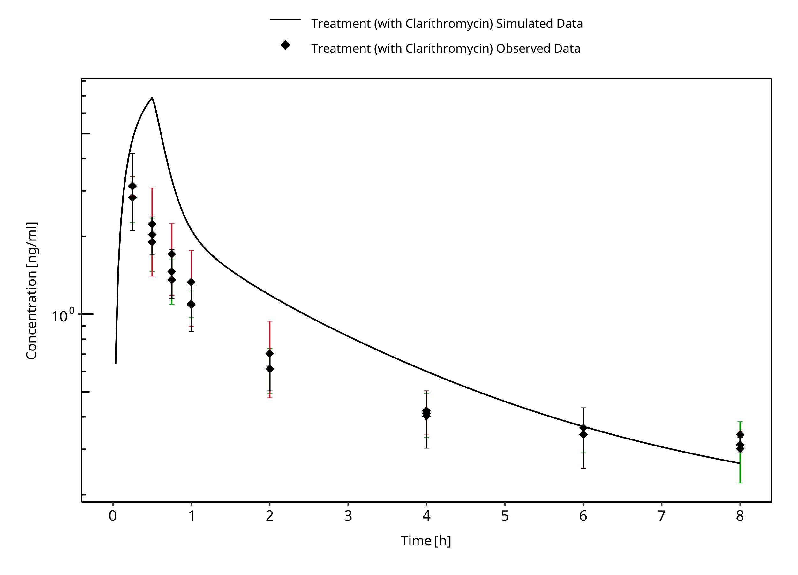

**Figure 3-9: Kurata 2002 (0.25 mg IV) - Plasma**

 
 

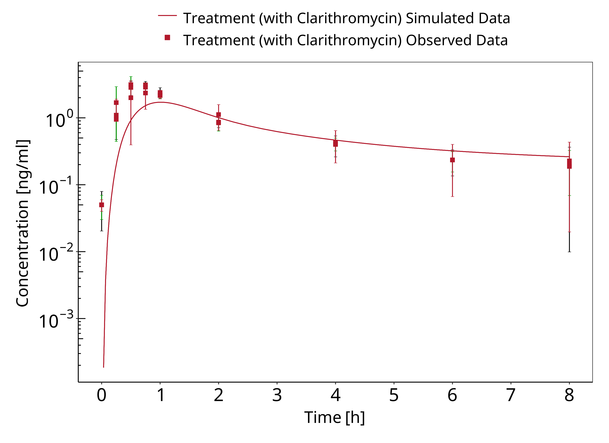

**Figure 3-10: Kurata 2002 (0.25 mg PO) - Plasma**

 
 

## 3.2 Erythromycin - Digoxin DDI

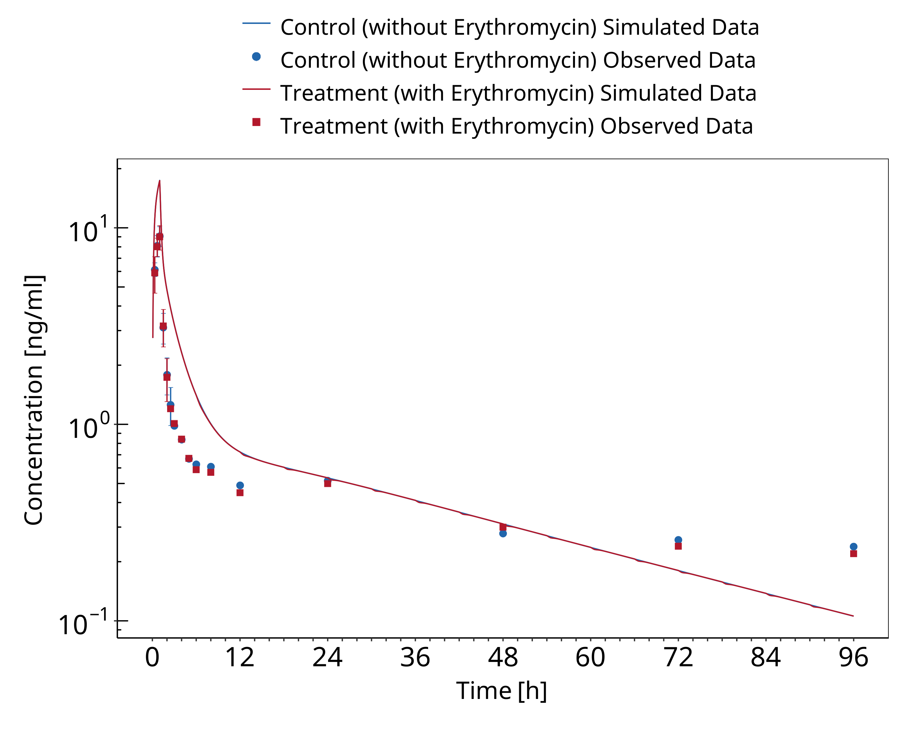

**Figure 3-11: Tsutsumi 2002 - Plasma**

 
 

## 3.3 Itraconazole - Digoxin DDI


**Figure 3-12: Jalava 1997**

 
 


**Figure 3-13: Partanen 1996 - Group 1**

 
 


**Figure 3-14: Partanen 1996 - Group 2**

 
 

## 3.4 Verapamil - Digoxin DDI


**Figure 3-15: Johnson 1987**

 
 


**Figure 3-16: Rodin 1988**

 
 


**Figure 3-17: Wiebe 2020**

 
 


**Figure 3-18: Klein 1982**

 
 


**Figure 3-19: Schwartz 1982**

 
 


**Figure 3-20: Belz 1983**

 
 


**Figure 3-21: Doering 1983**

 
 


**Figure 3-22: Pedersen 1983**

 
 


**Figure 3-23: Pedersen 1982**

 
 


**Figure 3-24: Belz 1981**

 
 

## 3.5 Rifampicin - Digoxin DDI


**Figure 3-25: Drescher 2003**

 
 


**Figure 3-26: Greiner 1999 (iv)**

 
 


**Figure 3-27: Greiner 1999 (po)**

 
 


**Figure 3-28: Gurley 2006**

 
 


**Figure 3-29: Gurley 2007**

 
 


**Figure 3-30: Gurley 2008**

 
 


**Figure 3-31: Kirby 2012**

 
 


**Figure 3-32: Larsen 2007**

 
 


**Figure 3-33: Reitman 2011**

 
 


**Figure 3-34: Wiebe 2020**

 
 

# 4 References

## Clarithromycin - Digoxin DDI

**Gurley 2006** Gurley BJ, Barone GW, Williams DK, Carrier J, Breen P, Yates CR, Song PF, Hubbard MA, Tong Y, Cheboyina S Effect of milk thistle (Silybum marianum) and black cohosh (Cimicifuga racemosa) supplementation on digoxin pharmacokinetics in humans. Drug Metab Dispos. 2006 Jan;34(1):69-74. doi: 10.1124/dmd.105.006312. Epub 2005   

**Gurley 2007** Gurley BJ, Swain A, Barone GW, Williams DK, Breen P, Yates CR, Stuart LB, Hubbard MA, Tong Y, Cheboyina S Effect of goldenseal (Hydrastis canadensis) and kava kava (Piper methysticum) supplementation on digoxin pharmacokinetics in humans. Drug Metab Dispos. 2007 Feb;35(2):240-5. doi: 10.1124/dmd.106.012708. Epub 2006   

**Gurley 2008b** Gurley BJ, Swain A, Williams DK, Barone G, Battu SK Gauging the clinical significance of P-glycoprotein-mediated herb-drug interactions: comparative effects of St. John's wort, Echinacea, clarithromycin, and rifampin on digoxin pharmacokinetics. Mol Nutr Food Res. 2008 Jul;52(7):772-9. doi: 10.1002/mnfr.200700081.  

**Kurata 2002** Kurata Y, Ieiri I, Kimura M, Morita T, Irie S, Urae A, Ohdo S, Ohtani H, Sawada Y, Higuchi S, Otsubo K Role of human MDR1 gene polymorphism in bioavailability and interaction of digoxin, a substrate of P-glycoprotein. Clin Pharmacol Ther. 2002 Aug;72(2):209-19. doi: 10.1067/mcp.2002.126177.  

**Rengelshausen 2003** Rengelshausen J, Goggelmann C, Burhenne J, Riedel KD, Ludwig J, Weiss J, Mikus G, Walter-Sack I, Haefeli WE Contribution of increased oral bioavailability and reduced nonglomerular renal clearance of digoxin to the digoxin-clarithromycin interaction. Br J Clin Pharmacol. 2003 Jul;56(1):32-8. doi: 10.1046/j.1365-2125.2003.01824.x.  

**Tsutsumi 2002** Tsutsumi K, Kotegawa T, Kuranari M, Otani Y, Morimoto T, Matsuki S, Nakano S The effect of erythromycin and clarithromycin on the pharmacokinetics of intravenous digoxin in healthy volunteers. J Clin Pharmacol. 2002 Oct;42(10):1159-64. doi: 10.1177/009127002401382641.  

## Erythromycin-Digoxin-DDI

**Tsutsumi 2002** Tsutsumi K, Kotegawa T, Kuranari M, Otani Y, Morimoto T, Matsuki S, Nakano S. The effect of erythromycin and clarithromycin on the pharmacokinetics of intravenous digoxin in healthy volunteers. *J Clin Pharmacol*. 2002 Oct;42(10):1159-64. doi: 10.1177/009127002401382641. PMID: 12362931.

## Itraconazole-Digoxin-DDI

**Jalava 1997** Jalava KM, Partanen J, Neuvonen PJ. Itraconazole decreases renal clearance of digoxin. Ther Drug Monit. 1997 Dec;19(6):609-13. doi: 10.1097/00007691-199712000-00001. PMID: 9421099.

**Partanen 1995** Partanen J, Jalava KM, Neuvonen PJ. Itraconazole increases serum digoxin concentration. Pharmacol Toxicol. 1996 Nov;79(5):274-6. doi: 10.1111/j.1600-0773.1996.tb00273.x. PMID: 8936563.

## Rifampicin-Digoxin-DDI

**Drescher 2003** Drescher S, Glaeser H, Mürdter T, Hitzl M, Eichelbaum M, Fromm MF. P-glycoprotein-mediated intestinal and biliary digoxin transport in humans. Clin Pharmacol Ther. 2003 Mar;73(3):223-31. doi: 10.1067/mcp.2003.27. PMID: 12621387.

**Gurley 2006** Gurley BJ, Barone GW, Williams DK, Carrier J, Breen P, Yates CR, Song PF, Hubbard MA, Tong Y, Cheboyina S. Effect of milk thistle (Silybum marianum) and black cohosh (Cimicifuga racemosa) supplementation on digoxin pharmacokinetics in humans. Drug Metab Dispos. 2006 Jan;34(1):69-74. doi: 10.1124/dmd.105.006312. Epub 2005 Oct 12. PMID: 16221754; PMCID: PMC1865121.

**Gurley 2007** Gurley BJ, Swain A, Barone GW, Williams DK, Breen P, Yates CR, Stuart LB, Hubbard MA, Tong Y, Cheboyina S. Effect of goldenseal (Hydrastis canadensis) and kava kava (Piper methysticum) supplementation on digoxin pharmacokinetics in humans. Drug Metab Dispos. 2007 Feb;35(2):240-5. doi: 10.1124/dmd.106.012708. Epub 2006 Nov 1. PMID: 17079360; PMCID: PMC1868501.

**Gurley 2008b** Gurley BJ, Swain A, Williams DK, Barone G, Battu SK. Gauging the clinical significance of P-glycoprotein-mediated herb-drug interactions: comparative effects of St. John's wort, Echinacea, clarithromycin, and rifampin on digoxin pharmacokinetics. Mol Nutr Food Res. 2008 Jul;52(7):772-9. doi: 10.1002/mnfr.200700081. PMID: 18214850; PMCID: PMC2562898.

**Greiner 1999** Greiner B, Eichelbaum M, Fritz P, Kreichgauer HP, von Richter O, Zundler J, Kroemer HK. The role of intestinal P-glycoprotein in the interaction of digoxin and rifampin. J Clin Invest. 1999 Jul;104(2):147-53. doi: 10.1172/JCI6663. Erratum in: J Clin Invest 2002 Aug;110(4):571. PMID: 10411543; PMCID: PMC408477.

**Kirby 2012** Kirby BJ, Collier AC, Kharasch ED, Whittington D, Thummel KE, Unadkat JD. Complex drug interactions of the HIV protease inhibitors 3: effect of simultaneous or staggered dosing of digoxin and ritonavir, nelfinavir, rifampin, or bupropion. Drug Metab Dispos. 2012 Mar;40(3):610-6. doi: 10.1124/dmd.111.042705. Epub 2011 Dec 21. PMID: 22190694; PMCID: PMC3286266.

**Larsen 2007** Larsen UL, Hyldahl Olesen L, Guldborg Nyvold C, Eriksen J, Jakobsen P, Østergaard M, Autrup H, Andersen V. Human intestinal P-glycoprotein activity estimated by the model substrate digoxin. Scand J Clin Lab Invest. 2007;67(2):123-34. doi: 10.1080/00365510600986084. PMID: 17365992.

**Reitmann 2011** Reitman ML, Chu X, Cai X, Yabut J, Venkatasubramanian R, Zajic S, Stone JA, Ding Y, Witter R, Gibson C, Roupe K, Evers R, Wagner JA, Stoch A. Rifampin's acute inhibitory and chronic inductive drug interactions: experimental and model-based approaches to drug-drug interaction trial design. Clin Pharmacol Ther. 2011 Feb;89(2):234-42. doi: 10.1038/clpt.2010.271. Epub 2010 Dec 29. PMID: 21191377.

**Wiebe 2020** Wiebe ST, Giessmann T, Hohl K, Schmidt-Gerets S, Hauel E, Jambrecina A, Bader K, Ishiguro N, Taub ME, Sharma A, Ebner T, Mikus G, Fromm MF, Müller F, Stopfer P. Validation of a Drug Transporter Probe Cocktail Using the Prototypical Inhibitors Rifampin, Probenecid, Verapamil, and Cimetidine. Clin Pharmacokinet. 2020 Dec;59(12):1627-1639. doi: 10.1007/s40262-020-00907-w. PMID: 32504272; PMCID: PMC7716890.

## Verapamil - Digoxin DDI

**Belz 1981** Belz GG, Aust PE, Munkes R. Digoxin plasma concentrations and nifedipine. Lancet. 1981 Apr 11;1(8224):844-5. doi: 10.1016/s0140-6736(81)92727-6. PMID: 6111709.

**Belz 1983** Belz GG, Doering W, Munkes R, Matthews J. Interaction between digoxin and calcium antagonists and antiarrhythmic drugs. Clin Pharmacol Ther. 1983 Apr;33(4):410-7. doi: 10.1038/clpt.1983.55. PMID: 6831819.

**Doering 1983** Doering W. Effect of coadministration of verapamil and quinidine on serum digoxin concentration. Eur J Clin Pharmacol. 1983;25(4):517-21. doi: 10.1007/BF00542121. PMID: 6653647.

**Johnson 1987** Johnson BF, Wilson J, Marwaha R, Hoch K, Johnson J. The comparative effects of verapamil and a new dihydropyridine calcium channel blocker on digoxin pharmacokinetics. Clin Pharmacol Ther. 1987 Jul;42(1):66-71. doi: 10.1038/clpt.1987.109. PMID: 2954736.

**Klein 1982** Klein HO, Lang R, Weiss E, Di Segni E, Libhaber C, Guerrero J, Kaplinsky E. The influence of verapamil on serum digoxin concentration. Circulation. 1982 May;65(5):998-1003. doi: 10.1161/01.cir.65.5.998. PMID: 7074765.

**Pedersen 1981** Pedersen KE, Dorph-Pedersen A, Hvidt S, Klitgaard NA, Nielsen-Kudsk F. Digoxin-verapamil interaction. Clin Pharmacol Ther. 1981 Sep;30(3):311-6. doi: 10.1038/clpt.1981.165. PMID: 7273594.

**Pedersen 1982** Pedersen KE, Dorph-Pedersen A, Hvidt S, Klitgaard NA, Pedersen KK. The long-term effect of verapamil on plasma digoxin concentration and renal digoxin clearance in healthy subjects. Eur J Clin Pharmacol. 1982;22(2):123-7. doi: 10.1007/BF00542456. PMID: 7094982.

**Pedersen 1983** Pedersen KE, Thayssen P, Klitgaard NA, Christiansen BD, Nielsen-Kudsk F. Influence of verapamil on the inotropism and pharmacokinetics of digoxin. Eur J Clin Pharmacol. 1983;25(2):199-206. doi: 10.1007/BF00543791. PMID: 6628501.

**Rodin 1988** Rodin SM, Johnson BF, Wilson J, Ritchie P, Johnson J. Comparative effects of verapamil and isradipine on steady-state digoxin kinetics. Clin Pharmacol Ther. 1988 Jun;43(6):668-72. doi: 10.1038/clpt.1988.93. PMID: 2967742.

**Schwartz 1982** Schwartz JB, Keefe D, Kates RE, Kirsten E, Harrison DC. Acute and chronic pharmacodynamic interaction of verapamil and digoxin in atrial fibrillation. Circulation. 1982 Jun;65(6):1163-70. doi: 10.1161/01.cir.65.6.1163. PMID: 7074776.

**Wiebe 2020** Wiebe ST, Giessmann T, Hohl K, Schmidt-Gerets S, Hauel E, Jambrecina A, Bader K, Ishiguro N, Taub ME, Sharma A, Ebner T, Mikus G, Fromm MF, Müller F, Stopfer P. Validation of a Drug Transporter Probe Cocktail Using the Prototypical Inhibitors Rifampin, Probenecid, Verapamil, and Cimetidine. Clin Pharmacokinet. 2020 Dec;59(12):1627-1639. doi: 10.1007/s40262-020-00907-w. PMID: 32504272; PMCID: PMC7716890.

# 5 Appendix

## 5.1 Open Systems Pharmacology Suite (OSPS) Introduction

Open Systems Pharmacology Suite (OSP suite) is a tool for PBPK modeling and simulation of drugs in laboratory animals and humans. PK-Sim® and MoBi® are part of the OSP suite [[1](#references-osps-introduction)].  PK-Sim® is based on a generic PBPK-model with 18 organs and tissues. One of the main assumptions is that all compartments are well-stirred. Represented organs/tissues include arterial and venous blood, adipose tissue (separable adipose, excluding yellow marrow), brain, lung, bone (including yellow marrow), gonads, heart, kidneys, large intestine, liver, muscle, portal vein, pancreas, skin, small intestine, spleen and stomach, as shown in [**Figure Appendix-1**](#figure-appendix-1).

Each organ consists of four sub-compartments namely the plasma, blood cells (which together build the vascular space), interstitial space, and cellular space. Distribution between the plasma and blood cells as well as between the interstitial and cellular compartments can be permeability-limited. In the brain, the permeation barrier is located between the vascular and the interstitial space. PK-Sim® estimates model parameters (intestinal permeability [[2](#references-osps-introduction)] organ partition coefficients (tissue-to-plasma partition coefficients) [[3,4](#references-osps-introduction)], and permeabilities) from physico-chemical properties of compounds (molecular weight, pKa, acid/base properties) and the composition of each tissue compartment (lipids, water and proteins). Partition coefficients can be calculated using a variety of methods available in PK-Sim®, for example the internal PK-Sim® method [[3,4](#references-osps-introduction)] or that of Rodgers and Rowland [[5-7](#references-osps-introduction)]. 

Physiological databases included in the software incorporate the dependencies of organ composition, organ weights, organ blood flows and gastrointestinal parameters (gastrointestinal length, radius of each section, intestinal surface area, gastrointestinal transit times, and pH in different intestinal segments [[2](#references-osps-introduction)]), with the user-defined body weight and height and ethnicity of the individual [[8](#references-osps-introduction)]. Thereby, PK Sim® allows generating realistic virtual populations. For a detailed description of the PBPK model structure implemented in PK Sim®, see Willmann et al. [[2,4,8,9](#references-osps-introduction)] or the OSP Suite homepage ([https://docs.open-systems-pharmacology.org/mechanistic-modeling-of-pharmacokinetics-and-dynamics/modeling-concepts](https://docs.open-systems-pharmacology.org/mechanistic-modeling-of-pharmacokinetics-and-dynamics/modeling-concepts)).


**Figure** **Appendix-1: Structure of the Whole Body PBPK Model integrated in PK-Sim®**

## References for OSPS introduction

[1] [www.open-systems-pharmacology.org](http://www.open-systems-pharmacology.org/)

[2] [Willmann S, Schmitt W, Keldenich J, Lippert J, Dressman JB. A physiological model for the estimation of the fraction dose absorbed in humans.J Med Chem. 2004 Jul 29;47(16):4022-31.](https://www.ncbi.nlm.nih.gov/pubmed/15267240)

[3] [Haerter MW, K.J., Schmitt W, *Estimation of physicochemical and ADME parameters.* , in *Handbook of Combinatorial Chemistry: Drugs, Catalysts, Materials*, H.W. Nicolaou KC HR, Editor. 2002, Wiley VCH Verlag GmbH: Weinheim, Germany. p. 743-60.](https://onlinelibrary.wiley.com/doi/pdf/10.1002/3527603034.ch26)

[4] [Willmann S, Lippert J, Schmitt W. From physicochemistry to absorption and distribution: predictive mechanistic modelling and computational tools. Expert Opin Drug Metab Toxicol. 2005 Jun;1(1):159-68.](https://www.ncbi.nlm.nih.gov/pubmed/16922658)

[5] [Rodgers, T, D. Leahy, and M. Rowland. Physiologically based pharmacokinetic modeling 1: predicting the tissue distribution of moderate-to-strong bases. J Pharm Sci. 2005 Jun;94(6):1259-76.](https://www.ncbi.nlm.nih.gov/pubmed/15858854)

[6] [Rodgers T, Rowland M. Physiologically based pharmacokinetic modelling 2: predicting the tissue distribution of acids, very weak bases, neutrals and zwitterions. J Pharm Sci. 2006 Jun;95(6):1238-57.](https://www.ncbi.nlm.nih.gov/pubmed/16639716)

[7] [Rodgers T, Rowland M. Mechanistic approaches to volume of distribution predictions: understanding the processes. Pharm Res. 2007 May;24(5):918-33.](https://www.ncbi.nlm.nih.gov/pubmed/17372687)

[8] [Willmann S, Höhn K, Edginton A, Sevestre M, Solodenko J, Weiss W, Lippert J, Schmitt W. Development of a physiology-based whole-body population model for assessing the influence of individual variability on the pharmacokinetics of drugs. J Pharmacokinet Pharmacodyn. 2007 Jun;34(3):401-31.](https://www.ncbi.nlm.nih.gov/pubmed/17431751)

[9] [Willmann S, Lippert J, Sevestre M, Solodenko J, Fois F, Schmitt W. PK-Sim®: a physiologically based pharmacokinetic ‘whole-body’ model. Biosilico 2003.1(4):121-24.](https://www.sciencedirect.com/science/article/pii/S1478538203023424?via%3Dihub)

## 5.2 Mathematical Implementation of Drug-Drug Interactions

**DDI modeling: Competitive inhibition** 

A detailed representation of the mathematical implementation of competitive enzyme inhibition can be found in the OSP manual ([https://docs.open-systems-pharmacology.org/working-with-pk-sim/pk-sim-documentation/pk-sim-compounds-defining-inhibition-induction-processes#competitive-inhibition-simple-setting-with-one-inhibitor](https://docs.open-systems-pharmacology.org/working-with-pk-sim/pk-sim-documentation/pk-sim-compounds-defining-inhibition-induction-processes#competitive-inhibition-simple-setting-with-one-inhibitor)).

**DDI modeling: Mechanism-based inhibition**

A detailed representation of the mathematical implementation of mechanism-based enzyme inhibition can be found in the OSP manual ([https://docs.open-systems-pharmacology.org/working-with-pk-sim/pk-sim-documentation/pk-sim-compounds-defining-inhibition-induction-processes#irreversible-inhibition](https://docs.open-systems-pharmacology.org/working-with-pk-sim/pk-sim-documentation/pk-sim-compounds-defining-inhibition-induction-processes#irreversible-inhibition)).

**DDI modeling: Induction**

A detailed representation of the mathematical implementation of enzyme induction can be found in the OSP manual ([https://docs.open-systems-pharmacology.org/working-with-pk-sim/pk-sim-documentation/pk-sim-compounds-defining-inhibition-induction-processes#enzyme-induction](https://docs.open-systems-pharmacology.org/working-with-pk-sim/pk-sim-documentation/pk-sim-compounds-defining-inhibition-induction-processes#enzyme-induction)).

## 5.3 Automatic (re)-qualification workflow

Open Systems Pharmacology ([https://www.open-systems-pharmacology.org/](http://www.open-systems-pharmacology.org)) provides a dynamic landscape of model repositories and a database of observed clinical data. Additionally, a technical framework to assess confidence of a specific intended use has been developed (qualification runner and reporting engine). This framework allows for an automatic (re)-qualification workflow of the OSP suite, comprising the following steps [**Figure Appendix-2**](#figure-appendix-2):

- PBPK model development and verification with observed data,

- Qualification plan generation,

- Qualification plan execution,

- Qualification report generation.

**Figure Appendix-2: OSP suite automatic (re)-qualification workflow**

In a first step, the respective qualification scenario is saved in a special qualification repository on OSP GitHub ([https://github.com/Open-Systems-Pharmacology/](https://github.com/Open-Systems-Pharmacology/)). This qualification scenario repository contains a detailed qualification plan that links and combines respective models and data to address the use case that shall be qualified. Therefore, the qualification plan consists of: 

- PK-Sim project files,
- Additional model building steps (if applicable),
- Description of potential cross-dependencies between PK-Sim project files (if applicable),
- Observed data (needed for model development and verification),
- Qualification scenario description text modules
- Detailed report settings to describe the generation of charts and qualification measures. 

PK-Sim projects, observed data sets, and qualification scenario text modules are deposited in distinct repositories and are referenced by the qualification plan ([**Figure Appendix-3**](#figure-appendix-3)).

**Figure Appendix-3: Qualification scenario repository landscape on GitHub**

In a second step the qualification runner ([https://github.com/Open-Systems-Pharmacology/QualificationRunner](https://github.com/Open-Systems-Pharmacology/QualificationRunner)) processes the qualification plan, i.e. all project parts are exported and prepared for the reporting engine ([https://github.com/Open-Systems-Pharmacology/Reporting-Engine](https://github.com/Open-Systems-Pharmacology/Reporting-Engine)). The reporting engine provides a validated environment (implemented in R) for model execution and finally generates the qualification report. This report contains the evaluation of the individual PBPK models with observed data (i.e. standard goodness of fit plots, visual predictive checks) and a comprehensive qualification of the specific use case assessing the predictive performance of the OSP suite by means of a predefined set of qualification measures and charts. 

The automated execution of the described workflow can be triggered to assess re-qualification in case new data, changes in model structure or parameterization, or new OSP suite releases arise.

