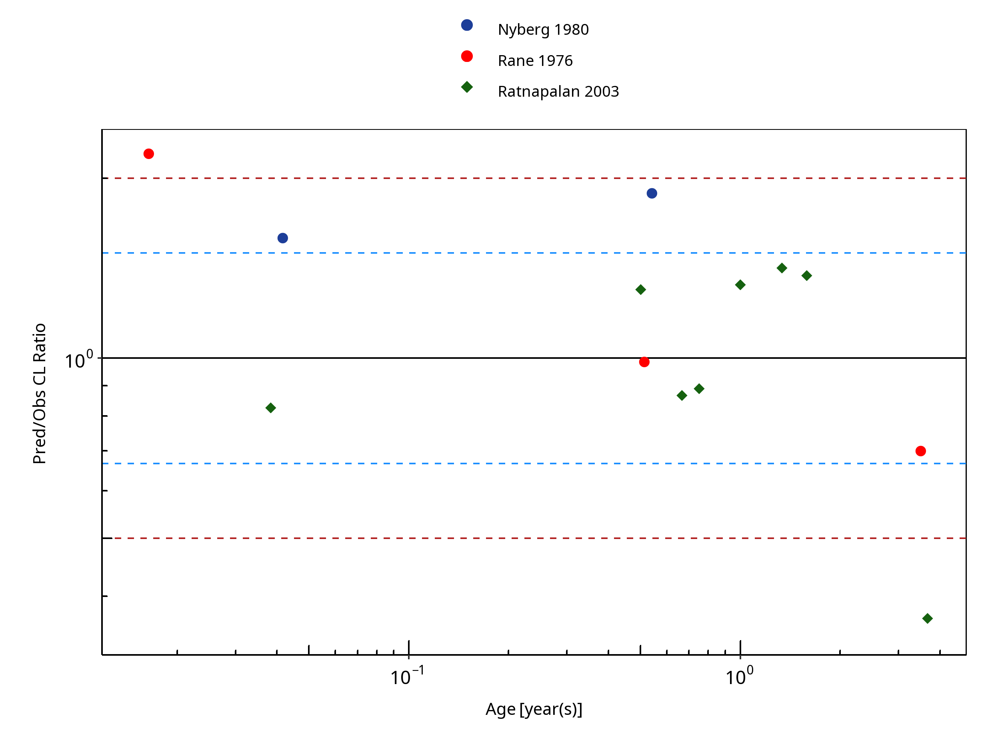

# Pediatric Qualification Package: P-gp Ontogeny

| Version                         | 1.0-OSP12.3                                                   |
| ------------------------------- | ------------------------------------------------------------ |
| Qualification Plan Release      | [https://github.com/Open-Systems-Pharmacology/Pediatric_Qualification_Package_P-gp_Ontogeny/releases/tag/v1.0](https://github.com/Open-Systems-Pharmacology/Pediatric_Qualification_Package_P-gp_Ontogeny/releases/tag/v1.0) |
| OSP Version                     | 12.3                                                          |
| Qualification Framework Version | 3.7                                                          |

This qualification report is filed at:

[https://github.com/Open-Systems-Pharmacology/OSP-Qualification-Reports](https://github.com/Open-Systems-Pharmacology/OSP-Qualification-Reports)

# Table of Contents

 * [1 Introduction to Pediatric Translation and P-gp Ontogeny Qualification](#introduction)
 * [2 Pediatric translation qualification results](#results)
   * [2.1 Digoxin PK Ratio tables and Figures](#digoxin-children)
 * [3 References](#references)

# 1 Introduction to Pediatric Translation and P-gp Ontogeny Qualification

The presented qualification report evaluates the predictive performance of the OSP suite to predict P-gp related drug transporter activity in children.

Therefore, PBPK models of specific *in vivo* probe substances covering pediatric populations from approximately 1 week to 4 years of age were built and evaluated. All models are whole-body PBPK models, allowing for dynamic pediatric translation in organs expressing P-gp. The qualification report demonstrates the level of confidence of the OSP suite with regard to reliable PBPK predictions of age-related P-gp-mediated drug transport during model-informed drug development. The presented PBPK models as well as the respective qualification plan and qualification report are provided open-source and transparently documented ([https://github.com/Open-Systems-Pharmacology/Pediatric_Qualification_Package_P-gp_Ontogeny](https://github.com/Open-Systems-Pharmacology/Pediatric_Qualification_Package_P-gp_Ontogeny)). 

## Translation of Adult PBPK to Children

Using a developed and validated (adult) PBPK model for an *in vivo* probe substance, a pediatric PBPK model can be established for children by translating physiology, clearance processes (as parameterized in the adult model) and age-dependent protein binding including the variability therein.[[Maharaj 2013](#references)] 

The PBPK models are developed with clinical data of healthy adult subjects obtained from the literature, covering available dosing ranges for e.g. intravenous as well as oral administration, to capture both systemic clearance as well as gut-wall metabolic clearance processes. For orally administered drugs, the same formulations that are used in children should ideally be included in the model for adults. Plasma concentrations following multiple dose application, mass balance information and other clinical measurements need to be included for model development, if available. During model translation from adults to children for a specific substance, uncertainties in data-quality caused by impact of disease or the target study population, inaccurate in vitro assay-techniques regarding mass balance, as well as study differences may cause not being able to adequately predict the PK in children for all reported studies. 

Prediction performance of the PBPK model for these probe substances in children are then shown by means of e.g. predicted versus observed clearance (CL) plots, of which the results support an adequate prediction of the ontogeny function for the application of PBPK model translation of adult PBPK to children.

For qualification purpose, during the translation of adult PBPK to children the following assumptions and considerations were made: 

- when translating an adult model to children, it was assumed that the metabolism and excretion pathways are qualitatively the same in children as in adults.
- no further changes to input parameters other than those for the physiology and protein binding were assumed. All other parameters (e.g. lipophilicity, intestinal permeability, solubility) were kept unchanged.

## Anthropometric and Physiological Information 

The age-dependencies of the relevant anthropometric (height, weight) and physiological parameters (e.g. blood flows, organ volumes, binding protein concentrations, hematocrit, cardiac output) in children was gathered from the literature and has been previously summarized [[Edginton 2006](#references)]. The information was incorporated into PK-Sim® and was used as default values for the simulations in children.

The applied ontogeny and variability of plasma proteins and active processes that are integrated into PK-Sim® for translation to children are described in the publicly available [[PK-Sim® Ontogeny Database](#references)] or otherwise referenced for the specific process.

## **P-gp transporter ontogeny** information

The renal ontogeny of P-gp was published by [[Hunt 2024](#references)]. This ontogeny goes back to transporter expression measurements from human postmortem renal cortical tissue samples [[Cheung 2019](#references)]. The ontogeny of the renal P-gp transporter was applied to all other P-gp expressing organs, mainly, liver and intestine and implemented in PK-Sim in the following way:

**Table 1-1: P-gp ontogeny scaling factors and geometric standard deviations as a function of post-menstrual age, derived from [[Hunt 2024](#references)].**

| **Post Menstrual Age [yr(s)]**   | **Ontogeny Scaling Factor**    | **GeoSD** |
| :-------------- | ----------- | ----------- |
| 0.1                            | 0                           | 2.903     |
| 0.2                            | 0.001                       | 2.901     |
| 0.3                            | 0.004                       | 2.89      |
| 0.4                            | 0.015                       | 2.857     |
| 0.5                            | 0.04                        | 2.783     |
| 0.6                            | 0.088                       | 2.653     |
| 0.7                            | 0.163                       | 2.472     |
| 0.8                            | 0.264                       | 2.267     |
| 0.9                            | 0.381                       | 2.072     |
| 1                              | 0.499                       | 1.91      |
| 1.1                            | 0.606                       | 1.789     |
| 1.2                            | 0.696                       | 1.702     |
| 1.3                            | 0.767                       | 1.64      |
| 1.4                            | 0.822                       | 1.597     |
| 1.5                            | 0.864                       | 1.567     |
| 1.6                            | 0.895                       | 1.546     |
| 1.7                            | 0.918                       | 1.53      |
| 1.8                            | 0.936                       | 1.519     |
| 1.9                            | 0.949                       | 1.511     |
| 2                              | 0.959                       | 1.504     |
| 2.1                            | 0.967                       | 1.5       |
| 2.2                            | 0.973                       | 1.496     |
| 2.3                            | 0.978                       | 1.493     |
| 2.4                            | 0.982                       | 1.491     |
| 2.5                            | 0.985                       | 1.489     |
| 2.6                            | 0.987                       | 1.487     |
| 2.7                            | 0.989                       | 1.486     |
| 2.8                            | 0.991                       | 1.485     |
| 2.9                            | 0.992                       | 1.484     |
| 3                              | 0.993                       | 1.484     |
| 4                              | 0.998                       | 1.481     |
| 5                              | 0.999                       | 1.48      |
| 10                             | 1                           | 1.48      |

## Qualification of **P-gp transporter ontogeny**

To qualify the OSP suite for the pediatric translation of the pharmacokinetics of drugs that are transported by P-gp, the following probe substance was included:

- Digoxin [[Digoxin-Model](#references)]

The adult PBPK model reports and the corresponding PK-Sim project files are filed at: [https://github.com/Open-Systems-Pharmacology/OSP-PBPK-Model-Library/](https://github.com/Open-Systems-Pharmacology/OSP-PBPK-Model-Library/)

For reproducibility of this qualification, the specific model files used were:

- [Digoxin-Model release v2.0](https://github.com/Open-Systems-Pharmacology/Digoxin-Model/releases/tag/v2.0)
- [Digoxin pediatric PK-Sim snapshot (Digoxin_Pediatrics.json release v1.1)](https://github.com/Open-Systems-Pharmacology/Digoxin-Pediatrics/releases/tag/v1.1)

This qualification currently uses a single probe compound (Digoxin). Since Digoxin clearance includes substantial renal filtration in addition to P-gp-mediated transport, this should be considered a limitation of the current qualification package.

# 2 Pediatric translation qualification results

### Evaluation of Pediatric translation

All pediatric translations are pure retrospective predictions, no pediatric pharmacokinetic studies were used to inform model parameters. All parameters necessary to model the pediatric populations, such as demographics (age, weight, height), as well as dosing formulation information were taken from the respective pediatrics studies from literature in order to evaluate their predictive performance. 

The models were evaluated by ratio plots of clearance (CL) values resulting from our predictions to the values observed during clinical studies, and by comparison of concentration-time profiles if available. As a quantitative measure of the descriptive and predictive performance of each model, the geometric mean fold error was calculated according to Eq. 1:

Eq. 1: ${\Huge  GMFE = 10^{\frac{\sum(|log(\frac{Pred}{Obs})|)}{n}} }$

with `GMFE` = **geometric mean fold error** of all CL predictions of the respective model, `Pred` PK parameter = **predicted CL**, `Obs` PK parameter = **observed CL**, and `n` = **number of observed values**.

The ratios of predicted over observed mean CL values from all compounds were also plotted across all age groups in the figure below. As illustrated, most of the predictions were within the 0.5 to 2.0 range (2-fold error). 

In the next sections the demographics as well as the evaluation results of the predictive performance of the specific compound PBPK models in children can be found.  

## 2.1 Digoxin PK Ratio tables and Figures

### Digoxin model

Digoxin PBPK predictions in children were evaluated using pharmacokinetic (PK) data reported in the following studies: 

- Ratnapalan S, Griffiths K, Costei AM, Benson L, Koren G. Digoxin-carvedilol interactions in children. J Pediatr. 2003 May;142(5):572-4.[[Ratnapalan 2003](#references)]
- Rane A, Wilson JT. Clinical pharmacokinetics in infants and children. Clin Pharmacokinet. 1976;1(1):2-24.[[Rane 1976](#references)]
- Nyberg L, Wettrell G. Pharmacokinetics and dosage of digoxin in neonates and infants. Eur J Clin Pharmacol. 1980 Jul;18(1):69-74.[[Nyberg 1980](#references)]

The pediatric PBPK model predicted the CL values of Digoxin observed in pediatric studies reasonably across all available age groups, ranging from 1 week to 4 years old. The ratios of mean predicted over observed CL values are illustrated in the table below as well as in the predicted versus observed CL ratio plot, showing that most predictions in children were within the 2-fold error range of observed values.

The Ratnapalan 2003 study population consisted of children with heart failure. In this qualification workflow, PBPK simulations were performed using standard pediatric physiology (i.e., without disease-state-specific heart failure adjustments). Therefore, potential disease-related effects on digoxin PK should be considered when interpreting predictive performance in this subgroup.

**Figure 2-1: Overall predictivity of the Digoxin PBPK model. Symbols represent mean ratios of PBPK predicted clearance over observed clearance of digoxin in children 1 week to 4 years old. Blue dashed lines and red dotted lines represent the 1.5-fold and 2-fold error, respectively.**

 
 

**Table 2-1: Measure of Overall predictivity of the Digoxin PBPK model. Symbols represent mean ratios of PBPK predicted clearance over observed clearance of digoxin in children 1 week to 4 years old. Blue dashed lines and red dotted lines represent the 1.5-fold and 2-fold error, respectively.**

|                       |Number |Ratio [%] |
|:----------------------|:------|:---------|
|Points total           |13     |-        |
|Points within 1.5 fold |9      |69.23     |
|Points within 2 fold   |11     |84.62     |

 
 

**Table 2-2: GMFE for Overall predictivity of the Digoxin PBPK model. Symbols represent mean ratios of PBPK predicted clearance over observed clearance of digoxin in children 1 week to 4 years old. Blue dashed lines and red dotted lines represent the 1.5-fold and 2-fold error, respectively.**

|Parameter |GMFE |
|:---------|:----|
|CL        |1.46 |

 
 

**Table 2-3: Overall predictivity of the Digoxin PBPK model. Symbols represent mean ratios of PBPK predicted clearance over observed clearance of digoxin in children 1 week to 4 years old. Blue dashed lines and red dotted lines represent the 1.5-fold and 2-fold error, respectively.**

|Study ID        |Age [year(s)] |Body Weight [kg] |Predicted CL [ml/min/kg] |Observed CL [ml/min/kg] |Pred/Obs CL Ratio |
|:---------------|:-------------|:----------------|:------------------------|:-----------------------|:-----------------|
|Nyberg 1980     |0.04          |3.77             |4.78                     |3.00                    |1.59              |
|Nyberg 1980     |0.54          |7.02             |8.51                     |4.50                    |1.89              |
|Rane 1976       |0.02          |3.61             |3.97                     |1.80                    |2.20              |
|Rane 1976       |0.51          |6.83             |7.41                     |7.50                    |0.99              |
|Rane 1976       |3.50          |15.63            |7.79                     |11.10                   |0.70              |
|Ratnapalan 2003 |1.00          |10.00            |5.20                     |3.91                    |1.33              |
|Ratnapalan 2003 |1.33          |10.75            |5.20                     |3.66                    |1.42              |
|Ratnapalan 2003 |0.75          |8.38             |5.17                     |5.79                    |0.89              |
|Ratnapalan 2003 |3.67          |16.00            |5.04                     |13.68                   |0.37              |
|Ratnapalan 2003 |1.58          |11.31            |5.18                     |3.76                    |1.38              |
|Ratnapalan 2003 |0.04          |3.75             |3.23                     |3.91                    |0.83              |
|Ratnapalan 2003 |0.50          |6.75             |5.03                     |3.85                    |1.31              |
|Ratnapalan 2003 |0.67          |7.83             |5.16                     |5.94                    |0.87              |

 
 

# 3 References

**Digoxin-Model** Digoxin-Model, Whole-body PBPK model of Digoxin. ([https://github.com/Open-Systems-Pharmacology/Digoxin-Model](https://github.com/Open-Systems-Pharmacology/Digoxin-Model))

**Cheung 2019** Cheung KWK, van Groen BD, Spaans E, van Borselen MD, de Bruijn ACJM, Simons-Oosterhuis Y, Tibboel D, Samsom JN, Verdijk RM, Smeets B, Zhang L, Huang SM, Giacomini KM, de Wildt SN. A Comprehensive Analysis of Ontogeny of Renal Drug Transporters: mRNA Analyses, Quantitative Proteomics, and Localization. Clin Pharmacol Ther. 2019 Nov;106(5):1083-1092. doi: 10.1002/cpt.1516. Epub 2019 Jul 3. PMID: 31127606; PMCID: PMC6777991.

**Edginton 2006** Edginton AN, Schmitt W, Willmann S. Development and evaluation of a generic physiologically based pharmacokinetic model for children. Clin Pharmacokinet. 2006;45(10):1013-34.

**Hunt 2024** Hunt JP, Dubinsky S, McKnite AM, Cheung KWK, van Groen BD, Giacomini KM, de Wildt SN, Edginton AN, Watt KM. Maximum likelihood estimation of renal transporter ontogeny profiles for pediatric PBPK modeling. CPT Pharmacometrics Syst Pharmacol. 2024 Apr;13(4):576-588. doi: 10.1002/psp4.13102. Epub 2024 Jan 10. PMID: 38156758; PMCID: PMC11015082.

**Maharaj 2013** Maharaj AR, Barrett JS, Edginton AN. A workflow example of PBPK modeling to support pediatric research and development: case study with lorazepam. The AAPS journal. 2013;15(2): 455-464.

**Nyberg 1980** Nyberg L, Wettrell G. Pharmacokinetics and dosage of digoxin in neonates and infants. Eur J Clin Pharmacol. 1980 Jul;18(1):69-74.

**PK-Sim Ontogeny Database** OSPSuite.Documentation/PK-Sim Ontogeny Database.pdf ([https://github.com/Open-Systems-Pharmacology/OSPSuite.Documentation/blob/v1.0/PK-Sim%20Ontogeny%20Database.pdf](https://github.com/Open-Systems-Pharmacology/OSPSuite.Documentation/blob/v1.0/PK-Sim%20Ontogeny%20Database.pdf))

**Rane 1976** Rane A, Wilson JT. Clinical pharmacokinetics in infants and children. Clin Pharmacokinet. 1976;1(1):2-24.

**Ratnapalan 2003** Ratnapalan S, Griffiths K, Costei AM, Benson L, Koren G. Digoxin-carvedilol interactions in children. J Pediatr. 2003 May;142(5):572-4.

