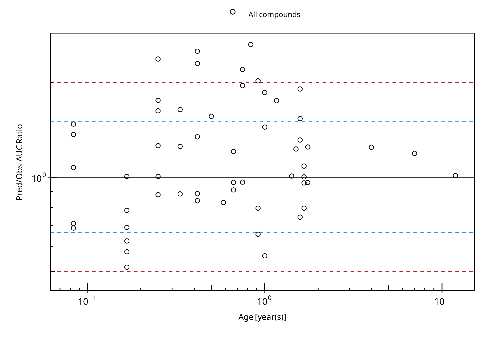
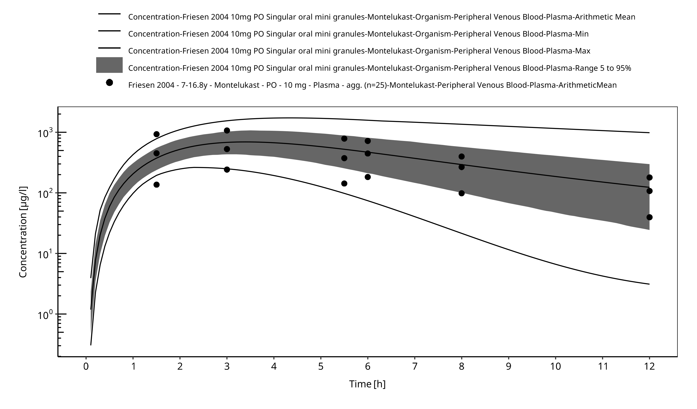
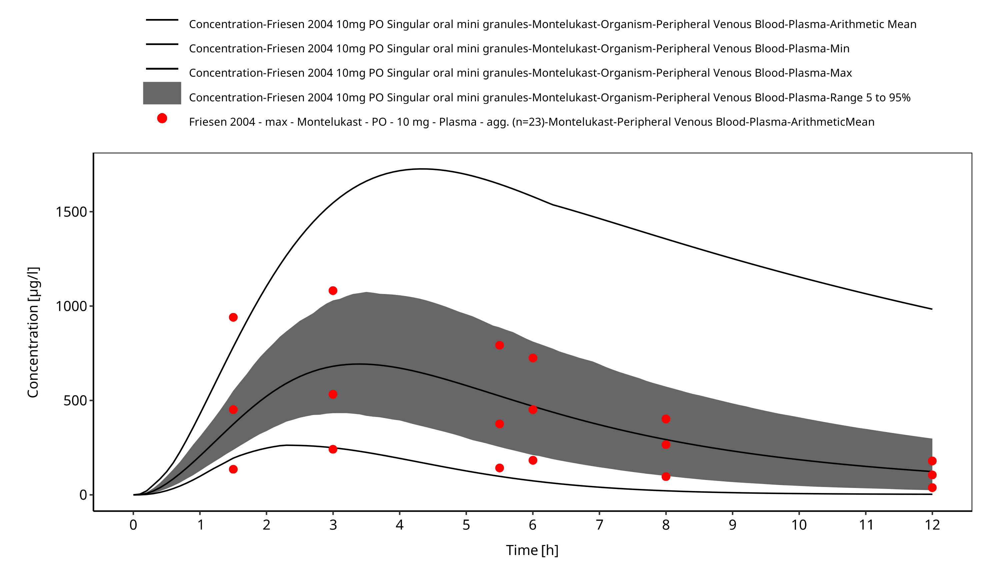

# Pediatric Qualification Package: CYP2C8 Ontogeny

| Version                         | 1.0-OSP12.0                                                   |
| ------------------------------- | ------------------------------------------------------------ |
| Qualification Plan Release      | https://github.com/Open-Systems-Pharmacology/Pediatric_Qualification_Package_CYP2C8_Ontogeny/releases/tag/v1.0 |
| OSP Version                     | 12.0                                                          |
| Qualification Framework Version | 3.3                                                          |

This qualification report is filed at:

https://github.com/Open-Systems-Pharmacology/OSP-Qualification-Reports

# Table of Contents

 * [1 Introduction to Pediatric Translation](#introduction)
 * [2 Pediatric translation qualification](#pediatric-translation-qualification)
   * [2.1 Montelukast PK Ratio tables and Figures](#montelukast-pk-ratios)
   * [2.2 Montelukast Concentration-Time profiles in Children](#montelukast-ct-profiles-in-children)
 * [3 References](#main-references)

# 1 Introduction to Pediatric Translation

The presented qualification report evaluates the predictive performance of the OSP suite to predict cytochrome P450 2C8 (CYP2C8)-mediated drug clearance in children.

Therefore, PBPK models of specific *in vivo* probe substances covering children aged below 6 months up to adolescents were built and evaluated. All models are whole-body PBPK models, allowing for pediatric translation in organs expressing CYP2C8. The qualification report demonstrates the level of confidence of the OSP suite with regard to reliable PBPK predictions of age-related CYP2C8-mediated drug clearance during model-informed drug development. The presented PBPK models as well as the respective qualification plan and qualification report are provided open-source and transparently documented (https://github.com/Open-Systems-Pharmacology/Pediatric_Qualification_Package_CYP2C8_Ontogeny). 

## Translation of Adult PBPK to Children

Using a developed and validated (adult) PBPK model for an *in vivo* probe substance, a pediatric PBPK model can be established for children at different ages by translating physiology, clearance processes (as parameterized in the adult model) and age-dependent protein binding including the variability therein.[[Maharaj 2013](#3-references)] 

The PBPK models are developed with clinical data of healthy adult subjects obtained from the literature, covering available dosing ranges for e.g. intravenous as well as oral administration, to capture both systemic clearance as well gut-wall metabolic clearance processes. For orally administered drugs, the same formulations that are used in children should ideally be included in the model for adults. Plasma concentrations following multiple-dose application, mass balance information and other clinical measurements need to be included for model development, if available. During model translation from adults to children for a specific substance, uncertainties in data-quality caused by impact of disease or the target study population, inaccurate in vitro assay-techniques regarding mass balance, as well as study differences may cause not being able to adequately predict the PK in children for all reported studies. 

Prediction performance of the PBPK model for these probe substances in children are then shown by means of e.g. predicted versus observed area under the plasma concentration (AUC)-ratio plots, of which the results support an adequate prediction of the ontogeny function for the application of PBPK model translation of adult PBPK to children.

For qualification purpose, during the translation of adult PBPK to children the following assumptions and considerations were made: 

- when translating an adult model to children, it was assumed that the metabolism and excretion pathways are qualitatively the same in children and in adults.
- no further changes to input parameters other than those for the physiology and protein binding. All other parameters (e.g. lipophilicity, intestinal permeability, solubility) were kept unchanged.

## Anthropometric and Physiological Information 

Regarding the age-dependencies of the relevant anthropometric (height, weight) and physiological parameters (e.g. blood flows, organ volumes, binding protein concentrations, hematocrit, cardiac output) in children was gathered from the literature and has been previously published. [[Edginton 2006](#3-references)] The information was incorporated into PK-Sim® and was used as default values for the simulations in children.

The CYP2C8 ontogeny function is reported by Upreti et al. [[Upreti 2015](#3-references)] and was integrated into PK-Sim. The ontogeny of CYP2C8 reaches 15% of adult activity at birth, peaks at 260% of adult activity around the age of 14 months and reaches adult activity by the age of 5 to 6 years. The applied ontogeny and variability of other active processes that are integrated into PK-Sim® for translation to children, are described in the publicly available ‘PK-Sim® Ontogeny Database Version 7.3' [[Ontogeny Database](#3-references)]  or otherwise referenced for the specific process.

### Qualification of **CYP2C8 enzyme ontogeny**

To qualify the OSP suite for the pediatric translation of the pharmacokinetics of new drugs that are metabolized by CYP2C8, the following probe substance was included:

- Montelukast [[Montelukast-Model](#3-references)]

The adult PBPK model report and the corresponding PK-Sim project file are filed at: https://github.com/Open-Systems-Pharmacology/OSP-PBPK-Model-Library/

# 2 Pediatric translation qualification

## Evaluation of Pediatric translation

All pediatric translations are pure retrospective predictions, no pediatric pharmacokinetic studies were used to inform model parameters. All parameters necessary to model the pediatric populations, such as demographics (age, weight, height), as well as dosing formulation information were taken from the respective pediatrics studies from literature in order to evaluate their predictive performance. 

The models were evaluated by ratio plots of area under the plasma concentration-time curve (AUC), or clearance (CL) values resulting from our predictions to the values observed during clinical studies, and by comparison of concentration-time profiles if available. As a quantitative measure of the descriptive and predictive performance of each model, the geometric mean fold error was calculated according to Eq. 1:

Eq. 1: GMFE=10^((Σ|log10(pred PK parameter∕obs PK parameter)|)∕n)

with GMFE = geometric mean fold error of all AUC or CL predictions of the respective model, pred PK parameter = predicted AUC or CL, obs PK parameter = observed AUC or CL, and n = number of observed values.

The ratios of predicted over observed mean AUC or CL values from all compound were also plotted across all age groups in the figure below. As illustrated, most of the prediction were within the 0.5 to 2.0 range (2-fold error). 

In the next sections the demographics as well as the evaluation results of the predictive performance of the specific compound PBPK models in children can be found.  

**Figure 2-1: Overall predictivity of the montelukast PBPK model as an in vivo marker of CYP2C8 mediated clearance. Open circles represent mean ratios of PBPK predicted AUC over observed AUC of in children 1 month to 11.9 years old. Blue dashed lines and red dotted lines represent the 1.5-fold and 2-fold error, respectively.**

 
 

**Table 2-1: Measure of Overall predictivity of the montelukast PBPK model as an in vivo marker of CYP2C8 mediated clearance. Open circles represent mean ratios of PBPK predicted AUC over observed AUC of in children 1 month to 11.9 years old. Blue dashed lines and red dotted lines represent the 1.5-fold and 2-fold error, respectively.**

|                       |Number |Ratio [%] |
|:----------------------|:------|:---------|
|Points total           |56     |-        |
|Points within 1.5 fold |36     |64.29     |
|Points within 2 fold   |50     |89.29     |

 
 

**Table 2-2: GMFE for Overall predictivity of the montelukast PBPK model as an in vivo marker of CYP2C8 mediated clearance. Open circles represent mean ratios of PBPK predicted AUC over observed AUC of in children 1 month to 11.9 years old. Blue dashed lines and red dotted lines represent the 1.5-fold and 2-fold error, respectively.**

|Parameter |GMFE |
|:---------|:----|
|AUC       |1.40 |

 
 

**Table 2-3: Overall predictivity of the montelukast PBPK model as an in vivo marker of CYP2C8 mediated clearance. Open circles represent mean ratios of PBPK predicted AUC over observed AUC of in children 1 month to 11.9 years old. Blue dashed lines and red dotted lines represent the 1.5-fold and 2-fold error, respectively.**

|Study ID     |Age [month(s)] |Body Weight [kg] |Predicted AUC [µg*h/l] |Observed AUC [µg*h/l] |Pred/Obs AUC Ratio |
|:------------|:--------------|:----------------|:----------------------|:---------------------|:------------------|
|Kearns 2008  |0.08           |4.04             |20846.61               |30336.98              |0.69               |
|Kearns 2008  |0.08           |4.04             |20846.61               |29350.14              |0.71               |
|Kearns 2008  |0.08           |4.04             |20846.61               |19481.80              |1.07               |
|Kearns 2008  |0.08           |4.04             |20846.61               |15271.04              |1.37               |
|Kearns 2008  |0.08           |4.04             |20846.61               |14152.63              |1.47               |
|Kearns 2008  |0.17           |4.58             |10046.03               |19490.31              |0.52               |
|Kearns 2008  |0.17           |4.58             |10046.03               |17384.80              |0.58               |
|Kearns 2008  |0.17           |4.58             |10046.03               |16069.03              |0.63               |
|Kearns 2008  |0.17           |4.58             |10046.03               |14555.88              |0.69               |
|Kearns 2008  |0.17           |4.58             |10046.03               |12845.36              |0.78               |
|Kearns 2008  |0.17           |4.58             |10046.03               |10016.44              |1.00               |
|Kearns 2008  |0.25           |5.13             |8802.04                |10024.69              |0.88               |
|Kearns 2008  |0.25           |5.13             |8802.04                |8774.44               |1.00               |
|Kearns 2008  |0.25           |5.13             |8802.04                |6998.66               |1.26               |
|Kearns 2008  |0.25           |5.13             |8802.04                |5419.72               |1.62               |
|Kearns 2008  |0.25           |5.13             |8802.04                |5024.99               |1.75               |
|Kearns 2008  |0.25           |5.13             |8802.04                |3709.21               |2.37               |
|Kearns 2008  |0.33           |5.67             |8681.58                |9835.07               |0.88               |
|Kearns 2008  |0.33           |5.67             |8681.58                |6941.12               |1.25               |
|Kearns 2008  |0.42           |6.21             |8698.70                |10369.89              |0.84               |
|Kearns 2008  |0.42           |6.21             |8698.70                |9843.32               |0.88               |
|Kearns 2008  |0.42           |6.21             |8698.70                |6488.08               |1.34               |
|Kearns 2008  |0.42           |6.21             |8698.70                |3791.25               |2.29               |
|Kearns 2008  |0.42           |6.21             |8698.70                |3462.05               |2.51               |
|Kearns 2008  |0.50           |6.75             |9614.11                |6167.91               |1.56               |
|Kearns 2008  |0.58           |7.29             |9805.12                |11833.50              |0.83               |
|Kearns 2008  |0.67           |7.83             |9987.51                |10986.76              |0.91               |
|Kearns 2008  |0.67           |7.83             |9987.51                |10394.92              |0.96               |
|Kearns 2008  |0.67           |7.83             |9987.51                |8289.15               |1.20               |
|Kearns 2008  |0.75           |8.38             |10137.93               |10534.24              |0.96               |
|Kearns 2008  |0.75           |8.38             |10137.93               |4612.97               |2.20               |
|Kearns 2008  |0.83           |8.92             |10286.73               |3897.29               |2.64               |
|Kearns 2008  |0.92           |9.46             |10426.56               |15879.40              |0.66               |
|Kearns 2008  |0.92           |9.46             |10426.56               |13116.26              |0.79               |
|Kearns 2008  |0.92           |9.46             |10426.56               |5155.53               |2.02               |
|Kearns 2008  |1.00           |10.00            |10563.87               |18848.16              |0.56               |
|Kearns 2008  |1.00           |10.00            |10563.87               |7334.83               |1.44               |
|Kearns 2008  |1.00           |10.00            |10563.87               |5690.10               |1.86               |
|Kearns 2008  |1.17           |10.38            |10779.51               |6167.14               |1.75               |
|Kearns 2008  |1.42           |10.94            |11130.88               |11060.03              |1.01               |
|Kearns 2008  |1.58           |11.31            |11324.86               |15221.25              |0.74               |
|Kearns 2008  |1.58           |11.31            |11324.86               |8642.35               |1.31               |
|Kearns 2008  |1.58           |11.31            |11324.86               |7392.36               |1.53               |
|Kearns 2008  |1.58           |11.31            |11324.86               |5945.00               |1.90               |
|Kearns 2008  |1.67           |11.50            |11424.61               |14374.25              |0.79               |
|Kearns 2008  |1.67           |11.50            |11424.61               |11940.31              |0.96               |
|Kearns 2008  |1.67           |11.50            |11424.61               |11414.00              |1.00               |
|Kearns 2008  |1.67           |11.50            |11424.61               |10558.23              |1.08               |
|Kearns 2008  |1.75           |11.69            |11520.13               |12013.84              |0.96               |
|Kearns 2008  |1.75           |11.69            |11520.13               |9250.71               |1.25               |
|Friesen 2004 |11.90          |40.55            |4428.28                |4387.20               |1.01               |
|Knorr 1999   |7.00           |26.00            |3480.98                |2929.00               |1.19               |
|Knorr 2001   |4.00           |17.00            |3382.76                |2721.00               |1.24               |
|Knorr 2006   |0.33           |6.80             |5964.28                |3644.30               |1.64               |
|Miyoga 2004  |1.50           |9.00             |4454.64                |3629.20               |1.23               |
|Miyoga 2004  |0.75           |9.00             |4819.09                |2470.90               |1.95               |

 
 

## 2.1 Montelukast PK Ratio tables and Figures

### Montelukast model

Montelukast PBPK predictions in children were evaluated using pharmacokinetic (PK) data reported in the following studies: 

- Knorr B, Holland S, Rogers JD, Nguyen HH, Reiss TF. Montelukast adult (10-mg film-coated tablet) and pediatric (5-mg chewable tablet) dose selections. J Allergy Clin Immunol. 2000 Sep;106(3 Suppl):S171-8.[[Knorr 2000](#3-references)]
- Friesen CA, Kearns GL, Andre L, Neustrom M, Roberts CC, Abdel-Rahman SM. Clinical efficacy and pharmacokinetics of montelukast in dyspeptic children with duodenal eosinophilia. J Pediatr Gastroenterol Nutr. 2004 Mar;38(3):343-51. [[Friesen 2004](#3-references)]
- Kearns GL, Lu S, Maganti L, Li XS, Migoya E, Ahmed T, Knorr B, Reiss TF. Pharmacokinetics and safety of montelukast oral granules in children 1 to 3 months of age with bronchiolitis. J Clin Pharmacol. 2008 Apr;48(4):502-11. doi: 10.1177/0091270008314251. Epub 2008 Feb 22. [[Kearns 2008](#3-references)]
- Knorr B, Nguyen HH, Kearns GL, Villaran C, Boza ML, Reiss TF, Rogers JD, Zhang J, Larson P, Spielberg S. Montelukast dose selection in children ages 2 to 5 years: comparison of population pharmacokinetics between children and adults. J Clin Pharmacol. 2001 Jun;41(6):612-9. [[Knorr 2001](#3-references)]
- Knorr B, Larson P, Nguyen HH, Holland S, Reiss TF, Chervinsky P, Blake K, van Nispen CH, Noonan G, Freeman A, Haesen R, Michiels N, Rogers JD, Amin RD, Zhao J, Xu X, Seidenberg BC, Gertz BJ, Spielberg S. Montelukast dose selection in 6- to 14-year-olds: comparison of single-dose pharmacokinetics in children and adults. J Clin Pharmacol. 1999 Aug;39(8):786-93. [[Knorr 1999](#3-references)]
- Knorr B, Maganti L, Ramakrishnan R, Tozzi CA, Migoya E, Kearns G. Pharmacokinetics and safety of montelukast in children aged 3 to 6 months. J Clin Pharmacol. 2006 Jun;46(6):620-7. [[Knorr 2006](#3-references)]
- Migoya E1, Kearns GL, Hartford A, Zhao J, van Adelsberg J, Tozzi CA, Knorr B, Deutsch P. Pharmacokinetics of montelukast in asthmatic patients 6 to 24 months old. J Clin Pharmacol. 2004 May;44(5):487-94. [[Migoya 2004](#3-references)]

The pediatric PBPK model predicted the clearance values of montelukast observed in pediatric studies reasonably across all available age groups, ranging from 1 month to 11.9 years old. The ratios of mean predicted over observed area under the observed plasma concentrations (AUC) are illustrated in the table below as well as in the predicted versus observed AUC ratio plot, showing that most predictions in children were within 2-fold error of observed values.

**Figure 2-2: Overall predictivity of the montelukast PBPK model. Open circles represent mean ratios of PBPK predicted AUC over observed AUC of montelukast in children 1 month to 11.9 years old. Blue dashed lines and red dotted lines represent the 1.5-fold and 2-fold error, respectively.**

 
 

**Table 2-4: Measure of Overall predictivity of the montelukast PBPK model. Open circles represent mean ratios of PBPK predicted AUC over observed AUC of montelukast in children 1 month to 11.9 years old. Blue dashed lines and red dotted lines represent the 1.5-fold and 2-fold error, respectively.**

|                       |Number |Ratio [%] |
|:----------------------|:------|:---------|
|Points total           |56     |-        |
|Points within 1.5 fold |36     |64.29     |
|Points within 2 fold   |50     |89.29     |

 
 

**Table 2-5: GMFE for Overall predictivity of the montelukast PBPK model. Open circles represent mean ratios of PBPK predicted AUC over observed AUC of montelukast in children 1 month to 11.9 years old. Blue dashed lines and red dotted lines represent the 1.5-fold and 2-fold error, respectively.**

|Parameter |GMFE |
|:---------|:----|
|AUC       |1.40 |

 
 

**Table 2-6: Overall predictivity of the montelukast PBPK model. Open circles represent mean ratios of PBPK predicted AUC over observed AUC of montelukast in children 1 month to 11.9 years old. Blue dashed lines and red dotted lines represent the 1.5-fold and 2-fold error, respectively.**

|Study ID     |Age [month(s)] |Body Weight [kg] |Predicted AUC [µg*h/l] |Observed AUC [µg*h/l] |Pred/Obs AUC Ratio |
|:------------|:--------------|:----------------|:----------------------|:---------------------|:------------------|
|Kearns 2008  |0.08           |4.04             |20846.61               |30336.98              |0.69               |
|Kearns 2008  |0.08           |4.04             |20846.61               |29350.14              |0.71               |
|Kearns 2008  |0.08           |4.04             |20846.61               |19481.80              |1.07               |
|Kearns 2008  |0.08           |4.04             |20846.61               |15271.04              |1.37               |
|Kearns 2008  |0.08           |4.04             |20846.61               |14152.63              |1.47               |
|Kearns 2008  |0.17           |4.58             |10046.03               |19490.31              |0.52               |
|Kearns 2008  |0.17           |4.58             |10046.03               |17384.80              |0.58               |
|Kearns 2008  |0.17           |4.58             |10046.03               |16069.03              |0.63               |
|Kearns 2008  |0.17           |4.58             |10046.03               |14555.88              |0.69               |
|Kearns 2008  |0.17           |4.58             |10046.03               |12845.36              |0.78               |
|Kearns 2008  |0.17           |4.58             |10046.03               |10016.44              |1.00               |
|Kearns 2008  |0.25           |5.13             |8802.04                |10024.69              |0.88               |
|Kearns 2008  |0.25           |5.13             |8802.04                |8774.44               |1.00               |
|Kearns 2008  |0.25           |5.13             |8802.04                |6998.66               |1.26               |
|Kearns 2008  |0.25           |5.13             |8802.04                |5419.72               |1.62               |
|Kearns 2008  |0.25           |5.13             |8802.04                |5024.99               |1.75               |
|Kearns 2008  |0.25           |5.13             |8802.04                |3709.21               |2.37               |
|Kearns 2008  |0.33           |5.67             |8681.58                |9835.07               |0.88               |
|Kearns 2008  |0.33           |5.67             |8681.58                |6941.12               |1.25               |
|Kearns 2008  |0.42           |6.21             |8698.70                |10369.89              |0.84               |
|Kearns 2008  |0.42           |6.21             |8698.70                |9843.32               |0.88               |
|Kearns 2008  |0.42           |6.21             |8698.70                |6488.08               |1.34               |
|Kearns 2008  |0.42           |6.21             |8698.70                |3791.25               |2.29               |
|Kearns 2008  |0.42           |6.21             |8698.70                |3462.05               |2.51               |
|Kearns 2008  |0.50           |6.75             |9614.11                |6167.91               |1.56               |
|Kearns 2008  |0.58           |7.29             |9805.12                |11833.50              |0.83               |
|Kearns 2008  |0.67           |7.83             |9987.51                |10986.76              |0.91               |
|Kearns 2008  |0.67           |7.83             |9987.51                |10394.92              |0.96               |
|Kearns 2008  |0.67           |7.83             |9987.51                |8289.15               |1.20               |
|Kearns 2008  |0.75           |8.38             |10137.93               |10534.24              |0.96               |
|Kearns 2008  |0.75           |8.38             |10137.93               |4612.97               |2.20               |
|Kearns 2008  |0.83           |8.92             |10286.73               |3897.29               |2.64               |
|Kearns 2008  |0.92           |9.46             |10426.56               |15879.40              |0.66               |
|Kearns 2008  |0.92           |9.46             |10426.56               |13116.26              |0.79               |
|Kearns 2008  |0.92           |9.46             |10426.56               |5155.53               |2.02               |
|Kearns 2008  |1.00           |10.00            |10563.87               |18848.16              |0.56               |
|Kearns 2008  |1.00           |10.00            |10563.87               |7334.83               |1.44               |
|Kearns 2008  |1.00           |10.00            |10563.87               |5690.10               |1.86               |
|Kearns 2008  |1.17           |10.38            |10779.51               |6167.14               |1.75               |
|Kearns 2008  |1.42           |10.94            |11130.88               |11060.03              |1.01               |
|Kearns 2008  |1.58           |11.31            |11324.86               |15221.25              |0.74               |
|Kearns 2008  |1.58           |11.31            |11324.86               |8642.35               |1.31               |
|Kearns 2008  |1.58           |11.31            |11324.86               |7392.36               |1.53               |
|Kearns 2008  |1.58           |11.31            |11324.86               |5945.00               |1.90               |
|Kearns 2008  |1.67           |11.50            |11424.61               |14374.25              |0.79               |
|Kearns 2008  |1.67           |11.50            |11424.61               |11940.31              |0.96               |
|Kearns 2008  |1.67           |11.50            |11424.61               |11414.00              |1.00               |
|Kearns 2008  |1.67           |11.50            |11424.61               |10558.23              |1.08               |
|Kearns 2008  |1.75           |11.69            |11520.13               |12013.84              |0.96               |
|Kearns 2008  |1.75           |11.69            |11520.13               |9250.71               |1.25               |
|Friesen 2004 |11.90          |40.55            |4428.28                |4387.20               |1.01               |
|Knorr 1999   |7.00           |26.00            |3480.98                |2929.00               |1.19               |
|Knorr 2001   |4.00           |17.00            |3382.76                |2721.00               |1.24               |
|Knorr 2006   |0.33           |6.80             |5964.28                |3644.30               |1.64               |
|Miyoga 2004  |1.50           |9.00             |4454.64                |3629.20               |1.23               |
|Miyoga 2004  |0.75           |9.00             |4819.09                |2470.90               |1.95               |

 
 

## 2.2 Montelukast Concentration-Time profiles in Children

#### Concentration-Time Profiles

Predicted versus observed plasma concentration-time profiles are listed below. Only simulations where observed data was available for comparison are shown.  Depending if the observed data were individual data or aggregated data, individual predictions or population predictions including variability are shown, respectively.

**Figure 2-3: Time Profile Analysis**

 
 

**Figure 2-4: Time Profile Analysis 1**

 
 

# 3 References

**Edginton 2006** Edginton AN, Schmitt W, Willmann S. Development and evaluation of a generic physiologically based pharmacokinetic model for children. Clin Pharmacokinet. 2006;45(10):1013-34.

**Friesen 2004** Friesen CA, Kearns GL, Andre L, Neustrom M, Roberts CC, Abdel-Rahman SM. Clinical efficacy and pharmacokinetics of montelukast in dyspeptic children with duodenal eosinophilia. J Pediatr Gastroenterol Nutr. 2004 Mar;38(3):343-51. 

**Kearns 2008** Kearns GL, Lu S, Maganti L, Li XS, Migoya E, Ahmed T, Knorr B, Reiss TF. Pharmacokinetics and safety of montelukast oral granules in children 1 to 3 months of age with bronchiolitis. J Clin Pharmacol. 2008 Apr;48(4):502-11. doi: 10.1177/0091270008314251. Epub 2008 Feb 22.

**Knorr 1999** Knorr B, Larson P, Nguyen HH, Holland S, Reiss TF, Chervinsky P, Blake K, van Nispen CH, Noonan G, Freeman A, Haesen R, Michiels N, Rogers JD, Amin RD, Zhao J, Xu X, Seidenberg BC, Gertz BJ, Spielberg S. Montelukast dose selection in 6- to 14-year-olds: comparison of single-dose pharmacokinetics in children and adults. J Clin Pharmacol. 1999 Aug;39(8):786-93. 

**Knorr 2000** Knorr B, Holland S, Rogers JD, Nguyen HH, Reiss TF. Montelukast adult (10-mg film-coated tablet) and pediatric (5-mg chewable tablet) dose selections. J Allergy Clin Immunol. 2000 Sep;106(3 Suppl):S171-8.

**Knorr 2001** Knorr B, Nguyen HH, Kearns GL, Villaran C, Boza ML, Reiss TF, Rogers JD, Zhang J, Larson P, Spielberg S. Montelukast dose selection in children ages 2 to 5 years: comparison of population pharmacokinetics between children and adults. J Clin Pharmacol. 2001 Jun;41(6):612-9. 

**Knorr 2006** Knorr B, Maganti L, Ramakrishnan R, Tozzi CA, Migoya E, Kearns G. Pharmacokinetics and safety of montelukast in children aged 3 to 6 months. J Clin Pharmacol. 2006 Jun;46(6):620-7. 

**Maharaj 2013** Maharaj AR, Barrett JS, Edginton AN. A workflow example of PBPK modeling to support pediatric research and development: case study with lorazepam. The AAPS journal. 2013;15(2): 455-464.

**Migoya 2004** Migoya E1, Kearns GL, Hartford A, Zhao J, van Adelsberg J, Tozzi CA, Knorr B, Deutsch P. Pharmacokinetics of montelukast in asthmatic patients 6 to 24 months old. J Clin Pharmacol. 2004 May;44(5):487-94.

**Montelukast-Model** Montelukast-Model, Whole-body PBPK model of Montelukast. (https://github.com/Open-Systems-Pharmacology/Montelukast-Model)

**Ontogeny Database** OSPSuite.Documentation/PK-Sim Ontogeny Database Version 7.3.pdf (https://github.com/Open-Systems-Pharmacology/OSPSuite.Documentation/blob/38cf71b384cfc25cfa0ce4d2f3addfd32757e13b/PK-Sim%20Ontogeny%20Database%20Version%207.3.pdf)

**Upreti 2015** Upreti VV, Wahlstrom JL. Meta-analysis of hepatic cytochrome P450 ontogeny to underwrite the prediction of pediatric pharmacokinetics using physiologically based pharmacokinetic modeling. J Clin Pharmacol. 2016 Mar;56(3):266-83. doi: 10.1002/jcph.585. Epub 2015 Oct 9.

