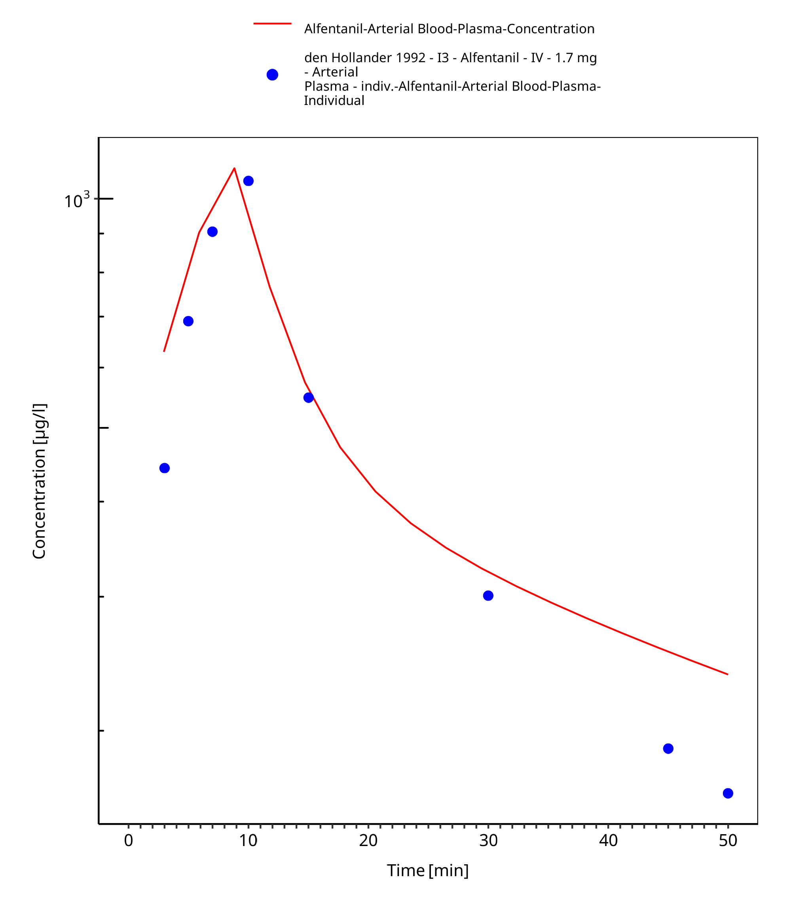

# Pediatric Qualification Package: CYP3A4 Ontogeny

| Version                         | 1.0-OSP12.0                                                   |
| ------------------------------- | ------------------------------------------------------------ |
| Qualification Plan Release      | [https://github.com/Open-Systems-Pharmacology/Pediatric_Qualification_Package_CYP3A4_Ontogeny/releases/tag/v1.0](https://github.com/Open-Systems-Pharmacology/Pediatric_Qualification_Package_CYP3A4_Ontogeny/releases/tag/v1.0) |
| OSP Version                     | 12.0                                                          |
| Qualification Framework Version | 3.3                                                          |

This qualification report is filed at:

[https://github.com/Open-Systems-Pharmacology/OSP-Qualification-Reports](https://github.com/Open-Systems-Pharmacology/OSP-Qualification-Reports)

# Table of Contents

 * [1 Introduction to Pediatric Translation and CYP3A4 Ontogeny Qualification](#introduction)
 * [2 Pediatric translation qualification results](#pediatric-translation-qualification-results)
   * [2.1 Sufentanil PK Ratio tables and Figures](#sufentanil-pk-ratios)
   * [2.2 Sufentanil Concentration-Time profiles in Children](#sufentanil-ct-profiles)
   * [2.3 Alfentanil PK Ratio tables and Figures](#alfentanil-pk-ratios)
   * [2.4 Alfentanil Concentration-Time profiles in Children](#alfentanil-ct-profiles)
 * [3 References](#main-references)

# 1 Introduction to Pediatric Translation and CYP3A4 Ontogeny Qualification

The presented qualification report evaluates the predictive performance of the OSP suite to predict cytochrome P450 3A4 (CYP3A4)-mediated drug clearance in children.

Therefore, PBPK models of specific *in vivo* probe substances covering children aged below 6 months up to adolescents were built and evaluated. All models are whole-body PBPK models, allowing for dynamic pediatric translation in organs expressing CYP3A4. The qualification report demonstrates the level of confidence of the OSP suite with regard to reliable PBPK predictions of age-related CYP3A4-mediated drug clearance during model-informed drug development. The presented PBPK models as well as the respective qualification plan and qualification report are provided open-source and transparently documented ([https://github.com/Open-Systems-Pharmacology/Pediatric_Qualification_Package_CYP3A4_Ontogeny](https://github.com/Open-Systems-Pharmacology/Pediatric_Qualification_Package_CYP3A4_Ontogeny)). 

## Translation of Adult PBPK to Children

Using a developed and validated (adult) PBPK model for an *in vivo* probe substance, a pediatric PBPK model can be established for children by translating physiology, clearance processes (as parameterized in the adult model) and age-dependent protein binding including the variability therein.[[Maharaj 2013](#3-references)] 

The PBPK models are developed with clinical data of healthy adult subjects obtained from the literature, covering available dosing ranges for e.g. intravenous as well as oral administration, to capture both systemic clearance as well gut-wall metabolic clearance processes. For orally administered drugs, the same formulations that are used in children should ideally be included in the model for adults. Plasma concentrations following multiple-dose application, mass balance information and other clinical measurements need to be included for model development, if available. During model translation from adults to children for a specific substance, uncertainties in data-quality caused by impact of disease or the target study population, inaccurate in vitro assay-techniques regarding mass balance, as well as study differences may cause not being able to adequately predict the PK in children for all reported studies. 

Prediction performance of the PBPK model for these probe substances in children are then shown by means of e.g. predicted versus observed area under the plasma concentration (AUC)-ratio plots, of which the results support an adequate prediction of the ontogeny function for the application of PBPK model translation of adult PBPK to children.

For qualification purpose, during the translation of adult PBPK to children the following assumptions and considerations were made: 

- when translating an adult model to children, it was assumed that the metabolism and excretion pathways are qualitatively the same in children as in adults.
- no further changes to input parameters other than those for the physiology and protein binding. All other parameters (e.g. lipophilicity, intestinal permeability, solubility) were kept unchanged.

## Anthropometric and Physiological Information 

Regarding the age-dependencies of the relevant anthropometric (height, weight) and physiological parameters (e.g. blood flows, organ volumes, binding protein concentrations, hematocrit, cardiac output) in children was gathered from the literature and has been previously published [[Edginton 2006](#3-references)]. The information was incorporated into PK-Sim® and was used as default values for the simulations in children.

The  applied ontogeny and variability of plasma proteins and active processes that are integrated into PK-Sim® for translation to children are described in the publicly available ‘PK-Sim® Ontogeny Database Version 7.3' [[Ontogeny Database](#3-references)] or otherwise referenced for the specific process.

## Qualification of **CYP3A4 enzyme ontogeny**

To qualify the OSP suite for the pediatric translation of the pharmacokinetics of new drugs that are metabolized by CYP3A4, the following set of probe substances was included:

- Alfentanil [[Alfentanil-Model](#3-references)]

- Sufentanil [[Sufentanil-Model](#3-references)]

The adult PBPK model reports and the corresponding PK-Sim project files are filed at: [https://github.com/Open-Systems-Pharmacology/OSP-PBPK-Model-Library/](https://github.com/Open-Systems-Pharmacology/OSP-PBPK-Model-Library/)

# 2 Pediatric translation qualification results

## Evaluation of Pediatric translation

All pediatric translations are pure retrospective predictions, no pediatric pharmacokinetic studies were used to inform model parameters. All parameters necessary to model the pediatric populations, such as demographics (age, weight, height), as well as dosing formulation information were taken from the respective pediatrics studies from literature in order to evaluate their predictive performance. 

The models were evaluated by ratio plots of area under the plasma concentration-time curve (AUC), or clearance (CL) values resulting from our predictions to the values observed during clinical studies, and by comparison of concentration-time profiles if available. As a quantitative measure of the descriptive and predictive performance of each model, the geometric mean fold error was calculated according to Eq. 1:

Eq. 1: GMFE=10^((Σ|log10(pred PK parameter∕obs PK parameter)|)∕n)

with GMFE = geometric mean fold error of all AUC or CL predictions of the respective model, pred PK parameter = predicted AUC or CL, obs PK parameter = observed AUC or CL, and n = number of observed values.

The ratios of predicted over observed mean AUC or CL values from all compound were also plotted across all age groups in the figure below. As illustrated, most of the prediction were within the 0.5 to 2.0 range (2-fold error). 

In the next sections the demographics as well as the evaluation results of the predictive performance of the specific compound PBPK models in children can be found.  

**Figure 2-1: Overall predictivity of the PBPK models. Open circles represent mean ratios of PBPK predicted AUC over observed AUC of all drugs in children 3.6 months to 9 years old. Blue dashed lines and red dotted lines represent the 1.5-fold and 2-fold error, respectively.**

 
 

**Table 2-1: Measure of Overall predictivity of the PBPK models. Open circles represent mean ratios of PBPK predicted AUC over observed AUC of all drugs in children 3.6 months to 9 years old. Blue dashed lines and red dotted lines represent the 1.5-fold and 2-fold error, respectively.**

|                       |Number |Ratio [%] |
|:----------------------|:------|:---------|
|Points total           |39     |-        |
|Points within 1.5 fold |29     |74.36     |
|Points within 2 fold   |38     |97.44     |

 
 

**Table 2-2: GMFE for Overall predictivity of the PBPK models. Open circles represent mean ratios of PBPK predicted AUC over observed AUC of all drugs in children 3.6 months to 9 years old. Blue dashed lines and red dotted lines represent the 1.5-fold and 2-fold error, respectively.**

|Parameter |GMFE |
|:---------|:----|
|AUC       |1.25 |

 
 

**Table 2-3: Overall predictivity of the PBPK models. Open circles represent mean ratios of PBPK predicted AUC over observed AUC of all drugs in children 3.6 months to 9 years old. Blue dashed lines and red dotted lines represent the 1.5-fold and 2-fold error, respectively.**

|Study ID           |Age [year(s)] |Body Weight [kg] |Predicted AUC [µg*h/l] |Observed AUC [µg*h/l] |Pred/Obs AUC Ratio |
|:------------------|:-------------|:----------------|:----------------------|:---------------------|:------------------|
|Davis 1987         |1.29          |8.90             |7.47                   |13.81                 |0.54               |
|Davis 1987         |0.43          |5.30             |9.35                   |9.09                  |1.03               |
|Guay 1991          |2.08          |12.10            |1.09                   |1.81                  |0.60               |
|Guay 1991          |2.58          |16.00            |0.66                   |0.77                  |0.86               |
|Guay 1991          |2.67          |11.30            |1.68                   |1.49                  |1.13               |
|Guay 1991          |3.25          |16.00            |1.45                   |1.38                  |1.05               |
|Guay 1991          |3.83          |14.20            |0.93                   |1.10                  |0.84               |
|Guay 1991          |4.58          |15.00            |0.74                   |1.12                  |0.66               |
|Guay 1991          |4.58          |19.00            |1.42                   |2.25                  |0.63               |
|Guay 1991          |4.83          |17.50            |1.46                   |1.16                  |1.25               |
|Guay 1991          |5.25          |18.50            |0.75                   |0.73                  |1.04               |
|Guay 1991          |5.25          |19.65            |1.47                   |1.42                  |1.04               |
|Guay 1991          |5.33          |24.00            |1.89                   |2.26                  |0.83               |
|Guay 1991          |5.33          |24.00            |1.06                   |1.26                  |0.84               |
|Guay 1991          |5.75          |14.50            |1.26                   |2.53                  |0.50               |
|Guay 1991          |5.92          |28.20            |1.55                   |2.13                  |0.73               |
|Guay 1991          |5.92          |25.00            |0.80                   |0.95                  |0.84               |
|Guay 1991          |6.92          |29.60            |1.04                   |1.03                  |1.01               |
|Guay 1991          |7.50          |23.50            |0.45                   |0.58                  |0.77               |
|Guay 1991          |7.50          |15.20            |1.22                   |1.23                  |0.99               |
|Guay 1991          |8.75          |22.60            |0.87                   |0.94                  |0.93               |
|den Hollander 1992 |0.92          |6.50             |347.14                 |351.67                |0.99               |
|den Hollander 1992 |0.83          |6.40             |352.31                 |233.33                |1.51               |
|den Hollander 1992 |0.99          |8.50             |376.38                 |330.00                |1.14               |
|den Hollander 1992 |0.30          |5.10             |469.36                 |308.33                |1.52               |
|den Hollander 1992 |0.92          |6.15             |296.56                 |265.00                |1.12               |
|den Hollander 1992 |1.30          |10.40            |353.86                 |405.00                |0.87               |
|den Hollander 1992 |9.00          |25.60            |323.36                 |188.33                |1.72               |
|den Hollander 1992 |3.50          |14.40            |314.59                 |310.00                |1.01               |
|den Hollander 1992 |5.50          |19.50            |315.14                 |345.00                |0.91               |
|den Hollander 1992 |3.50          |18.50            |341.38                 |378.33                |0.90               |
|Meistelman 1987    |4.70          |20.00            |68.19                  |98.04                 |0.70               |
|Meistelman 1987    |5.50          |20.00            |63.19                  |56.50                 |1.12               |
|Meistelman 1987    |7.70          |23.00            |62.90                  |40.16                 |1.57               |
|Meistelman 1987    |4.50          |14.00            |54.21                  |72.46                 |0.75               |
|Meistelman 1987    |4.80          |24.00            |80.61                  |90.09                 |0.89               |
|Meistelman 1987    |4.50          |20.00            |69.91                  |69.44                 |1.01               |
|Meistelman 1987    |6.20          |23.00            |68.47                  |75.76                 |0.90               |
|Meistelman 1987    |4.90          |22.00            |72.99                  |123.46                |0.59               |

 
 

## 2.1 Sufentanil PK Ratio tables and Figures

### Sufentanil model

Sufentanil PBPK predictions in children were evaluated using pharmacokinetic (PK) data reported in the following studies: 

- Davis PJ, Cook DR, Stiller RL, Davin-Robinson KA. Pharmacodynamics and pharmacokinetics of high-dose sufentanil in infants and children undergoing cardiac surgery. Anesth Analg. 1987 Mar;66(3):203-8.[[Davis 1987](#3-references)]
- Guay J, Gaudreault P, Tang A, Goulet B, Varin F. Pharmacokinetics of sufentanil in normal children. Can J Anaesth. 1992 Jan;39(1):14-20.[[Guay 1992](#3-references)]

The pediatric PBPK model predicted the clearance values of sufentanil observed in pediatric studies reasonably across all available age groups, ranging from 5 months to 8.75 years old. The ratios of mean predicted over observed clearance values are illustrated in the table below as well as in the predicted versus observed clearance ratio plot, showing that most predictions in children were within 2-fold error of observed values.

**Figure 2-2: Overall predictivity of the sufentanil PBPK model. Open circles represent mean ratios of PBPK predicted AUC over observed AUC of sufentanil in children 5 months to 8.75 years old. Blue dashed lines and red dotted lines represent the 1.5-fold and 2-fold error, respectively.**

 
 

**Table 2-4: Measure of Overall predictivity of the sufentanil PBPK model. Open circles represent mean ratios of PBPK predicted AUC over observed AUC of sufentanil in children 5 months to 8.75 years old. Blue dashed lines and red dotted lines represent the 1.5-fold and 2-fold error, respectively.**

|                       |Number |Ratio [%] |
|:----------------------|:------|:---------|
|Points total           |21     |-        |
|Points within 1.5 fold |16     |76.19     |
|Points within 2 fold   |20     |95.24     |

 
 

**Table 2-5: GMFE for Overall predictivity of the sufentanil PBPK model. Open circles represent mean ratios of PBPK predicted AUC over observed AUC of sufentanil in children 5 months to 8.75 years old. Blue dashed lines and red dotted lines represent the 1.5-fold and 2-fold error, respectively.**

|Parameter |GMFE |
|:---------|:----|
|AUC       |1.25 |

 
 

**Table 2-6: Overall predictivity of the sufentanil PBPK model. Open circles represent mean ratios of PBPK predicted AUC over observed AUC of sufentanil in children 5 months to 8.75 years old. Blue dashed lines and red dotted lines represent the 1.5-fold and 2-fold error, respectively.**

|Study ID   |Age [month(s)] |Body Weight [kg] |Predicted AUC [µg*h/l] |Observed AUC [µg*h/l] |Pred/Obs AUC Ratio |
|:----------|:--------------|:----------------|:----------------------|:---------------------|:------------------|
|Davis 1987 |1.29           |8.90             |7.47                   |13.81                 |0.54               |
|Davis 1987 |0.43           |5.30             |9.35                   |9.09                  |1.03               |
|Guay 1991  |2.08           |12.10            |1.09                   |1.81                  |0.60               |
|Guay 1991  |2.58           |16.00            |0.66                   |0.77                  |0.86               |
|Guay 1991  |2.67           |11.30            |1.68                   |1.49                  |1.13               |
|Guay 1991  |3.25           |16.00            |1.45                   |1.38                  |1.05               |
|Guay 1991  |3.83           |14.20            |0.93                   |1.10                  |0.84               |
|Guay 1991  |4.58           |15.00            |0.74                   |1.12                  |0.66               |
|Guay 1991  |4.58           |19.00            |1.42                   |2.25                  |0.63               |
|Guay 1991  |4.83           |17.50            |1.46                   |1.16                  |1.25               |
|Guay 1991  |5.25           |18.50            |0.75                   |0.73                  |1.04               |
|Guay 1991  |5.25           |19.65            |1.47                   |1.42                  |1.04               |
|Guay 1991  |5.33           |24.00            |1.89                   |2.26                  |0.83               |
|Guay 1991  |5.33           |24.00            |1.06                   |1.26                  |0.84               |
|Guay 1991  |5.75           |14.50            |1.26                   |2.53                  |0.50               |
|Guay 1991  |5.92           |28.20            |1.55                   |2.13                  |0.73               |
|Guay 1991  |5.92           |25.00            |0.80                   |0.95                  |0.84               |
|Guay 1991  |6.92           |29.60            |1.04                   |1.03                  |1.01               |
|Guay 1991  |7.50           |23.50            |0.45                   |0.58                  |0.77               |
|Guay 1991  |7.50           |15.20            |1.22                   |1.23                  |0.99               |
|Guay 1991  |8.75           |22.60            |0.87                   |0.94                  |0.93               |

 
 

## 2.2 Sufentanil Concentration-Time profiles in Children

#### Concentration-Time Profiles

Predicted versus observed plasma concentration-time profiles are listed below. Only simulations where observed data was available for comparison are shown.  Depending if the observed data were individual data or aggregated data, individual predictions or population predictions including variability are shown, respectively.

**Figure 2-3: Time Profile Analysis**

 
 

**Figure 2-4: Time Profile Analysis 1**

 
 

**Figure 2-5: Time Profile Analysis**

 
 

**Figure 2-6: Time Profile Analysis 1**

 
 

**Figure 2-7: Time Profile Analysis**

 
 

**Figure 2-8: Time Profile Analysis 1**

 
 

## 2.3 Alfentanil PK Ratio tables and Figures

### Alfentanil model

Alfentanil PBPK predictions in children were evaluated using pharmacokinetic (PK) data reported in the following studies: 

- den Hollander JM, Hennis PJ, Burm AG, Vletter AA, Bovill JG. Pharmacokinetics of alfentanil before and after cardiopulmonary bypass in pediatric patients undergoing cardiac surgery: Part I. J Cardiothorac Vasc Anesth. 1992 Jun;6(3):308-12.[[Meistelman 1987](#3-references)]
- Meistelman C, Saint-Maurice C, Lepaul M, Levron JC, Loose JP, Mac Gee K. A comparison of alfentanil pharmacokinetics in children and adults. Anesthesiology. 1987 Jan;66(1):13-6.[[den Hollander 1992](#3-references)]

The pediatric PBPK model predicted the AUC values of alfentanil observed in pediatric studies reasonably across all available age groups, ranging from 3.6 months to 9 years old. The ratios of mean predicted over observed AUC values are illustrated in the table below as well as in the predicted versus observed AUC ratio plot, showing that most predictions in children were within 2-fold error of observed values. Another reported study on alfentanil pharmacokinetics in children [[Goresky 1987](#3-references)] showed systematically higher exposure for most individuals compared to the other herein included studies. This deviation may have been caused by different impact of individual pathophysiology of the target study population, inaccurate in vitro assay-techniques or other study differences. 

**Figure 2-9: Overall predictivity of the alfentanil PBPK model. Open circles represent mean ratios of PBPK predicted AUC over observed AUC of alfentanil in children 3.6 months to 9 years old. Blue dashed lines and red dotted lines represent the 1.5-fold and 2-fold error, respectively.**

 
 

**Table 2-7: Measure of Overall predictivity of the alfentanil PBPK model. Open circles represent mean ratios of PBPK predicted AUC over observed AUC of alfentanil in children 3.6 months to 9 years old. Blue dashed lines and red dotted lines represent the 1.5-fold and 2-fold error, respectively.**

|                       |Number |Ratio [%] |
|:----------------------|:------|:---------|
|Points total           |18     |-        |
|Points within 1.5 fold |13     |72.22     |
|Points within 2 fold   |18     |100.00    |

 
 

**Table 2-8: GMFE for Overall predictivity of the alfentanil PBPK model. Open circles represent mean ratios of PBPK predicted AUC over observed AUC of alfentanil in children 3.6 months to 9 years old. Blue dashed lines and red dotted lines represent the 1.5-fold and 2-fold error, respectively.**

|Parameter |GMFE |
|:---------|:----|
|AUC       |1.24 |

 
 

**Table 2-9: Overall predictivity of the alfentanil PBPK model. Open circles represent mean ratios of PBPK predicted AUC over observed AUC of alfentanil in children 3.6 months to 9 years old. Blue dashed lines and red dotted lines represent the 1.5-fold and 2-fold error, respectively.**

|Study ID           |Age [year(s)] |Body Weight [kg] |Predicted AUC [µg*h/l] |Observed AUC [µg*h/l] |Pred/Obs AUC Ratio |
|:------------------|:-------------|:----------------|:----------------------|:---------------------|:------------------|
|den Hollander 1992 |0.92          |6.50             |347.14                 |351.67                |0.99               |
|den Hollander 1992 |0.83          |6.40             |352.31                 |233.33                |1.51               |
|den Hollander 1992 |0.99          |8.50             |376.38                 |330.00                |1.14               |
|den Hollander 1992 |0.30          |5.10             |469.36                 |308.33                |1.52               |
|den Hollander 1992 |0.92          |6.15             |296.56                 |265.00                |1.12               |
|den Hollander 1992 |1.30          |10.40            |353.86                 |405.00                |0.87               |
|den Hollander 1992 |9.00          |25.60            |323.36                 |188.33                |1.72               |
|den Hollander 1992 |3.50          |14.40            |314.59                 |310.00                |1.01               |
|den Hollander 1992 |5.50          |19.50            |315.14                 |345.00                |0.91               |
|den Hollander 1992 |3.50          |18.50            |341.38                 |378.33                |0.90               |
|Meistelman 1987    |4.70          |20.00            |68.19                  |98.04                 |0.70               |
|Meistelman 1987    |5.50          |20.00            |63.19                  |56.50                 |1.12               |
|Meistelman 1987    |7.70          |23.00            |62.90                  |40.16                 |1.57               |
|Meistelman 1987    |4.50          |14.00            |54.21                  |72.46                 |0.75               |
|Meistelman 1987    |4.80          |24.00            |80.61                  |90.09                 |0.89               |
|Meistelman 1987    |4.50          |20.00            |69.91                  |69.44                 |1.01               |
|Meistelman 1987    |6.20          |23.00            |68.47                  |75.76                 |0.90               |
|Meistelman 1987    |4.90          |22.00            |72.99                  |123.46                |0.59               |

 
 

## 2.4 Alfentanil Concentration-Time profiles in Children

#### Concentration-Time Profiles

Predicted versus observed plasma concentration-time profiles are listed below. Only simulations where observed data was available for comparison are shown.  Depending if the observed data were individual data or aggregated data, individual predictions or population predictions including variability are shown, respectively.

**Figure 2-10: Time Profile Analysis**

 
 

**Figure 2-11: Time Profile Analysis 1**

 
 

**Figure 2-12: Time Profile Analysis**

 
 

**Figure 2-13: Time Profile Analysis 1**

 
 

# 3 References

**Alfentanil-Model** Alfentanil-Model, Whole-body PBPK model of Alfentanil. ([https://github.com/Open-Systems-Pharmacology/Alfentanil-Model](https://github.com/Open-Systems-Pharmacology/Alfentanil-Model)) 

**Davis 1987** Davis PJ, Cook DR, Stiller RL, Davin-Robinson KA. Pharmacodynamics and pharmacokinetics of high-dose sufentanil in infants and children undergoing cardiac surgery. Anesth Analg. 1987 Mar;66(3):203-8.

**den Hollander 1992** den Hollander JM, Hennis PJ, Burm AG, Vletter AA, Bovill JG. Pharmacokinetics of alfentanil before and after cardiopulmonary bypass in pediatric patients undergoing cardiac surgery: Part I. J Cardiothorac Vasc Anesth. 1992 Jun;6(3):308-12.

**Edginton 2006** Edginton AN, Schmitt W, Willmann S. Development and evaluation of a generic physiologically based pharmacokinetic model for children. Clin Pharmacokinet. 2006;45(10):1013-34.

**Goresky 1987** Goresky GV, Koren G, Sabourin MA, Sale JP, Strunin L., The pharmacokinetics of alfentanil in children. Anesthesiology. 1987 Nov;67(5):654-9.

**Guay 1992** Guay J, Gaudreault P, Tang A, Goulet B, Varin F. Pharmacokinetics of sufentanil in normal children. Can J Anaesth. 1992 Jan;39(1):14-20.

**Maharaj 2013** Maharaj AR, Barrett JS, Edginton AN. A workflow example of PBPK modeling to support pediatric research and development: case study with lorazepam. The AAPS journal. 2013;15(2): 455-464.

**Meistelman 1987** Meistelman C, Saint-Maurice C, Lepaul M, Levron JC, Loose JP, Mac Gee K. A comparison of alfentanil pharmacokinetics in children and adults. Anesthesiology. 1987 Jan;66(1):13-6.

**Ontogeny Database** OSPSuite.Documentation/PK-Sim Ontogeny Database Version 7.3.pdf ([https://github.com/Open-Systems-Pharmacology/OSPSuite.Documentation/blob/38cf71b384cfc25cfa0ce4d2f3addfd32757e13b/PK-Sim%20Ontogeny%20Database%20Version%207.3.pdf](https://github.com/Open-Systems-Pharmacology/OSPSuite.Documentation/blob/38cf71b384cfc25cfa0ce4d2f3addfd32757e13b/PK-Sim%20Ontogeny%20Database%20Version%207.3.pdf))

**Sufentanil-Model** Sufentanil-Model, Whole-body PBPK model of Sufentanil. ([https://github.com/Open-Systems-Pharmacology/Sufentanil-Model](https://github.com/Open-Systems-Pharmacology/Sufentanil-Model))

