# Pediatric Qualification Package: GFR Ontogeny

| Version                         | 1.3-OSP11.0                                                   |
| ------------------------------- | ------------------------------------------------------------ |
| Qualification Plan Release      | https://github.com/Open-Systems-Pharmacology/Pediatric_Qualification_Package_GFR_Ontogeny/releases/tag/v1.3 |
| OSP Version                     | 11.0                                                          |
| Qualification Framework Version | 2.3                                                          |

This qualification report is filed at:

https://github.com/Open-Systems-Pharmacology/OSP-Qualification-Reports

# Table of Contents
  * [1 Introduction to Pediatric Translation](#1-introduction-to-pediatric-translation)
  * [2 Pediatric translation qualification](#2-pediatric-translation-qualification)
    * [2.1 Amikacin PK Ratio tables and Figures](#21-amikacin-pk-ratio-tables-and-figures)
    * [2.2 Amikacin Concentration-Time profiles in Children](#22-amikacin-concentration-time-profiles-in-children)
    * [2.3 Vancomycin PK Ratio tables and Figures](#23-vancomycin-pk-ratio-tables-and-figures)
    * [2.4 Vancomycin Concentration-Time profiles in Children](#24-vancomycin-concentration-time-profiles-in-children)
  * [3 References](#3-references)
# 1 Introduction to Pediatric Translation
The presented qualification report evaluates the predictive performance of the OSP suite to predict glomerular filtration rate (GFR)-mediated drug clearance in children.

Therefore, PBPK models of specific *in vivo* probe substances covering children aged below 6 months up to adolescents were built and evaluated. All models are whole-body PBPK models, allowing for pediatric translation in all organs. The qualification report demonstrates the level of confidence of the OSP suite with regard to reliable PBPK predictions of age related GFR-mediated drug clearance during model-informed drug development. The presented PBPK models as well as the respective qualification plan and qualification report are provided open-source and transparently documented (https://github.com/Open-Systems-Pharmacology/Pediatric_Qualification_Package_GFR_Ontogeny). 

## Translation of Adult PBPK to Children

Using a developed and validated (adult) PBPK model for an *in vivo* probe substance, a pediatric PBPK model can be established for children at different ages by translating physiology, clearance processes (as parameterized in the adult model) and age-dependent protein binding including the variability therein.[[Maharaj 2013](#3-references)] 

The PBPK models are developed with clinical data of healthy adult subjects obtained from the literature. Plasma concentrations following multiple-dose application, mass balance information and other clinical measurements need to be included for model development, if available. During model translation from adults to children for a specific substance, uncertainties in data-quality caused by impact of disease or the target study population, inaccurate in vitro assay-techniques regarding mass balance, as well as study differences may cause not being able to adequately predict the PK in children for all reported studies. 

Prediction performance of the PBPK model for these probe substances in children are then shown by means of e.g. predicted versus observed clearance-ratio plots, of which the results support an adequate prediction of the ontogeny function for the application of PBPK model translation of adult PBPK to children.

For qualification purpose, during the translation of adult PBPK to children the following assumptions and considerations were made: 

- when translating an adult model to children, it was assumed that the metabolism and excretion pathways are qualitatively the same in children as in adults.
- no further changes to input parameters other than those for the physiology and protein binding. All other parameters (e.g. lipophilicity) were kept unchanged. 

## Anthropometric and Physiological Information 

Regarding the age-dependencies of the relevant anthropometric (height, weight) and physiological parameters (e.g. blood flows, organ volumes, binding protein concentrations, hematocrit, cardiac output) in children was gathered from the literature and has been previously published. [[Edginton 2006](#3-references)] The information was incorporated into PK-Sim® and was used as default values for the simulations in children.

The  applied ontogeny and variability of plasma proteins that are integrated into PK-Sim® for translation to children are described in the publicly available ‘PK-Sim® Ontogeny Database Version 7.3' [[Ontogeny Database](#3-references)] or otherwise referenced for the specific process.

### Qualification of **GFR ontogeny**

For the qualification of the GFR elimination of compounds, the following probe substances were included:

- Amikacin [[Amikacin-Model](#3-references)]
- Vancomycin [[Vancomycin-Model](#3-references)]

The adult PBPK model reports and the corresponding PK-Sim project files are filed at: https://github.com/Open-Systems-Pharmacology/OSP-PBPK-Model-Library/

# 2 Pediatric translation qualification
## Evaluation of Pediatric translation

All pediatric translations are pure retrospective predictions, no pediatric pharmacokinetic studies were used to inform model parameters. All parameters necessary to model the pediatric populations, such as demographics (age, weight, height), as well as dosing formulation information were taken from the respective pediatrics studies from literature in order to evaluate their predictive performance. 

The models were evaluated by ratio plots of area under the plasma concentration-time curve (AUC), or clearance (CL) values resulting from our predictions to the values observed during clinical studies, and by comparison of concentration-time profiles if available. As a quantitative measure of the descriptive and predictive performance of each model, the geometric mean fold error was calculated according to Eq. 1:

Eq. 1: GMFE=10^((Σ|log10(pred PK parameter∕obs PK parameter)|)∕n)

with GMFE = geometric mean fold error of all AUC or CL predictions of the respective model, pred PK parameter = predicted AUC or CL, obs PK parameter = observed AUC or CL, and n = number of observed values.

The ratios of predicted over observed mean AUC or CL values from all compound were also plotted across all age groups in the figure below. As illustrated, most of the prediction were within the 0.5 to 2.0 range (2-fold error). 

In the next sections the demographics as well as the evaluation results of the predictive performance of the specific compound PBPK models in children can be found.  

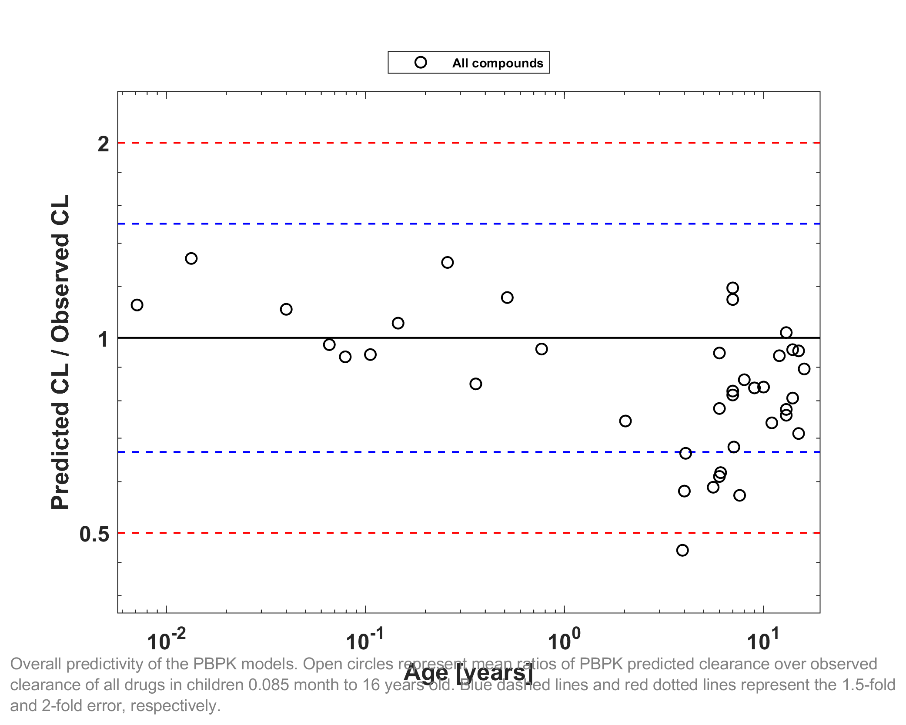

GMFE (CL) = 1.258017 

|CL                    |Number|Ratio [%]|
|---------------------:|-----:|--------:|
|Points total          |39    |-        |
|Points within 1.5 fold|32    |82.0513  |
|Points within 2-fold  |38    |97.4359  |

|Study ID       |Age [y]  |BodyWeight [kg]|Predicted CL [ml/min/kg]|Observed CL [ml/min/kg]|Pred/Obs CL Ratio|
|--------------:|--------:|--------------:|-----------------------:|----------------------:|----------------:|
|Vogelstein 1977|15       |77             |1.2386                  |1.74                   |0.71181          |
|Vogelstein 1977|15       |62.5           |1.3748                  |1.44                   |0.95476          |
|Vogelstein 1977|9        |21.5           |2.1428                  |2.56                   |0.83703          |
|Vogelstein 1977|13       |51             |1.3754                  |1.35                   |1.0188           |
|Vogelstein 1977|12       |27.1902        |2.4773                  |2.64                   |0.93839          |
|Vogelstein 1977|7        |27.4           |1.7874                  |2.19                   |0.81617          |
|Vogelstein 1977|4        |14             |2.4482                  |4.22                   |0.58013          |
|Vogelstein 1977|6        |17.3           |2.4921                  |2.63                   |0.94756          |
|Vogelstein 1977|6        |15.5           |2.6032                  |4.26                   |0.61107          |
|Vogelstein 1977|7        |15.9           |2.7463                  |2.3                    |1.1941           |
|Vogelstein 1977|14       |39.5           |1.8313                  |1.91                   |0.95879          |
|Vogelstein 1977|10       |32.8           |1.9309                  |2.3                    |0.83954          |
|Vogelstein 1977|14       |45.5           |1.8002                  |2.23                   |0.80729          |
|Vogelstein 1977|11       |35.2           |1.9073                  |2.58                   |0.73927          |
|Vogelstein 1977|13       |27.7           |2.2178                  |2.86                   |0.77547          |
|Vogelstein 1977|8        |20.8           |2.4815                  |2.88                   |0.86162          |
|Vogelstein 1977|6        |15.5           |2.5751                  |3.31                   |0.77799          |
|Vogelstein 1977|13       |49             |1.428                   |1.88                   |0.75956          |
|Vogelstein 1977|7        |20.6           |2.3606                  |2.06                   |1.1459           |
|Vogelstein 1977|16       |35.0809        |2.2115                  |2.47                   |0.89535          |
|Treluyer 2002  |0.013333 |3.5867         |0.070272                |0.053                  |1.3259           |
|Treluyer 2002  |0.04     |3.76           |0.080791                |0.073                  |1.1067           |
|Treluyer 2002  |0.065833 |3.9279         |0.092732                |0.095                  |0.97612          |
|Treluyer 2002  |0.079167 |4.0146         |0.099088                |0.106                  |0.9348           |
|Treluyer 2002  |0.10583  |4.1879         |0.11119                 |0.118                  |0.94232          |
|Treluyer 2002  |0.14583  |4.4479         |0.12642                 |0.12                   |1.0535           |
|Treluyer 2002  |0.51583  |6.8529         |0.14655                 |0.127                  |1.1539           |
|Treluyer 2002  |0.7675   |8.4888         |0.14415                 |0.15                   |0.96098          |
|Treluyer 2002  |2.0242   |12.3044        |0.13469                 |0.181                  |0.74412          |
|Treluyer 2002  |4.0608   |16.8869        |0.12606                 |0.19                   |0.66347          |
|Treluyer 2002  |6.085    |21.821         |0.12142                 |0.196                  |0.6195           |
|Treluyer 2002  |7.09     |24.434         |0.12008                 |0.177                  |0.67841          |
|Belfayol 1996  |7        |23.5           |46.5991                 |56.3                   |0.82769          |
|Schaad 1980    |0.0071184|3.07           |4.0924                  |3.6416                 |1.1238           |
|Schaad 1980    |0.25833  |4.9            |10.5784                 |8.0925                 |1.3072           |
|Schaad 1980    |0.35833  |5.2            |11.9254                 |14.0462                |0.84901          |
|Schaad 1980    |3.917    |15.5           |28.7895                 |61.2428                |0.47009          |
|Schaad 1980    |5.583    |20             |34.7354                 |59.0636                |0.5881           |
|Schaad 1980    |7.583    |26.7           |42.4893                 |74.3584                |0.57141          |

## 2.1 Amikacin PK Ratio tables and Figures
### Amikacin model

Amikacin PBPK predictions in children were evaluated using pharmacokinetic (PK) data reported in the following studies: 

- Tréluyer JM, Merlé Y, Tonnelier S, Rey E, Pons G. Nonparametric population pharmacokinetic analysis of amikacin in neonates, infants, and children. Antimicrob Agents Chemother. 2002 May;46(5):1381-7.[[Tréluyer 2002](#3-references)]
- Vogelstein B, Kowarski A, Lietman PS. The pharmacokinetics of amikacin in children. J Pediatr. 1977 Aug;91(2):333-9.[Vogelstein 1977](#3-references)]
- Belfayol L, Talon P, Eveillard M, Alet P, Fauvelle F. Pharmacokinetics of once-daily amikacin in pediatric patients. Clin Microbiol Infect. 1996 Feb;2(3):186-191.[[Belfayol 1996](#3-references)]

The pediatric PBPK model reasonably well predicted the clearance values of amikacin  pediatric studies across all available age groups, ranging from 0.16 months to 16 years old. The ratios of mean predicted over observed clearance values are illustrated in the table below as well as in the predicted versus observed clearance ratio plot, showing that all predictions in children were within 2-fold error of observed values.

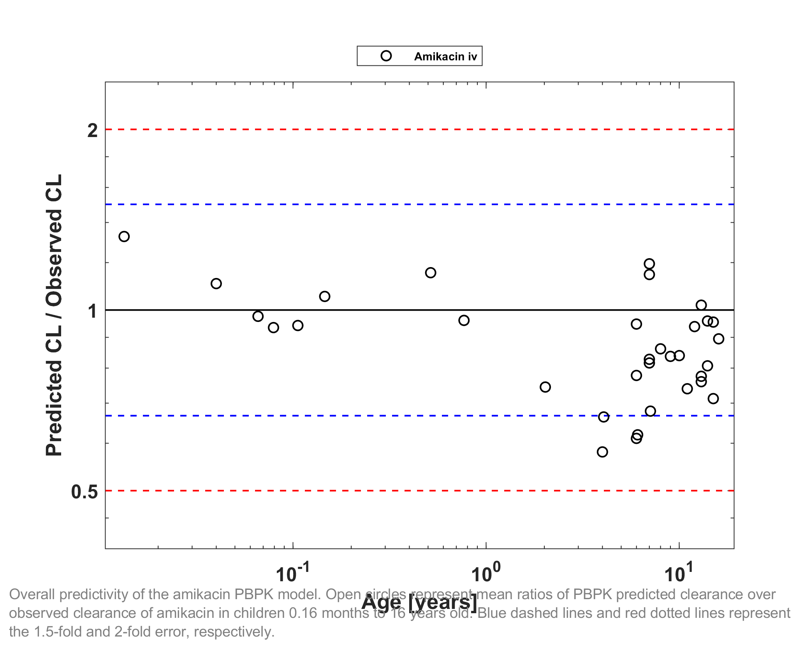

GMFE (CL) = 1.219861 

|CL                    |Number|Ratio [%]|
|---------------------:|-----:|--------:|
|Points total          |33    |-        |
|Points within 1.5 fold|29    |87.8788  |
|Points within 2-fold  |33    |100      |

|Study ID       |Age [y] |BodyWeight [kg]|Predicted CL [ml/min/kg]|Observed CL [ml/min/kg]|Pred/Obs CL Ratio|
|--------------:|-------:|--------------:|-----------------------:|----------------------:|----------------:|
|Vogelstein 1977|15      |77             |1.2386                  |1.74                   |0.71181          |
|Vogelstein 1977|15      |62.5           |1.3748                  |1.44                   |0.95476          |
|Vogelstein 1977|9       |21.5           |2.1428                  |2.56                   |0.83703          |
|Vogelstein 1977|13      |51             |1.3754                  |1.35                   |1.0188           |
|Vogelstein 1977|12      |27.1902        |2.4773                  |2.64                   |0.93839          |
|Vogelstein 1977|7       |27.4           |1.7874                  |2.19                   |0.81617          |
|Vogelstein 1977|4       |14             |2.4482                  |4.22                   |0.58013          |
|Vogelstein 1977|6       |17.3           |2.4921                  |2.63                   |0.94756          |
|Vogelstein 1977|6       |15.5           |2.6032                  |4.26                   |0.61107          |
|Vogelstein 1977|7       |15.9           |2.7463                  |2.3                    |1.1941           |
|Vogelstein 1977|14      |39.5           |1.8313                  |1.91                   |0.95879          |
|Vogelstein 1977|10      |32.8           |1.9309                  |2.3                    |0.83954          |
|Vogelstein 1977|14      |45.5           |1.8002                  |2.23                   |0.80729          |
|Vogelstein 1977|11      |35.2           |1.9073                  |2.58                   |0.73927          |
|Vogelstein 1977|13      |27.7           |2.2178                  |2.86                   |0.77547          |
|Vogelstein 1977|8       |20.8           |2.4815                  |2.88                   |0.86162          |
|Vogelstein 1977|6       |15.5           |2.5751                  |3.31                   |0.77799          |
|Vogelstein 1977|13      |49             |1.428                   |1.88                   |0.75956          |
|Vogelstein 1977|7       |20.6           |2.3606                  |2.06                   |1.1459           |
|Vogelstein 1977|16      |35.0809        |2.2115                  |2.47                   |0.89535          |
|Treluyer 2002  |0.013333|3.5867         |0.070272                |0.053                  |1.3259           |
|Treluyer 2002  |0.04    |3.76           |0.080791                |0.073                  |1.1067           |
|Treluyer 2002  |0.065833|3.9279         |0.092732                |0.095                  |0.97612          |
|Treluyer 2002  |0.079167|4.0146         |0.099088                |0.106                  |0.9348           |
|Treluyer 2002  |0.10583 |4.1879         |0.11119                 |0.118                  |0.94232          |
|Treluyer 2002  |0.14583 |4.4479         |0.12642                 |0.12                   |1.0535           |
|Treluyer 2002  |0.51583 |6.8529         |0.14655                 |0.127                  |1.1539           |
|Treluyer 2002  |0.7675  |8.4888         |0.14415                 |0.15                   |0.96098          |
|Treluyer 2002  |2.0242  |12.3044        |0.13469                 |0.181                  |0.74412          |
|Treluyer 2002  |4.0608  |16.8869        |0.12606                 |0.19                   |0.66347          |
|Treluyer 2002  |6.085   |21.821         |0.12142                 |0.196                  |0.6195           |
|Treluyer 2002  |7.09    |24.434         |0.12008                 |0.177                  |0.67841          |
|Belfayol 1996  |7       |23.5           |46.5991                 |56.3                   |0.82769          |

## 2.2 Amikacin Concentration-Time profiles in Children
#### Concentration-Time Profiles

Predicted versus observed plasma concentration-time profiles are listed below. Only simulations where observed data was available for comparison are shown.  Depending if the observed data were individual data or aggregated data, individual predictions or population predictions including variability are shown, respectively.
## 2.3 Vancomycin PK Ratio tables and Figures
### Vancomycin model

Vancomycin PBPK predictions in children were evaluated using pharmacokinetic (PK) data reported in the following studies: 

- Schaad UB, McCracken GH Jr, Nelson JD. Clinical pharmacology and efficacy of vancomycin in pediatric patients. J Pediatr. 1980 Jan;96(1):119-26.[[Schaad 1980](#3-references)]

The pediatric PBPK model predicted the clearance values of vancomycin observed in pediatric studies reasonably across all available age groups, ranging from 0.085 months to 7.58 years old. The ratios of mean predicted over observed clearance values are illustrated in the table below as well as in the predicted versus observed clearance ratio plot, showing that all predictions in children were within 2-fold error of observed values.

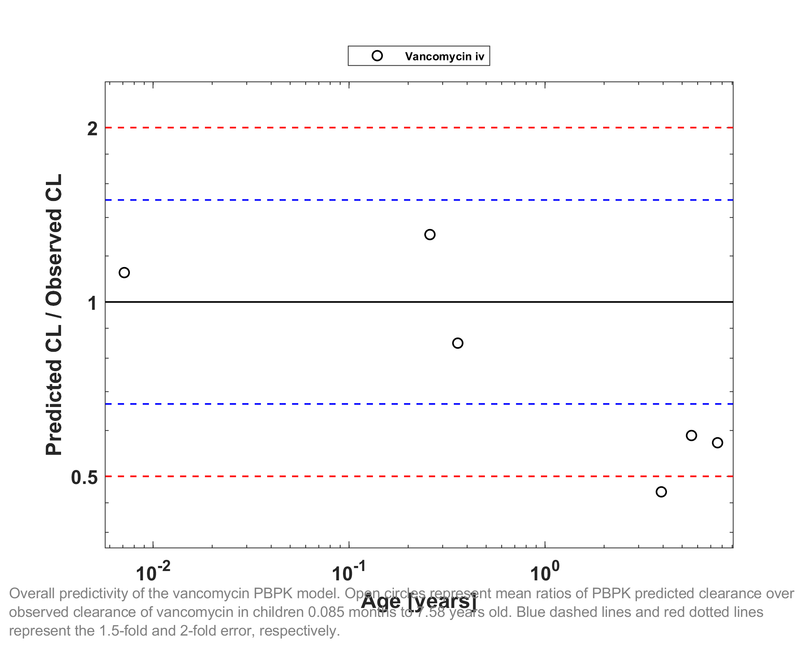

GMFE (CL) = 1.490238 

|CL                    |Number|Ratio [%]|
|---------------------:|-----:|--------:|
|Points total          |6     |-        |
|Points within 1.5 fold|3     |50       |
|Points within 2-fold  |5     |83.3333  |

|Study ID   |Age [y]  |BodyWeight [kg]|Predicted CL [ml/min]|Observed CL [ml/min]|Pred/Obs CL Ratio|
|----------:|--------:|--------------:|--------------------:|-------------------:|----------------:|
|Schaad 1980|0.0071184|3.07           |4.0924               |3.6416              |1.1238           |
|Schaad 1980|0.25833  |4.9            |10.5784              |8.0925              |1.3072           |
|Schaad 1980|0.35833  |5.2            |11.9254              |14.0462             |0.84901          |
|Schaad 1980|3.917    |15.5           |28.7895              |61.2428             |0.47009          |
|Schaad 1980|5.583    |20             |34.7354              |59.0636             |0.5881           |
|Schaad 1980|7.583    |26.7           |42.4893              |74.3584             |0.57141          |

## 2.4 Vancomycin Concentration-Time profiles in Children
#### Concentration-Time Profiles

Predicted versus observed plasma concentration-time profiles are listed below. Only simulations where observed data was available for comparison are shown.  Depending if the observed data were individual data or aggregated data, individual predictions or population predictions including variability are shown, respectively.

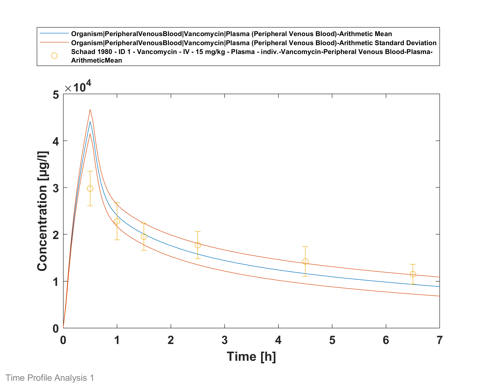

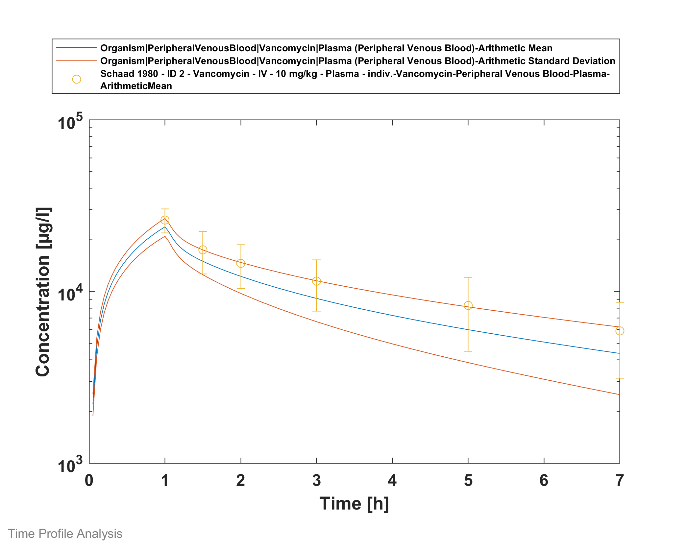

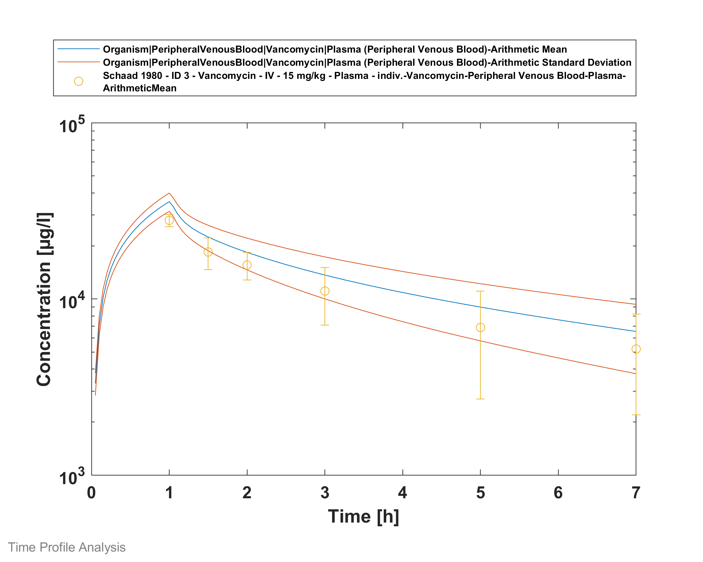

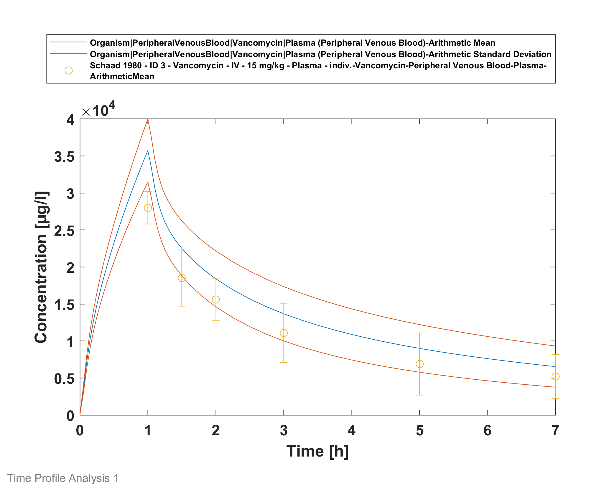

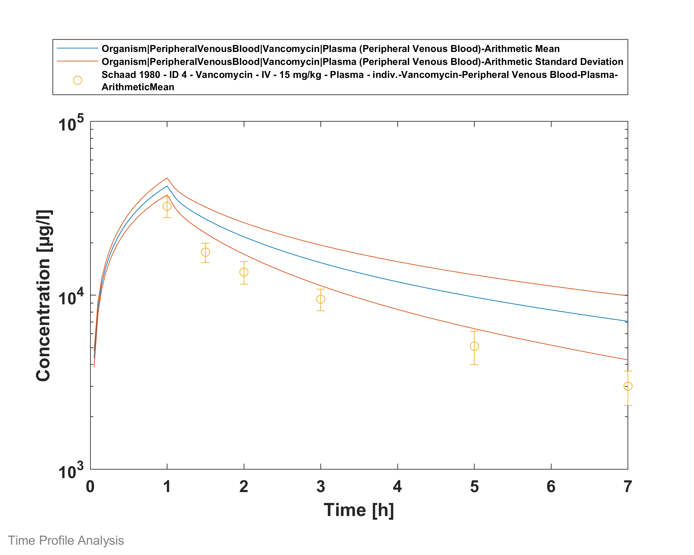

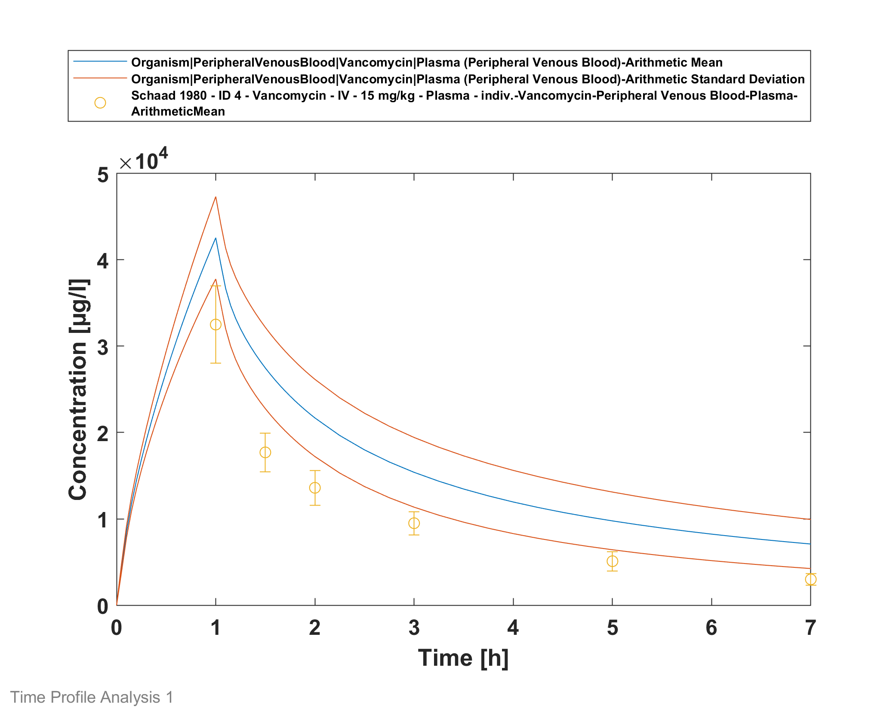

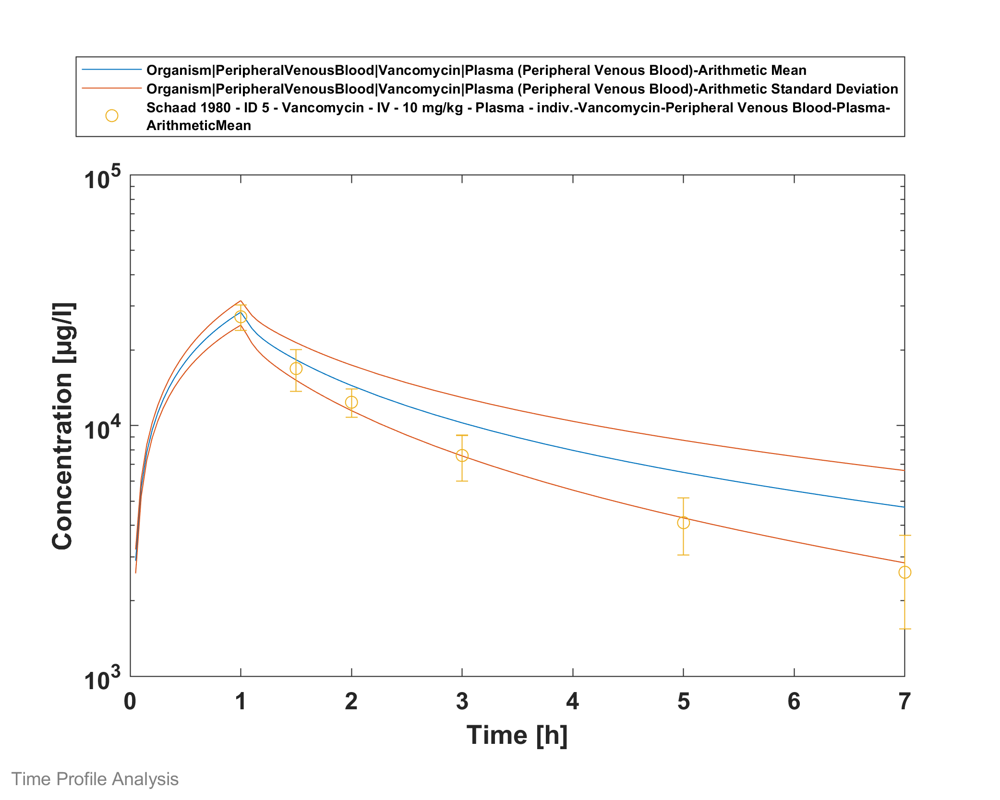

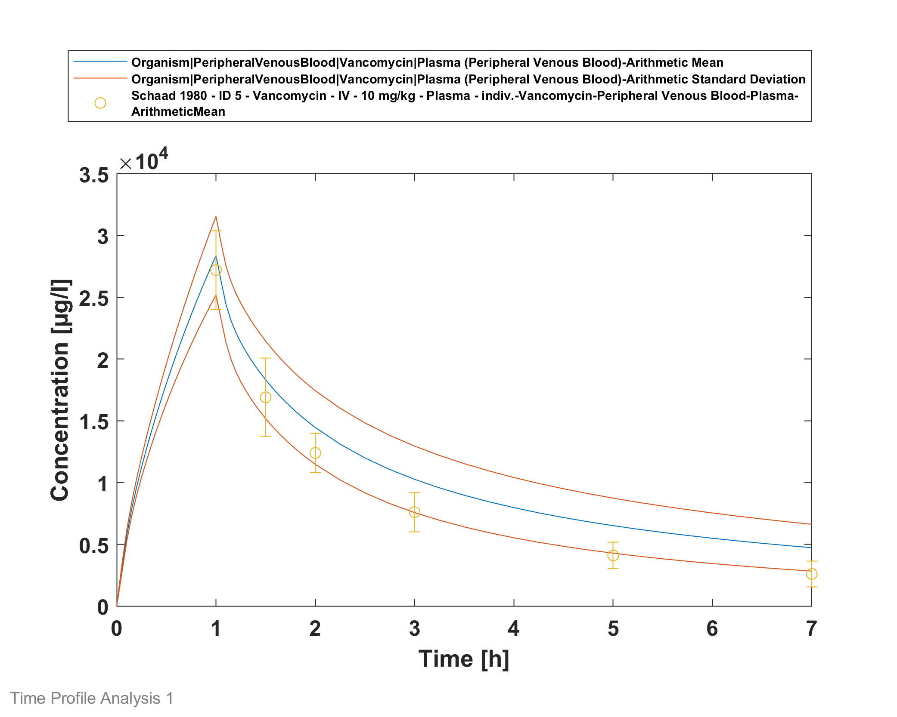

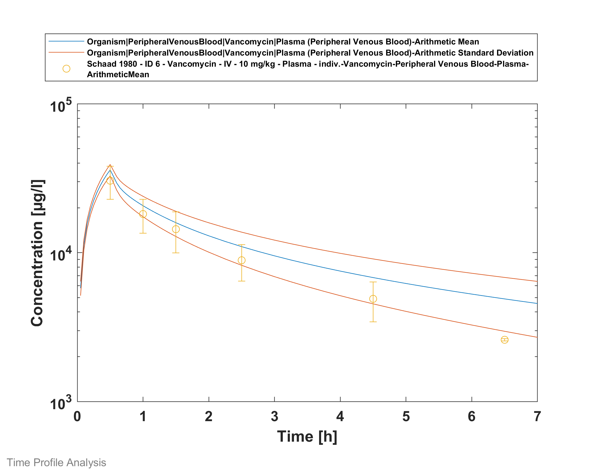

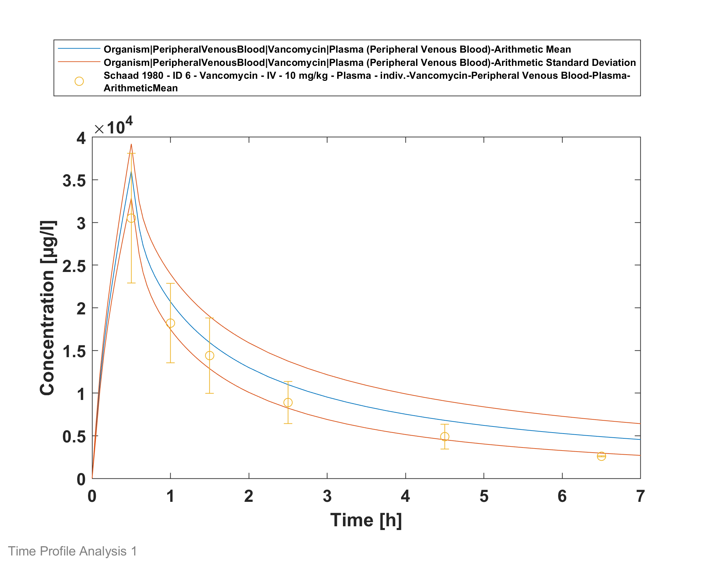

# 3 References
**Amikacin-Model** Amikacin-Model, Whole-body PBPK model of Amikacin. (https://github.com/Open-Systems-Pharmacology/Amikacin-Model)

**Belfayol 1996 **Belfayol L, Talon P, Eveillard M, Alet P, Fauvelle F. Pharmacokinetics of once-daily amikacin in pediatric patients. Clin Microbiol Infect. 1996 Feb;2(3):186-191.

**Edginton 2006** Edginton AN, Schmitt W, Willmann S. Development and evaluation of a generic physiologically based pharmacokinetic model for children. Clin Pharmacokinet. 2006;45(10):1013-34.

**Maharaj 2013** Maharaj AR, Barrett JS, Edginton AN. A workflow example of PBPK modeling to support pediatric research and development: case study with lorazepam. The AAPS journal. 2013;15(2): 455-464.

**Ontogeny Database** OSPSuite.Documentation/PK-Sim Ontogeny Database Version 7.3.pdf (https://github.com/Open-Systems-Pharmacology/OSPSuite.Documentation/blob/38cf71b384cfc25cfa0ce4d2f3addfd32757e13b/PK-Sim%20Ontogeny%20Database%20Version%207.3.pdf)

**Schaad 1980** Schaad UB, McCracken GH Jr, Nelson JD. Clinical pharmacology and efficacy of vancomycin in pediatric patients. J Pediatr. 1980 Jan;96(1):119-26.

**Tréluyer 2002** Tréluyer JM, Merlé Y, Tonnelier S, Rey E, Pons G. Nonparametric population pharmacokinetic analysis of amikacin in neonates, infants, and children. Antimicrob Agents Chemother. 2002 May;46(5):1381-7.

**Vancomycin-Model** Vancomycin-Model, Whole-body PBPK model of Vancomycin. (https://github.com/Open-Systems-Pharmacology/Vancomycin-Model) 

**Vogelstein 1977** Vogelstein B, Kowarski A, Lietman PS. The pharmacokinetics of amikacin in children. J Pediatr. 1977 Aug;91(2):333-9.
